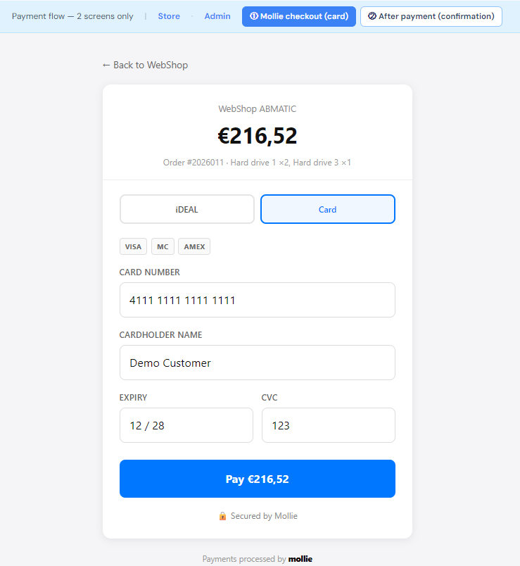

# WebShopABMATIC — B2B E-Commerce Platform

     

**WebShopABMATIC** is a modern and scalable B2B e-commerce platform built with **Blazor Server**, **.NET 10**, and **hexagonal architecture**. It delivers a complete experience for customers (storefront) and managers (admin panel), including advanced catalog, order, stock, and payment operations.

> **Live reference:** https://adminsenceweb.azurewebsites.net/

---

## 🎯 What Is WebShopABMATIC?

### Overview
Complete B2B online sales system with **two core applications**:

---

#### 📦 **Storefront**

**Storefront interface — Catalog & shopping:**

Customer purchase experience:
- 🔍 **Product catalog** with search and filters
- 🛒 **Smart shopping cart** with stock validation
- 💳 **Integrated Mollie checkout** (debit/card/iDEAL)
- 📋 **Order management** and purchase history
- 👤 **Customer profile** with addresses and preferences

---

#### 🎛️ **Admin Panel**

**Dashboard — Real-time KPIs and alerts:**

- 📊 **Administrative dashboard** with KPIs, operational alerts, and executive business visibility.

---

#### 💳 **Payments** (Mollie)

**Checkout payment screen:**

PrePay checkout experience:
- 💳 **Integrated Mollie checkout** (iDEAL/card) with secure redirect
- 🧪 **Mock mode for local development** without requiring a real key

**Payment received / confirmation screen:**

Post-payment confirmation experience:
- ✅ **Payment confirmation screen** with clear customer feedback
- 🔄 **Automatic order status update** to paid via webhook
- 📦 **Stock deduction and audit logging** after confirmation

---

## ✨ Key Features

### Robust Architecture
- ✅ **Hexagonal pattern** -> clear separation of concerns (UI, Application, Domain, Infrastructure)
- ✅ **CQRS-ready** -> ports and use cases for isolated operations
- ✅ **IAsyncDisposable** -> proper resource lifecycle management
- ✅ **CancellationToken** -> timeout/cancel support for long operations
- ✅ **Circuit Breaker** -> resilient retry behavior

### Professional UX
- 🎨 **AB-MATIC design language** -> modern layout with sidebar, dashboard, and cards
- 📱 **Responsive UI** -> works on desktop, tablet, and mobile
- ⚡ **Performance-focused** -> virtualization-ready, `@key` directives
- 🌐 **Multilingual-ready** -> prepared for PT/EN/NL

### Data Management
- 📚 **40+ tables** seeded with realistic demo data
- 🔐 **ASP.NET Core Identity** -> robust authentication
- 📋 **EF Core 10** -> optimized queries
- 📊 **Audit trail** -> all changes tracked with userId + timestamp

### Integrations
- 💳 **Mollie Payments** -> payment processing
- ☁️ **Azure Blob Storage** -> product image storage
- 📧 **Email queue** -> asynchronous notifications
- 🗄️ **SQL Server** -> persistent data layer

---

## 🔐 3. Authentication & Authorization

### 3.1 Authentication Strategy

| Type | Stack | Details |
|------|-------|----------|
| **Storefront** | Registration + Login | B2B customers register and sign in |
| **Admin Panel** | Staff Login | Restricted access with required roles |
| **Stack Foundation** | ASP.NET Core Identity | Cookie auth for Blazor Server (no JWT by default) |

### 3.2 Roles

| Role | Access | Limitations |
|--------|--------|------------|
| **Admin** | 🔓 Full | Everything: users, configuration, audit |
| **Manager** | 🔓 Partial | Catalog + orders (no user management) |
| **Customer** | 🔓 Limited | Storefront only: catalog, cart, orders |

### 3.3 Resource Permissions

| Resource | Admin | Manager | Customer |
|---------|-------|---------|----------|
| Products | ✅ RW | ✅ RW | ✅ R |
| Categories | ✅ RW | ✅ RW | ✅ R |
| Discounts | ✅ RW | ✅ R | — |
| Orders | ✅ RW | ✅ RW | ✅ Own |
| Customers | ✅ RW | ✅ R | ✅ Own |
| Users & Roles | ✅ RW | — | — |
| Audit | ✅ R | — | — |

**Legend:** R = Read | W = Write | RW = Read+Write | — = No access

### 3.4 Valid test logins (legacy auth — Azure `abmatic_test`)

Login uses **legacy ABMATIC tables**, not ASP.NET Identity (`AspNetUsers` is not used at runtime).

| Portal | URL | Table | Credential fields |
|--------|-----|-------|-------------------|
| **Admin** | `/admin/login` | `Settings.StaffUsers` | `Login` + `Password` (plaintext) |
| **Store** | `/sign-in` | `Customers.Customers` | `WebshopLogin` + `PasswordWebshop` / `SaltWebshop` |

**After demo seed** (`Sql/seeds.sql` on `abmatic_test`):

| Login | Password | Access |
|-------|----------|--------|
| `admin@webshop.com` | `demo` | Admin + Manager |
| `manager@webshop.com` | `demo` | Manager |
| `customer@webshop.com` | `demo` | Store customer (Tailspin Toys) |

**Real ERP data on Azure:** when the database has client ABMATIC rows (hundreds of webshop products, real staff), use credentials from `[Settings].[StaffUsers]` and `[Customers].[Customers]` in SSMS — **not** the old Identity passwords (`Admin@12345`, etc.).

> Login credentials are in `Sql/seeds.sql` (`StaffUsers` + `Customers`) — not AspNet Identity.

---

## Documentation

- 🏗️ [`readme/SPEC_INFRASTRUCTURE.md`](readme/SPEC_INFRASTRUCTURE.md) — Hexagonal architecture, connection strings, migrations, DI
- 📊 [`readme/DATA_DUTCH_ENGLISH_MODEL.md`](readme/DATA_DUTCH_ENGLISH_MODEL.md) — Schemas, table inventory, Dutch → English mapping
- 🌱 [`readme/DATA_DEMO_SEED.md`](readme/DATA_DEMO_SEED.md) — SQL demo seed: schemas, tables, run `seeds.sql` on Azure SQL (`abmatic.database.windows.net`)
- 🖥️ [`readme/SPEC_ADMIN.md`](readme/SPEC_ADMIN.md) — Admin panel: logins, registrations, stock, dashboards
- 🛒 [`readme/SPEC_WEB_STORE.md`](readme/SPEC_WEB_STORE.md) — Web store: catalog, customer auth, checkout, stock display
- 💳 [`readme/MOLLIE_PAYMENTS_open.md`](readme/MOLLIE_PAYMENTS_open.md) — Mollie test key, webhook, E2E checklist (open / pending)
- 📦 [`readme/SPEC_STOCK_OPERATIONS_PROPOSAL.md`](readme/SPEC_STOCK_OPERATIONS_PROPOSAL.md) — Stock operations, checkout, Mollie
- ✅ [`readme/DATA_SUMMARY.md`](readme/DATA_SUMMARY.md) — **Demo data summary** (all tables, live row counts, admin screens)
- ✅ [`readme/SUNDAY.md`](readme/SUNDAY.md) — Seed inventory (`seeds.sql` — complete)
- ✅ [`readme/IMPLEMENTATION_ROADMAP_open.md`](readme/IMPLEMENTATION_ROADMAP_open.md) — **Main delivery tracker** (dev 100% first · prod go-live last)
- 🔐 [`readme/AUTH_IDENTITY_ROADMAP_open.md`](readme/AUTH_IDENTITY_ROADMAP_open.md) — Identity, roles, customers, user IDs on writes
- 📋 [`readme/AUDITS_open.md`](readme/AUDITS_open.md) — Audit log plan (CRUD / Login / Report / Logout badges + checklist)
- ✅ [`readme/AZUREBLOB.md`](readme/AZUREBLOB.md) — Product images: `AzureFiles` ↔ `Product`, Azure Blob `files` + SAS
- 🖥️ [`readme/MOCK_PROTOTYPE_GUIDE.md`](readme/MOCK_PROTOTYPE_GUIDE.md) — Mock layouts, menus, entities, and validation walkthrough
- 🎨 [`readme/PATTERNS_UI_QUICK_START.md`](readme/PATTERNS_UI_QUICK_START.md) — Buttons, grids, forms (copy-paste)
- 🏗️ [`readme/PATTERNS_CODE_AND_INFRASTRUCTURE.md`](readme/PATTERNS_CODE_AND_INFRASTRUCTURE.md) — Blazor patterns,
- 📋 [`readme/docs/mock-loja.html`](readme/docs/mock-loja.html) — Storefront prototype (entry point)
- 📋 [`readme/docs/mock-payments.html`](readme/docs/mock-payments.html) — Mollie card checkout + payment success
- 📋 [`readme/docs/mock-admin.html`](readme/docs/mock-admin.html) — Admin prototype

---

**© 2026 AdminSense. All rights reserved.**

