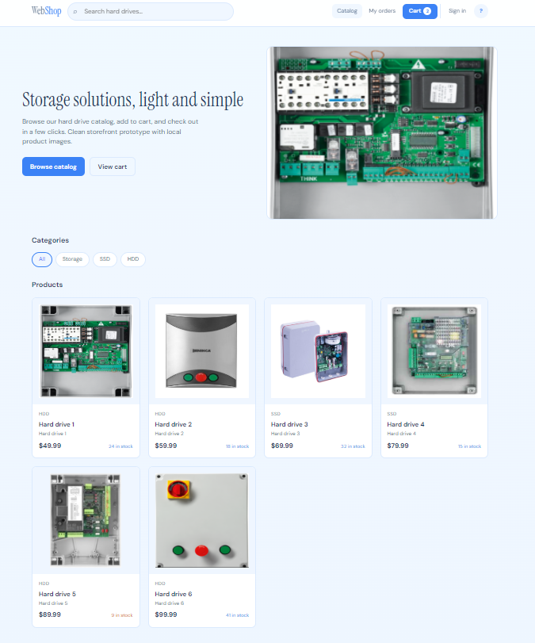

# WebShopABMATIC — B2B E-Commerce Platform

     

**WebShopABMATIC** is a modern and scalable B2B e-commerce platform built with **Blazor Server**, **.NET 10**, and **hexagonal architecture**. It delivers a complete experience for customers (storefront) and managers (admin panel), including advanced catalog, order, stock, and payment operations.

> **Live reference:** https://adminsenceweb.azurewebsites.net/
> 

---

## 🎯 What Is WebShopABMATIC?

### Overview
Complete B2B online sales system with **two core applications**:

---

#### 📦 **Storefront**

**Storefront interface — Catalog & shopping:**

Customer purchase experience:
- 🔍 **Product catalog** with search and filters
- 🛒 **Smart shopping cart** with stock validation
- 💳 **Integrated Mollie checkout** (debit/card/iDEAL) — **mock until client API keys**
- 📋 **Order management** and purchase history
- 👤 **Customer profile** with addresses and preferences

---

#### 🎛️ **Admin Panel**

**Dashboard — Real-time KPIs and alerts:**

- 📊 **Administrative dashboard** with KPIs, operational alerts, and executive business visibility.

---

#### 💳 **Payments** (Mollie)

**Checkout payment screen:**

PrePay checkout experience:
- 💳 **Integrated Mollie checkout** (iDEAL/card) with secure redirect
- 🧪 **Mock mode is the current rule** (`Mollie:UseMock`) until the client delivers API keys — see [SPEC_MOLLIE_PAYMENTS_open.md](docs/SPEC_MOLLIE_PAYMENTS_open.md)

**Payment received / confirmation screen:**

Post-payment confirmation experience:
- ✅ **Payment confirmation screen** with clear customer feedback
- 🔄 **Automatic order status update** to paid via webhook
- 📦 **Stock deduction and audit logging** after confirmation

---

## ✨ Key Features

### Robust Architecture
- ✅ **Hexagonal pattern** -> clear separation of concerns (UI, Application, Domain, Infrastructure)
- ✅ **CQRS-ready** -> ports and use cases for isolated operations
- ✅ **IAsyncDisposable** -> proper resource lifecycle management
- ✅ **CancellationToken** -> timeout/cancel support for long operations
- ✅ **Circuit Breaker** -> resilient retry behavior

### Professional UX
- 🎨 **AB-MATIC design language** -> modern layout with sidebar, dashboard, and cards
- 📱 **Responsive UI** -> works on desktop, tablet, and mobile
- ⚡ **Performance-focused** -> virtualization-ready, `@key` directives
- 🌐 **Multilingual-ready** -> prepared for PT/EN/NL

### Data Management
- 📚 **40+ tables** with data on `abmatic_test`
- 🔐 **ASP.NET Core Identity** -> robust authentication
- 📋 **EF Core 10** -> optimized queries
- 📊 **Audit trail** -> all changes tracked with userId + timestamp

### Integrations
- 💳 **Mollie Payments** -> payment processing
- ☁️ **Azure Blob Storage** -> product image storage
- 🗄️ **SQL Server** -> persistent data layer

---

## 🔐 3. Authentication & Authorization

### 3.1 Authentication Strategy

| Type | Stack | Details |
|------|-------|----------|
| **Storefront** | Registration + Login | B2B customers register and sign in |
| **Admin Panel** | Staff Login | Restricted access with required roles |
| **Stack Foundation** | ASP.NET Core Identity | Cookie auth for Blazor Server (no JWT by default) |

### 3.2 Roles

| Role | Access | Limitations |
|--------|--------|------------|
| **Admin** | 🔓 Full | Everything: users, configuration, audit |
| **Manager** | 🔓 Partial | Catalog + orders (no user management) |
| **Customer** | 🔓 Limited | Storefront only: catalog, cart, orders |

### 3.3 Resource Permissions

| Resource | Admin | Manager | Customer |
|---------|-------|---------|----------|
| Products | ✅ RW | ✅ RW | ✅ R |
| Categories | ✅ RW | ✅ RW | ✅ R |
| Discounts | ✅ RW | ✅ R | — |
| Orders | ✅ RW | ✅ RW | ✅ Own |
| Customers | ✅ RW | ✅ R | ✅ Own |
| Users & Roles | ✅ RW | — | — |
| Audit | ✅ R | — | — |

**Legend:** R = Read | W = Write | RW = Read+Write | — = No access

### 3.4 Authentication (legacy — Azure `abmatic_test`)

Login uses **legacy ABMATIC tables**, not ASP.NET Identity (`AspNetUsers` is not used at runtime).

| Portal | URL | Table | Credential fields |
|--------|-----|-------|-------------------|
| **Admin** | `/admin/login` | `Settings.StaffUsers` | `Login` + `Password` |
| **Store** | `/sign-in` | `Customers.Customers` | `WebshopLogin` + `PasswordWebshop` / `SaltWebshop` |

Use credentials from those tables in the connected database (`abmatic_test`). Inspect `LoginWebshop` / `Login` in admin (`/admin/customers`, `/admin/staff-users`) or via SSMS. Passwords are stored hashed (store) or per legacy rules (staff) — reset via admin when needed.

---

## Documentation

**Agents / Claude / Cursor:** start at **[`AGENTS.md`](AGENTS.md)** (process + which SPEC/patterns to use).  
**Humans:** **[`docs/README.md`](docs/README.md)** (full index).

| Doc | Purpose |
|-----|---------|
| [SPEC_WEB_STORE.md](docs/SPEC_WEB_STORE.md) | Storefront: catalog, auth, checkout, stock display |
| [SPEC_ADMIN.md](docs/SPEC_ADMIN.md) | Admin panel, staff vs customer auth |
| [SPEC_INFRASTRUCTURE.md](docs/SPEC_INFRASTRUCTURE.md) | Hexagonal layout, Azure, Blazor, DI |
| [AMENDMENTS.md](docs/AMENDMENTS.md) | Short runtime amendments |
| [SPEC_MOLLIE_PAYMENTS_open.md](docs/SPEC_MOLLIE_PAYMENTS_open.md) | Mollie go-live checklist |
| [SPEC_IMPLEMENTATION_ROADMAP_open.md](docs/SPEC_IMPLEMENTATION_ROADMAP_open.md) | Delivery tracker |
| [DATA_SUMMARY.md](docs/DATA_SUMMARY.md) | Database summary |
| [DATA_DUTCH_ENGLISH_MODEL.md](docs/DATA_DUTCH_ENGLISH_MODEL.md) | Dutch DB ↔ English code map |
| [DATA_FREIGHT_DELIVERY.md](docs/DATA_FREIGHT_DELIVERY.md) | Store freight from ERP products |
| [DATA_AZUREBLOB.md](docs/DATA_AZUREBLOB.md) | Product images / Blob |
| [PATTERNS_UI_QUICK_START.md](docs/PATTERNS_UI_QUICK_START.md) | UI patterns |
| [PATTERNS_CODE_AND_INFRASTRUCTURE.md](docs/PATTERNS_CODE_AND_INFRASTRUCTURE.md) | Code patterns + doc naming |
| [mocks/](docs/mocks/) | HTML prototypes (`mock-admin.html`, `mock-payments.html`) |

Agent guides: [`AGENTS.md`](AGENTS.md) · [`CLAUDE.md`](CLAUDE.md) · [`.claude/CLAUDE.md`](.claude/CLAUDE.md) · Cursor: `.cursor/rules/agents.mdc` + `docs-sync.mdc`

---

**© 2026 AdminSense. All rights reserved.**

