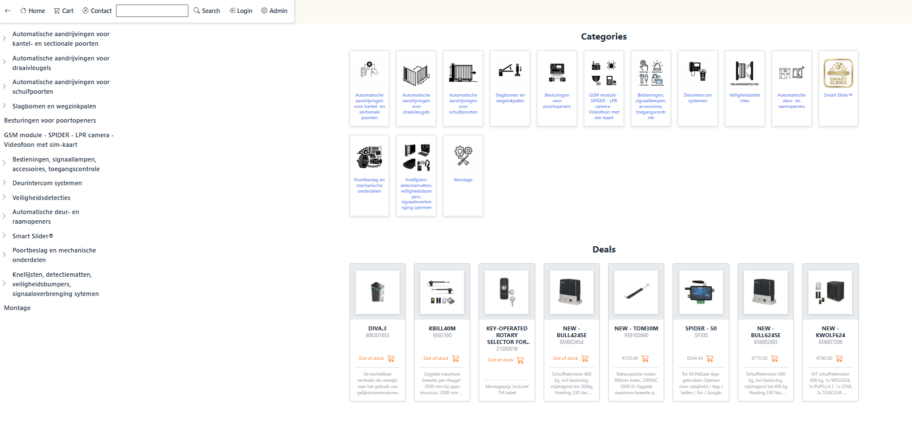
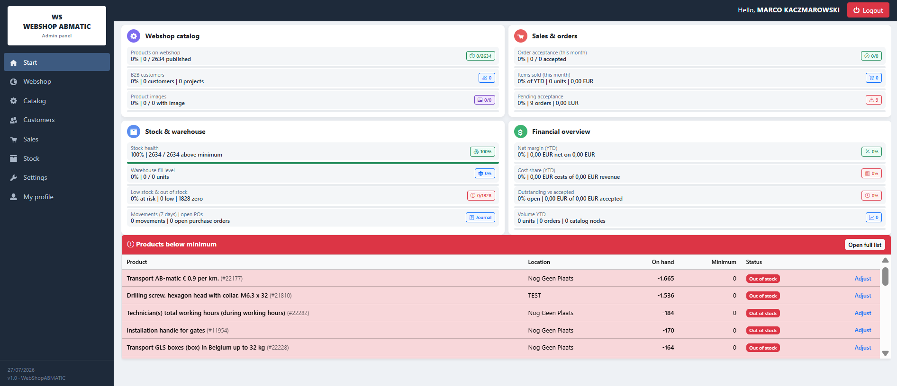

# 🛒 WebShopABMATIC — B2B E-Commerce Platform

**B2B e-commerce platform with Blazor Server, .NET 10, and hexagonal architecture**

---

> [!NOTE]
> **WebShopABMATIC** is a B2B e-commerce platform: customer storefront + staff admin, on the live ERP database `abmatic_test`.  
> **Live reference:** https://adminsenceweb.azurewebsites.net/

---

## 🛍️ Storefront

- Product catalog with search (guest list price, or Out of stock / Price on request)
- Shopping cart with stock and required-option validation
- Checkout with Mollie PrePay — **mock until the client delivers API keys**
- Customer account: profile and order history

Auth: legacy cookies (`/sign-in`), not ASP.NET Identity — see [SPEC_ADMIN.md](docs/SPEC_ADMIN.md) §2 and [SPEC_WEB_STORE.md](docs/SPEC_WEB_STORE.md).

---

## 👨‍💼 Admin Panel

Staff dashboard and operational screens (catalog, orders, stock, settings). Staff login: `/admin/login`.

---

## 💳 Payments (Mollie)

- PrePay (iDEAL / card) via Mollie; current runtime uses **`Mollie:UseMock`**
- Blazor mock checkout: `/checkout/mollie-mock` (no real charge)
- Payment confirmation uses real order lines, VAT and ERP freight price (missing price → €0)
- Go-live checklist: [SPEC_MOLLIE_PAYMENTS_open.md](docs/SPEC_MOLLIE_PAYMENTS_open.md)
- Cart / confirmation UX: [SPEC_WEB_STORE.md](docs/SPEC_WEB_STORE.md)

---

## 📚 Documentation

| Audience | Start here |
|----------|------------|
| **Humans** | [docs/README.md](docs/README.md) — full index |
| **Agents (Cursor / Claude)** | [AGENTS.md](AGENTS.md) → [.claude/CLAUDE.md](.claude/CLAUDE.md) |

---

**© 2026 AdminSense. All rights reserved.**
