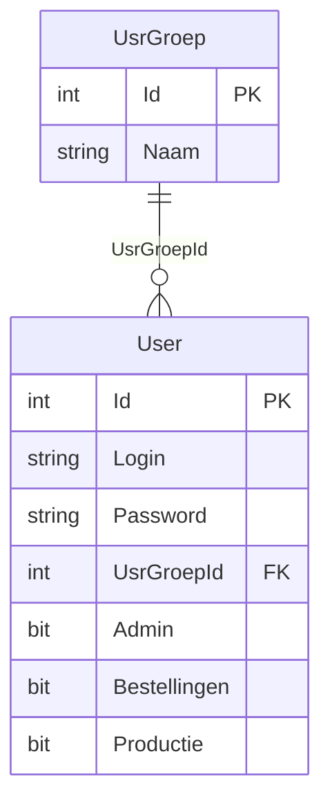

# Plan: Staff user password, group, and access flags

## Problem

[`StaffUserList.razor`](../WebShopABMATIC.Client/Components/Pages/Admin/StaffUserList.razor) only edits Login / name / job title. Client cannot set password or group. New users also cannot open the admin panel unless ERP access bits are set.

## Database (confirmed — no schema change)

| Concern | SQL | C# |
|---------|-----|-----|
| Password | `[Instellingen].[User].Password` | `StaffUser.Password` (plaintext, legacy) |
| Group | `UsrGroepId` → `[Instellingen].[UsrGroep]` | `StaffUser.UserGroupId` → `UserGroup` |
| Admin role | bit `Admin` | `StaffUser.Admin` → cookie `AppRoles.Admin` |
| Manager role | `Bestellingen` or `Productie` or `Admin` | [`LegacySignInService`](../WebShopABMATIC/Infrastructure/Auth/LegacySignInService.cs) |

No join table. Group CRUD already exists at `/admin/user-groups`.

## Profile vs Staff user — analysis and decision

| Screen | Who | Same table | Fields today | Password |
|--------|-----|------------|--------------|----------|
| `/admin/staff-users` | Admin managing others | `Instellingen.User` | Login, names, job | Missing (create defaults `ChangeMe!`) |
| `/admin/profile` | Logged-in staff self | same row | First/Last/Phone; Login/Email read-only | Change own password (requires current) via [`LegacyStaffProfileService`](../WebShopABMATIC/Infrastructure/Auth/LegacyStaffProfileService.cs) |

**Decision:** do **not** merge Profile into Staff user. Keep two responsibilities:

1. **Staff user (admin ops)** — create/edit account: password set/reset, `UsrGroep`, access flags, identity fields.
2. **My profile (self-service)** — leave as-is: edit own name/phone; change own password with current-password check. Do **not** expose group or Admin/Manager flags on Profile (no self-escalation).

Both write the same columns (`FirstName` / `LastName` / `Tel` / `Password`). No shared port refactor in this pass — document the split in `SPEC_ADMIN`. Unifying screens later is out of scope.

Also surface **Tel** on the Staff user form (already on DTO/repository; Profile maps it as Phone) so contact data stays consistent.

## Scope (this delivery)

### Form fields to add on Staff user

1. **Password**
   - Create: required + confirm.
   - Edit: optional “New password” (+ confirm); empty keeps existing. Admin may set without knowing current (ops reset). Never return password to UI / `GetForEdit`.
2. **User group** — dropdown of `UserGroup` (`Naam`), bound to `UserGroupId` (nullable).
3. **Access flags** (required so login works)
   - **Admin** → `StaffUser.Admin`
   - **Manager (orders)** → `StaffUser.Bestellingen` (enough for Manager role; leave `Productie` unchanged; no third checkbox)
   - Validation: at least one of Admin or Manager must be true on save
4. **Tel** — optional phone (align with Profile)

### Grid

Add columns: Group name, Admin (Yes/No), Manager (Yes if `Bestellingen || Productie || Admin`).

### Backend

- Extend [`StaffUserEditDto`](../WebShopABMATIC/Application/Admin/StaffUsers/StaffUserDto.cs): `Password` / `ConfirmPassword` (write-only), `IsAdmin`, `IsManager`; keep `UserGroupId` / `Tel`.
- Extend [`StaffUserDto`](../WebShopABMATIC/Application/Admin/StaffUsers/StaffUserDto.cs): `UserGroupName`, `IsAdmin`, `IsManager` for grid.
- [`StaffUserRepository.SaveAsync`](../WebShopABMATIC/Infrastructure/Persistence/Repositories/StaffUserRepository.cs): persist password when provided; map flags; keep `AdminCrudDefaults` for other required ERP columns.
- Lookups: load groups for dropdown (reuse `IUserGroupRepository` / port list).
- [`AdminEditFormValidator.ValidateStaffUser`](../WebShopABMATIC/Application/Validation/AdminEditFormValidator.cs): password rules + at least one access flag.
- UI: [`StaffUserList.razor`](../WebShopABMATIC.Client/Components/Pages/Admin/StaffUserList.razor) — fields + group select.

### Out of scope

- Merging Profile + Staff user
- Group / flags on Profile
- Password hashing (ERP plaintext until a separate security project)
- Full ERP permission matrix (`Crm`, `CanAccess*`, `Productie` checkbox)
- Identity / `AspNetUsers` path

## Docs

- [`docs/SPEC_ADMIN.md`](./SPEC_ADMIN.md): Staff user form fields; clarify Profile vs Staff user; fix hub note if needed.
- [`docs/AMENDMENTS.md`](./AMENDMENTS.md): dated one-liner.
- [`docs/DATA_DUTCH_ENGLISH_MODEL.md`](./DATA_DUTCH_ENGLISH_MODEL.md) only if `UsrGroepId` / access-flag note is missing.

## Execution order

1. DTOs + validator + repository + group lookup  
2. `StaffUserList.razor` UI + grid  
3. Docs  
