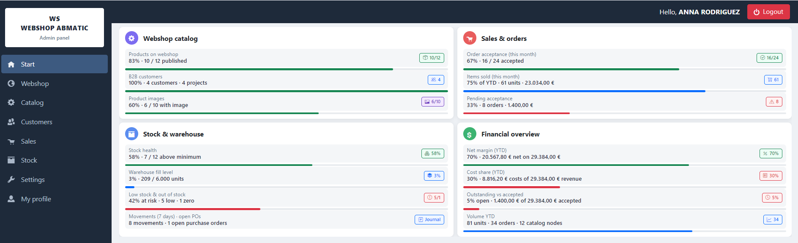
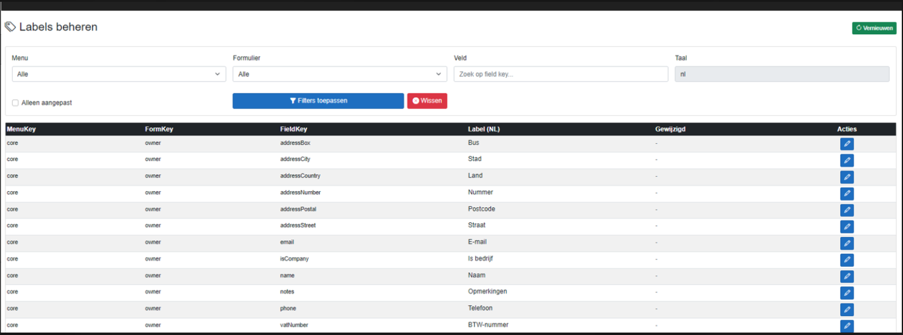

# Admin Panel — Functional Specification

   

> [!IMPORTANT]
> **Executive Summary:** The WebShopABMATIC **Admin Panel** is the staff-facing Blazor Server application for managing catalog, customers, orders, stock, and settings. It follows the AB-MATIC-style shell (sidebar, dashboard, hub cards, filter grids, forms) documented in the reference screenshots below. Access requires **Admin** or **Manager** roles via ASP.NET Core Identity.

### Coverage statistics

| Category | Count | Status | Notes |
|----------|-------|--------|-------|
| **Layout screenshots** | 3 | ✅ Documented | `main_screen`, `menu_screen`, `forms_screen` |
| **Sidebar menus** | 8 | ✅ Documented | Start through My profile |
| **Hub entities** | 22 | ✅ Documented | Full registration map |
| **Blazor routes** | 22+ | ✅ Complete | Dedicated `*List.razor` per hub entity (form + grid) |
| **Stock rules** | 6 | ✅ Documented | Min/max, reserve, low-stock KPI |

### Implementation quality

| Aspect | Status | Details |
|--------|--------|---------|
| **Shell + dashboard** | ✅ Complete | KPI cards via `IAdminDashboardPort` → `AdminDashboardUseCase` |
| **Hub navigation** | ✅ Complete | `AdminHubRegistry` mirrors sidebar |
| **List + forms** | ✅ Complete | All hub entities — Product pattern (form + grid) |
| **Product media** | ✅ Complete | `ProductAdminUseCase` + `IProductMediaPort` |
| **Financial widgets** | 🟡 Placeholder | YTD returns zero until accounting wired |

---

## Overview

| Artifact | Path | Role |
|----------|------|------|
| **Blazor app** | `Web/` | Runnable admin + store UI (legacy login — see §2.4) |
| **HTML prototype** | `docs/mock-admin.html` | Visual reference before Blazor |
| **Layout screenshots** | `docs/images/*_screen.png` | Approved shell patterns |
| **UI patterns** | `docs/PATTERNS_UI_QUICK_START.md` | Buttons, grids, forms |
| **Architecture** | `docs/SPEC_INFRASTRUCTURE.md` | Hexagonal layers, DI, connection strings |

### Implementation status

| Area | Status | Details |
|------|--------|---------|
| **Shell layout** | ✅ Implemented | Sidebar, top bar, logout, footer |
| **Dashboard KPIs** | ✅ Implemented | `IAdminDashboardPort` → `AdminDashboardUseCase` |
| **Hub navigation** | ✅ Implemented | 7 sidebar menus, entity cards |
| **Entity CRUD pages** | ✅ Implemented | 21 `*List.razor` pages (form + grid per entity) |
| **Product CRUD + media** | ✅ Implemented | `ProductAdminUseCase` + `IProductMediaPort` |
| **Stock alerts on dashboard** | ✅ Implemented | `Quantity <= MinQuantity` count |
| **Financial YTD widgets** | 🟡 Placeholder | Values return `0` until accounting wired |

---

## 🏗️ Backend architecture (hexagonal)

Admin Blazor pages **never** use EF directly. Each screen injects an **inbound port**; the Application layer runs **use cases**; Infrastructure provides **repository adapters**.

```text
ProductList.razor
  → IProductAdminPort                    (Application/Ports/Inbound)
  → ProductAdminUseCase                  (Application/UseCases/Admin)
  → IProductRepository + IProductMediaPort (Application/Ports/Outbound)
  → ProductRepository + LocalProductMediaService (Infrastructure)
  → WebShopABMATICDbContext              (Persistence)
```

| Concern | Project / folder |
|---------|------------------|
| UI (driving adapter) | `Web/Components/Pages/Admin/` |
| DTOs | `Application/Admin/{Entity}/` |
| Inbound ports | `Application/Ports/Inbound/IAdminPorts.cs` |
| Use cases | `Application/UseCases/Admin/*AdminUseCase.cs` |
| Outbound ports | `Application/Ports/Outbound/I*Repository.cs` |
| Domain rules | `Domain/` (e.g. `Catalog/Products/Product.cs`) |
| EF repositories | `Infrastructure/Persistence/Repositories/` |
| Hub card routes | `Infrastructure/Admin/AdminHubRegistry.cs` |

DI: `AddWebShopApplication()` registers use cases; `AddWebShopInfrastructure()` registers repositories and Identity.

## 🖥️ 1. Visual layout (reference screenshots)

The admin UI is defined by **three screen types**. These match the legacy AB-MATIC reference app and our HTML/Blazor mocks.

### 1.1 Main dashboard — `main_screen.png`



| Element | Behaviour |
|---------|-----------|
| **Sidebar** | Dark navigation; brand box **WS WEBSHOP ABMATIC**; menu items with Open Iconic icons |
| **Top bar** | Greeting **Hello, {STAFF NAME}**; red **Logout** button |
| **Content** | 2×2 **portfolio cards** with KPIs, progress indicators, and action pills |
| **Footer** | Current date + application version (`v1.0`) |

**Blazor route:** `/admin`  
**Purpose:** Landing page after login. Read-only summary with drill-down links to hubs (e.g. Webshop catalog → **Manage** → `/admin/hub/webshop`).

#### Dashboard widgets (vNext)

| Card | Metrics (data source) | Staff actions |
|------|----------------------|---------------|
| **Webshop catalog** | `Product.ShowOnWebshop` count; `WebshopStructure` node count | Open Webshop hub |
| **Sales & orders** | Orders this month; acceptance rate; pending `Order.IsAccepted = false` | Open Sales hub / order list |
| **Stock operations** | Low-stock count: `ProductStockLocation` where `Quantity <= MinQuantity` | Open Stock hub |
| **Financial · YTD** | Revenue, costs, net (accounting integration planned) | Reporting (future) |

---

### 1.2 Sub-menu hub — `menu_screen.png`


| Element | Behaviour |
|---------|-----------|
| **Back to start** | `btn-outline-secondary btn-sm` + `oi-arrow-left` |
| **Title + subtitle** | Menu name and one-line scope description |
| **Entity cards** | Icon circle, entity tag, title, description, full-width **"{Entity} form"** button |

**Blazor route:** `/admin/hub/{webshop|catalog|customers|sales|stock|settings|profile}`  
**Purpose:** Second navigation level — staff choose which **registration (master data)** to maintain before opening list or form screens.

---

### 1.3 List and form — `forms_screen.png`



| Element | Behaviour |
|---------|-----------|
| **List header** | Entity title; green **Refresh** (`btn-success btn-sm`) |
| **Filter panel** | Search, dropdowns, **Modified only** checkbox |
| **Apply Filters** | `btn btn-primary` + `bi-funnel-fill` |
| **Clear** | `btn btn-danger` + `bi-x-circle-fill` |
| **Grid** | `table-dark`, striped rows, icon-only **Edit** (`btn-sm btn-primary`) |
| **Form** | Card with **Save** / **Cancel**; field validation per UI patterns |

**Blazor routes:** e.g. `/admin/products`, `/admin/products/{id}`, `/admin/products/new`  
**Purpose:** Standard CRUD pattern for every hub entity.

---

## 🔐 2. Authentication and login

> [!IMPORTANT]
> **Runtime (current):** cookie auth via `LegacySignInService` — **not** ASP.NET Identity `AspNetUsers`.  
> Sections below that mention Identity as the live store are **historical targets**; do not treat them as current behaviour.

### 2.1 Technology (current)

| Item | Specification |
|------|----------------|
| **Provider** | Cookie authentication (`LegacyCookieAuthentication`) |
| **Cookie name** | `.WebShopABMATIC.Auth.Session` |
| **Sign-in service** | `LegacySignInService` |
| **Admin login page** | `/admin/login` → `POST /account/admin-login` |
| **Store login page** | `/sign-in` → `POST /account/store-login` |
| **Post-login redirect** | Admin/Manager → `/admin` (or `returnUrl`); Customer → store `returnUrl` or `/` |
| **Store session** | Customer: `IsPersistent=false` (browser session cookie) + sliding **15 min** idle; client idle logout via `store-session-timeout.js` |
| **Staff “remember me”** | Admin login may set `IsPersistent=true` when checked |
| **Server session store** | **None** — cookie alone is authoritative (no in-memory `StoreBrowserSession` gate) |
| **Blazor bridge** | `LegacyAuthenticationStateProvider` flows the cookie into Interactive Server circuits |

### 2.2 Roles and policies

| Role | Policy | Access |
|------|--------|--------|
| **Admin** | `AppPolicies.AdminOnly` | Full admin panel |
| **Manager** | `AppPolicies.AdminOrManager` | Operational admin menus |
| **Customer** | `AppPolicies.CustomerOnly` | **Storefront only** — profile, cart, checkout, **My orders** (`/orders`). **No** `/admin/*` |

### 2.3 Credentials (ERP / `abmatic_test`)

| Portal | Table | Fields |
|--------|-------|--------|
| **Admin (staff)** | `Settings.StaffUsers` (`Instellingen.User`) | `Login`, `Password` (plaintext in legacy DB) |
| **Store (customer)** | `Customers.Customers` (`Klanten.Klant`) | `WebshopLogin` / email, `PasswordWebshop`, `SaltWebshop` |

These are **two different identities** in the ABMATIC schema. A webshop customer account does **not** open the admin panel. Customer purchase history is on the **store**: `/orders`, `/orders/{id}`, `/my-account` — not under `/admin`.

### 2.4 Store registration

| Route | Purpose |
|-------|---------|
| `/sign-up` | Create webshop customer (`ICustomerRegistrationPort`) + auto store sign-in |
| `/sign-in` | Existing customer login |

### 2.5 Legacy StaffUsers in admin UI

`/admin/staff-users` remains for ERP/HR-style staff rows. **Admin authentication uses those rows today** via `SignInStaffAsync`. Any older note that “StaffUsers are not used for login” is **obsolete**.

### 2.6 Logout

- Admin top bar **Logout**; store header **Sign out** → `/account/logout`.

### 2.7 Password reset (dev / admin)

| Screen | Route | Who | Behaviour |
|--------|-------|-----|-----------|
| **System users** | `/admin/system-users` | Admin only | **Reset password** (grid or edit form): optional new password, or auto-generated temp password shown once |
| **Customers** | `/admin/customers` | Admin only (button) | **Reset webshop password** for customers with linked Identity account (`IdentityUserId`) |

Implementation: `IIdentityPasswordPort` → `UserManager.ResetPasswordAsync`. No email is sent in development — copy the temporary password from the success alert.

### 2.8 Current user context (Auth-6)

| Port | Implementation | Used for |
|------|----------------|----------|
| `ICurrentUserContext` | `HttpCurrentUserContext` | Resolve Identity user + legacy `StaffUsers.Id` bridge |

`CurrentUserSnapshot` exposes:

- `IdentityUserId`, `CustomerId`, `StaffUserId` (match `StaffUsers.Login` = Identity email)
- `AuditLabel` — varchar audit columns (`Customers.CreatedBy`, `Products.LastModifiedBy`)
- `ResolveLegacyUserId(fallback)` — int FK columns (`Orders.CreatedByUserId`, `AzureFiles.CreatedByUserId`)

**Writes updated:** webshop checkout orders, admin order create, product save/media, customer save.

**Legacy bridge:** no new column — staff resolved by email match; store orders fall back to customer `AccountManagerUserId`, then `1`.

**Migration backlog** (int FK tables): `Orders`, `OrderLogs`, `AzureFiles`, `CalendarEntry`, `TaskItem`, `Timesheet`, `OrderStructure`.

---

## 📋 3. Sidebar menus and registrations (master data)

Each sidebar item opens a **hub** of entity cards. Below: what staff **register and maintain** (CRUD), and primary database tables.

### 3.1 Menu summary

| # | Menu | Purpose | Hub entities |
|---|------|---------|--------------|
| 1 | **Start** | Dashboard only | — |
| 2 | **Webshop** | Storefront navigation and product grouping | `WebshopStructure`, `WebshopProductStructure` |
| 3 | **Catalog** | Products, pricing, options, suppliers | `Product`, `ProductPrice`, `ProductQuantityTier`, `ProductOption`, `PriceListCategory`, `Manufacturer`, `Supplier` |
| 4 | **Customers** | B2B accounts, addresses, discounts | `Customer`, `CustomerDeliveryAddress`, `CustomerProductDiscount`, `CustomerType` |
| 5 | **Sales** | Orders and fulfilment configuration | `Order`, `OrderStatus`, `DeliveryType` |
| 6 | **Stock** | Warehouses and quantities | `ProductStockLocation`, `StockLocation` |
| 7 | **Settings** | Payments, system users, VAT | `PaymentMethod`, `SystemUser` (Identity), `VatType` |
| 8 | **My profile** | Logged-in staff user | `StaffUser` (profile form) |

---

### 3.2 Webshop — storefront structure

| Entity | Table | What staff registers |
|--------|-------|----------------------|
| **Webshop structure** | `WebshopStructure` | Hierarchical **catalog menu** on the public site (`NameNl`, parent, `SortOrder`) |
| **Webshop product structure** | `WebshopProductStructure` | **Category labels** for the shop in NL/FR/EN |

**Store impact:** Drives category navigation on the web store (`WebshopStructure` chips / tree).

---

### 3.3 Catalog — products and pricing

| Entity | Table | What staff registers |
|--------|-------|----------------------|
| **Product** | `Product` | Master product: names, part numbers, supplier/manufacturer, **`ShowOnWebshop`**, `WebshopDescriptionNl`, EAN |
| **Product price** | `ProductPrice` | Price rows: gross/net sales and purchase, validity dates, assembly/installation |
| **Product quantity tier** | `ProductQuantityTier` | Volume discounts (`MinimumQuantity`, `Discount`) |
| **Product option** | `ProductOption` | Configurable options (required flag, sort order, price formulas) |
| **Price list category** | `PriceListCategories` | Sections for exported price lists |
| **Manufacturer** | `Manufacturer` | Brand/manufacturer master |
| **Supplier** | `Supplier` | Supplier master and price list metadata |

**Store impact:** Only `Product` with `ShowOnWebshop = true` appears on the storefront. Prices and options drive cart line calculations.

**Blazor status:** ✅ Full list + form for **Product**; other catalog entities — list/form routes prepared.

---

### 3.4 Customers — B2B accounts

| Entity | Table | What staff registers |
|--------|-------|----------------------|
| **Customer** | `Customer` | Company account, VAT, address, **`WebshopLogin`** + password hash, `CustomerTypeId`, `DeliveryTypeId` |
| **Customer delivery address** | `CustomerDeliveryAddress` | Ship-to addresses per customer |
| **Customer product discount** | `CustomerProductDiscount` | Customer-specific % discount per product (validity dates) |
| **Customer type** | `CustomerType` | Segment (dealer, contractor, …), base discount, default delivery |

**Store impact:** `WebshopLogin` is the customer sign-in on the web store. Discounts apply at checkout when implemented.

**Blazor status:** ✅ Customer **list**; form CRUD planned.

---

### 3.5 Sales — orders and workflow

| Entity | Table | What staff registers |
|--------|-------|----------------------|
| **Order** | `Order` + `OrderLine` | Sales orders: project link, acceptance, delivery type, discounts, line items |
| **Order status** | `OrderStatus` | Workflow steps; **`ReserveStock`**, **`AffectsStock`** flags |
| **Delivery type** | `DeliveryType` | Pickup, delivery, installation; cost inclusion rules |

**Staff workflows (vNext):**

- Review orders placed from the web store.
- Accept or reject (`Order.IsAccepted`).
- Progress status (drives stock reservation/consumption via `OrderStatus`).

**Blazor status:** ✅ Order **list**; detail editor planned.

---

### 3.6 Stock — inventory

| Entity | Table | What staff registers |
|--------|-------|----------------------|
| **Stock location** | `StockLocation` | Warehouses and storage sites (`IsWarehouse`) |
| **Product stock location** | `ProductStockLocation` | Per product/location: `Quantity`, `ReservedQuantity`, **`MinQuantity`**, **`MaxQuantity`**, last count |
| **Stock movement** | `StockMovements` | Historical in/out/reservation journal (read-only) |
| **Stock order (PO)** | `StockOrder` / `StockOrderLines` | Purchase orders (CRUD in Phase E) |

**Blazor routes (Stock hub):**

| Route | Page | Notes |
|-------|------|-------|
| `/admin/stock/overview` | Stock overview | KPI widgets + balance by location |
| `/admin/stock/movements` | Movement journal | Date/product filters, read-only grid |
| `/admin/product-stock` | Product stock | CRUD per product/location; **low-stock filter** |
| `/admin/stock/adjustment` | Stock adjustment | Manual inbound/outbound movements |
| `/admin/stock-locations` | Stock locations | Warehouse master data |

**Blazor status:** ✅ Overview + movement journal (Phase A); product stock + locations CRUD implemented.

---

### 3.7 Settings — platform configuration

| Entity | Table | What staff registers |
|--------|-------|----------------------|
| **System user** | `AspNetUsers` | Admin/Manager login accounts (email, roles, lockout) — `/admin/system-users` |
| **Payment method** | `PaymentMethod` | Pre-pay / post-pay methods (NL/FR/EN names) |
| **VAT type** | `VatType` | VAT rates and invoice text |

> Legacy **User group** and **Staff user** pages remain at `/admin/user-groups` and `/admin/staff-users` but are hidden from the Settings hub (MVP).

> [!WARNING]
> **System user** management is **Admin-only** (`AppPolicies.AdminOnly`). Managers cannot create admin accounts.

> Legacy **Staff user** (`[Settings].[StaffUsers]`) is the **current** admin login source (`SignInStaffAsync`). System-users / AspNetUsers Identity path is not the active storefront/admin runtime.

---

## 📦 4. Stock validation and alerts

Stock rules connect **admin maintenance**, **order workflow**, and the **storefront display**.

### 4.1 Data model (registrations)

| Field | Entity | Meaning |
|-------|--------|---------|
| `Quantity` | `ProductStockLocation` | On-hand stock at a location |
| `ReservedQuantity` | `ProductStockLocation` | Allocated to orders not yet fulfilled |
| `MinQuantity` | `ProductStockLocation` | **Reorder / low-stock threshold** |
| `MaxQuantity` | `ProductStockLocation` | Upper storage guideline |
| `ReserveStock` | `OrderStatus` | When order enters this status, stock is reserved |
| `AffectsStock` | `OrderStatus` | When order reaches this status, stock quantities are updated |

### 4.2 Admin validations and alerts

| Rule | Where enforced | Behaviour |
|------|----------------|-----------|
| **Low stock alert** | Dashboard + **`StockLowAlerts`** | Count + banner + **Products below minimum** table |
| **Low stock review** | `/admin/product-stock?lowStock=true` | **All / Low stock** toggle; red rows; product name column |
| **Dismiss stock alerts** | Dashboard **Dismiss all** | Marks `StockLowAlerts` read |
| **Stock adjustment** | `/admin/stock/adjustment` | Signed qty + reason (not via grid quantity edit) |
| **Movement journal** | `/admin/stock/movements` | Filter by date, product, reservation |
| **Stock overview** | `/admin/stock/overview` | KPIs: low stock, movements (7d), open POs |
| **Inactive location** | `ProductStockLocation.IsInactive` | Exclude from availability (planned UI filter) |
| **Negative quantity** | Form validation (planned) | Block save if `Quantity < 0` |
| **Reserved vs available** | Business logic (planned) | Available = `Quantity - ReservedQuantity` (conceptual) |

### 4.3 Storefront stock display (linked behaviour)

| Rule | Where | Behaviour |
|------|-------|-----------|
| **Show availability hint** | Product detail / catalog | “N in stock” from default `ProductStockLocation` |
| **Low stock styling** | Catalog cards | Orange when `Stock <= MinQuantity` (`IsLowStock`) |
| **Out of stock** | Catalog + detail | Red “Out of stock” when `Stock <= 0`; disable add where applicable |
| **Block add-to-cart** | Cart / checkout | ✅ Server validates available qty at checkout |
| **ShowOnWebshop gate** | Catalog query | Product hidden unless `ShowOnWebshop = true` |

> [!TIP]
> Store stock display is **informational** in the HTML mock; hard validation at checkout will be enforced in the Blazor storefront service layer.

---

## 📊 5. Dashboards and reporting

### 5.1 Start dashboard (`/admin`)

Primary operational dashboard — see [§1.1](#11-main-dashboard--main_screenpng).

| KPI | Calculation (current implementation) |
|-----|--------------------------------------|
| Products on webshop | `COUNT(Product WHERE ShowOnWebshop = true)` |
| Webshop structure nodes | `COUNT(WebshopStructure)` |
| Orders this month | `COUNT(Order WHERE CreatedAt >= month start)` |
| Pending acceptance | `COUNT(Order WHERE IsAccepted = false)` |
| Low stock alerts | `COUNT(ProductStockLocation WHERE Quantity <= MinQuantity)` |
| Revenue / costs / net YTD | Placeholder `0` until accounting module connected |

### 5.2 Future dashboards (planned)

| Dashboard | Audience | Content |
|-----------|----------|---------|
| **Sales pipeline** | Manager | Orders by `OrderStatus`, acceptance SLA |
| **Stock overview** | Warehouse | Locations under min, reserved vs on-hand |
| **Customer revenue** | Admin | Top customers, discounts applied |
| **Webshop analytics** | Marketing | Popular products, conversion (requires telemetry) |

---

## 🔄 6. Functional flows (staff)

```mermaid
flowchart TD
  Login[/Account/Login] --> Admin[/admin Dashboard]
  Admin --> Hub[/admin/hub/catalog]
  Hub --> List[/admin/products]
  List --> Form[/admin/products/id]
  Form --> List
  List --> Hub
  Hub --> Admin
  Admin --> Logout[Logout]
```

### 6.1 Typical tasks

| Task | Navigation path |
|------|-----------------|
| Publish product on webshop | Catalog → Product → set **ShowOnWebshop** |
| Set customer web login | Customers → Customer → **WebshopLogin** |
| Review new store order | Sales → Order → filter pending acceptance |
| Fix low stock | Stock → Product stock → increase **Quantity** or adjust **MinQuantity** |
| Add delivery address | Customers → Delivery address |

---

## ⚙️ 7. Blazor implementation map

| Screen type | Prototype | Blazor |
|-------------|-----------|--------|
| Dashboard | `mock-admin.html` `#view-dashboard` | `Components/Pages/Admin/Dashboard.razor` |
| Hub | `#view-hub` | `Hub.razor` |
| List | `#view-list` | `ProductList.razor`, `CustomerList.razor`, `OrderList.razor` |
| Form | `#view-form` | `ProductForm.razor` |
| Shell | sidebar + top bar | `AdminLayout`, `AdminSidebar`, `AdminTopBar` |

### 7.1 Run locally

```bash
cd Web
dotnet run
```

1. Open the HTTPS URL from the console.
2. Sign in with a `StaffUsers` login from the connected database.
3. Land on `/admin`.

> [!NOTE]
> Domain data requires Azure SQL with the ABMATIC schema (`connWebShopABMATIC` → `abmatic_test`). Login is legacy tables only — **not** Identity migrations.

---

## ✅ 8. Validation and UI standards

All admin screens MUST follow [PATTERNS_UI_QUICK_START.md](PATTERNS_UI_QUICK_START.md):

| Control | Rule |
|---------|------|
| Back navigation | `oi-arrow-left`, `btn-outline-secondary btn-sm` |
| Grid edit | Icon-only `btn-sm btn-primary` |
| Apply / Clear filters | Full-size `btn-primary` / `btn-danger` |
| Form save | `btn-primary` with spinner when saving |
| Tables | `table-dark`, `table-striped`, `@key` on rows |
| Required fields | `*` in label, validation on blur (Blazor forms) |

---

## Documentation

- 🏠 [Main Documentation](../README.md) — Project overview and requirements

---

**© 2026 AdminSense. All rights reserved.**
