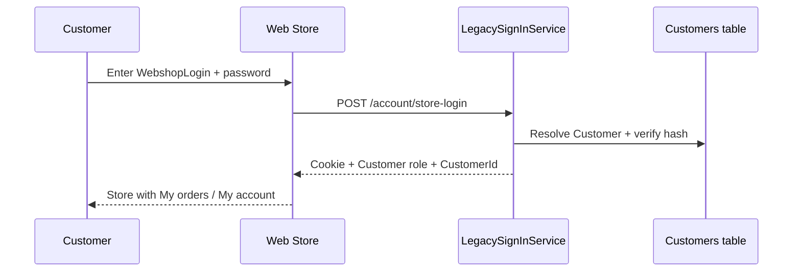
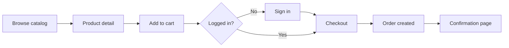

# Web Store — Functional Specification

  

> [!IMPORTANT]
> **Executive Summary:** B2B storefront for catalog, cart, checkout (**Mollie mock PrePay** until the client sends API keys — see [SPEC_MOLLIE_PAYMENTS_open.md](./SPEC_MOLLIE_PAYMENTS_open.md)), and **customer account area** (profile + **order history**). Customer never uses `/admin` for their own purchases — that is staff-only ([SPEC_ADMIN.md](./SPEC_ADMIN.md)).

### Coverage statistics

| Category | Count | Status | Notes |
|----------|-------|--------|-------|
| **Auth flows** | 2 | ✅ | Customer `/sign-in`; staff `/admin/login` (separate ERP tables) |
| **Account area** | 3 | ✅ | `/my-account`, `/orders`, `/orders/{id}` |
| **Checkout** | PrePay | ✅ | Cart → **Mollie mock** (required until client keys) → payment-return → confirmation |

### Implementation quality

| Aspect | Status | Details |
|--------|--------|---------|
| **Catalog UX** | ✅ | `IStoreCatalogPort` — lazy products per category; icons on demand |
| **Checkout** | ✅ | `CheckoutUseCase` + **`Mollie:UseMock`** until client delivers keys; stock on pay |
| **Customer login** | ✅ | Legacy `WebshopLogin` + hash/salt → role `Customer` |
| **Order history** | ✅ | Header **My orders** → `/orders`; detail `/orders/{id}` |
| **Staff entry** | ✅ | Header **Admin** → `/admin/login` (`StaffUsers`) |

---

## Overview

| Artifact | Path | Role |
|----------|------|------|
| **Store UI** | `WebShopABMATIC.Client/Components/Pages/Store/` | Blazor storefront |
| **Admin data** | ERP tables via repositories | Maintained in admin panel |
| **Admin spec** | [SPEC_ADMIN.md](./SPEC_ADMIN.md) | Staff panel + auth §2 |

### Implementation status

| Area | Blazor | Backend |
|------|--------|---------|
| **Catalog browse** | ✅ `Catalog.razor` | `StoreCatalogService` |
| **Product detail** | ✅ `ProductDetail.razor` | Same port |
| **Cart / checkout** | ✅ `Cart.razor` | `StoreCartService` + `ICheckoutPort` |
| **Orders list** | ✅ `Orders.razor` | `ICheckoutPort.GetCustomerOrdersAsync` |
| **Order detail / confirmation** | ✅ | `GetOrderSummaryAsync` |
| **Customer sign-in** | ✅ `SignIn.razor` | `POST /account/store-login` |
| **Admin entry** | ✅ Header **Admin** | `POST /account/admin-login` |

### Backend architecture (hexagonal)

Store pages inject **inbound ports** only — same hexagonal stack as admin:

```text
Catalog.razor
  → IStoreCatalogPort              (Application/Ports)
  → StoreCatalogService            (Infrastructure/Store)
  → WebShopABMATICDbContext + IProductMediaPort
```

Future: `IOrderService` / `ICartService` as inbound ports with use cases in Application; checkout persists via outbound `IOrderRepository`.

---

## 🛒 1. Visual design and catalog imagery

The storefront uses a **light blue** theme (`--primary: #0ea5e9`, soft backgrounds). Product cards show image, name, price, and stock hint.

### 1.1 Catalog products (prototype SKUs)

| SKU | Image | Mock name | Category | Mock stock |
|-----|-------|-----------|----------|------------|
| 1 |  | Hard drive 1 | storage | 24 |
| 2 |  | Hard drive 2 | storage | 18 |
| 3 |  | Hard drive 3 | ssd | 32 |
| 4 |  | Hard drive 4 | ssd | 15 |
| 5 |  | Hard drive 5 | hdd | 9 (low) |
| 6 |  | Hard drive 6 | hdd | 41 |

**Production mapping:** Each row becomes a `Product` with `ShowOnWebshop = true`, linked `ProductPrice` for `GrossSalesPrice`, and `ProductStockLocation.Quantity` for availability.

### 1.2 Screen regions (prototype)

| Region | Purpose |
|--------|---------|
| **Header** | Logo, search, account menu, cart badge |
| **Category chips** | Filter by `WebshopStructure` / category id |
| **Product grid** | Cards with image, price, stock line |
| **Product detail** | Large image, description, options, quantity, add to cart |
| **Cart drawer / page** | Line items, quantities, subtotal |
| **Checkout** | Delivery address, delivery type, payment method, confirm |
| **Account** | Profile, orders history, delivery addresses |
| **Footer** | Link to admin panel (staff) |

Open the prototype:

```text
docs/mock-loja.html
```

(relative to repository root; open in browser or via static file server)

---

## 🔐 2. Authentication and login

### 2.1 Customer identity model

| Concept | Entity / field | Description |
|---------|----------------|-------------|
| **Store login** | `Customer.WebshopLogin` / email | Shop username |
| **Password** | `PasswordWebshop` + `SaltWebshop` | Legacy hash (not AspNetUsers at runtime) |
| **Role** | `AppRoles.Customer` | Policy `CustomerOnly` for store routes |

> [!NOTE]
> Customers typically get credentials from admin (`WebshopLogin`). Self-register exists at `/sign-up` when enabled.

### 2.2 Login flow



| Step | Behaviour |
|------|-----------|
| 1 | Customer opens **Login** → `/sign-in` |
| 2 | Enters webshop login + password |
| 3 | Cookie session (`.WebShopABMATIC.Auth.Session`); `CustomerId` for pricing, addresses, orders |
| 4 | Header shows **My orders** + account name |

**Runtime:** `Customers.WebshopLogin` + hash/salt on `abmatic_test`.

**Session rules (store):**
- Session cookie (`IsPersistent=false`) — ends when the browser is closed.
- Sliding idle **15 minutes** (cookie + `store-session-timeout.js` → `/account/logout`).
- Auth validity = cookie only (no server-side in-memory browser-session dictionary).
- Interactive catalog uses `InteractiveServer` with **prerender on** so HTML (nav/links) renders before the SignalR circuit connects.

### 2.3 Logout

- Header **Sign out** → `/account/logout`. Guest may browse catalog; checkout needs login.

### 2.4 Staff access from store

- Header **Admin** → `/admin/login` with **StaffUsers** credentials (separate from customer).
- Customers must not access `/admin/*` (`AdminOrManager` policy).
- **Customer order history is never in admin for that buyer’s self-service** — use store **My orders**.

---

## 📋 3. Registrations and master data (what the store consumes)

The store does not own master data; it **reads** configurations maintained in the admin panel.

### 3.1 Data dependencies

| Admin registration | Store usage |
|--------------------|-------------|
| **Product** + `ShowOnWebshop` | Visible catalog |
| **ProductPrice** | Current valid sales price per product |
| **ProductQuantityTier** | Volume discount at quantity breaks |
| **ProductOption** | Configurable lines on product detail |
| **WebshopStructure** / **WebshopProductStructure** | Navigation and category filters |
| **Customer** | Login, company name, default terms |
| **CustomerDeliveryAddress** | Checkout ship-to selection |
| **CustomerProductDiscount** | Customer-specific price override |
| **CustomerType** | Default discount %, delivery defaults |
| **DeliveryType** | Checkout delivery options and costs |
| **PaymentMethod** | Checkout payment choice |
| **VatType** | Line and order VAT calculation |
| **ProductStockLocation** | Stock hints and cart validation |

### 3.2 Customer-facing “registrations”

| Action | Who | Result |
|--------|-----|--------|
| **Account created** | Admin | New `Customer` + `WebshopLogin` |
| **Delivery address added** | Customer (profile) or Admin | `CustomerDeliveryAddress` |
| **Order placed** | Customer | New `Order` + `OrderLine` rows |
| **Password change** | Customer | Update Identity password (and legacy hash if synced) |

---

## 🧩 4. Storefront functionality

### 4.1 Catalog and search

| Feature | Description | Validation / rules |
|---------|-------------|-------------------|
| **Product list** | Grid of products with image, name, price | Only `ShowOnWebshop = true` |
| **Category filter** | Chips map to `WebshopStructure` ids | Empty category shows no products |
| **Search** | Text match on name, part number, EAN | Case-insensitive (planned server-side) |
| **Sort** | Price, name (planned) | — |

### 4.2 Product detail

| Feature | Description |
|---------|-------------|
| **Hero image** | From product media or default asset |
| **Meta line** | `ProductId`, `ShowOnWebshop`, tags |
| **Description** | `WebshopDescriptionNl` / EN / FR |
| **Price** | Current `ProductPrice.GrossSalesPrice` (customer discounts applied) |
| **Options** | Required/optional `ProductOption` values |
| **Stock line** | e.g. “24 in stock” from stock location |
| **Quantity** | Spinner before add to cart |
| **Add to cart** | Creates/updates cart line with options |

### 4.3 Cart

| Feature | Description |
|---------|-------------|
| **Line items** | Product, qty, unit price, option surcharges |
| **Update qty** | Recalculate tiers and totals |
| **Remove line** | — |
| **Subtotal / VAT** | Per `VatType` on lines |
| **Persistence** | Logged-in: server cart; guest: session (TBD) |

### 4.4 Checkout

| Step | Fields / logic |
|------|----------------|
| **Delivery address** | Select `CustomerDeliveryAddress` or default |
| **Delivery type / frete** | From ERP only — see [DATA_FREIGHT_DELIVERY.md](./DATA_FREIGHT_DELIVERY.md). Customer `DeliveryTypeId` (`Klant.LeverigsType`) → `OrderDeliveryTypeProduct` products → `ProductPrices.GrossSalesPrice`. **No hardcoded fee.** Missing link/price → **€0**. User selects at most one freight product (Dutch `ProdName`). |
| **Payment method** | `PaymentMethod` (Mollie mock until client keys) |
| **Review** | Lines, delivery fee, VAT, total |
| **Submit** | Create `Order`, `OrderLine`; delivery line when fee &gt; 0 (`IsLeveringsTypeProduct`) |

### 4.5 Account area (logged-in customer)

| Screen | Route | Content |
|--------|-------|---------|
| **My orders** | `/orders` | List of this customer’s orders + payment status |
| **Order detail** | `/orders/{id}` | Lines, totals, Mollie id when PrePay |
| **Order confirmation** | `/orders/{id}/confirmation` | After successful pay; links back to My orders |
| **My account** | `/my-account` | Profile + link to My orders; password change |
| **Nav** | `StoreHeader` | **My orders** + account name when role `Customer` |

> [!IMPORTANT]
> After checkout, the customer stays in the **store** account area. Staff use `/admin/orders` to see **all** customers’ orders.

---

## 📦 5. Stock validation

Stock behaviour must stay **consistent** with admin rules ([SPEC_ADMIN.md §4](SPEC_ADMIN.md#4-stock-validation-and-alerts)).

### 5.1 Display rules (catalog and detail)

| Condition | UI behaviour | Implementation |
|-----------|----------------|----------------|
| `available > 0` + list price | Show **€…** to guests and customers (list price; customer discounts when logged in) | `StoreProductCard` / detail — **not** “login to see price” |
| `available > 0` + no ERP price | **Price on request** | `!HasPrice` (`HasNoPrice` or missing `ProductPrice`) |
| `available > MinQuantity` (or min = 0) | Optional green “N in stock” on legacy cards | `StoreProductDto` from default location |
| `available <= MinQuantity` and `> 0` | Orange **low** class | `IsLowStock` — uses DB `MinQuantity`, not hardcoded 10 |
| `available = 0` | **Out of stock** (card label + cart button disabled) | `IsOutOfStock` — do **not** use “Unavailable” |
| Product not on webshop | Hidden | `ShowOnWebshop != true` |

**Login:** required when **buying** (add to cart / checkout), not to browse or view list price (§9.1).

**Implemented** in `StoreCatalogService`, `StoreProductCard.razor`, `ProductCartButton.razor`, `StoreSearchModal.razor`, `ProductDetail.razor`, `StorePriceFormatter.FormatListPrice`.

### 5.2 Cart and checkout validation

| Rule | When | Action |
|------|------|--------|
| **Reserve on pay** | PrePay after order create | ✅ `ApplyReservationFromOrderAsync` (release if pay fails) |
| **Sufficient stock** | Quote + place order | ✅ Reject if `requestedQty > available` (`CheckoutUseCase.BuildQuoteAsync`) |
| **Stale cart (stock hit 0 later)** | Cart still has the line | ✅ Keep line; show **blocking** UI (danger alert, Out of stock / “only N left”, disabled checkout). Do **not** auto-remove. |
| **Consume on fulfilment** | Status with `AffectsStock` / sale on pay | ✅ via `IStockMovementService` |
| **Multi-location** | Warehouse selection (future) | Pick `ProductStockLocation` with `IsDefault` or nearest |

**UI:** `Cart.razor` — blocking quote errors disable **Place order** (label: “Cannot place order — fix stock”); line badge + Remove link. Server still re-checks on `PlaceOrderAsync`.

### 5.3 Order status interaction

| `OrderStatus` flag | Effect on stock |
|--------------------|-----------------|
| `ReserveStock = true` | Reserve quantity when order enters status |
| `AffectsStock = true` | Deduct on-hand when order reaches status |

Configured by staff in admin → **Sales** → **Order status**.

---

## 💰 6. Pricing and discounts

| Source | Applied when |
|--------|--------------|
| **ProductPrice** (valid date range) | All customers — base list price |
| **ProductQuantityTier** | Line quantity meets `MinimumQuantity` |
| **CustomerProductDiscount** | Logged-in customer, matching product |
| **CustomerType** base discount | Default % for customer segment |

**Display:** Show struck-through list price when discount applies (planned).

---

## 📊 7. Dashboards (customer vs operations)

### 7.1 Customer-facing (store)

| View | Purpose |
|------|---------|
| **Order history** | Status, date, total, lines |
| **Open orders** | Awaiting acceptance / shipment |
| **Quick reorder** | Copy lines from past `Order` (planned) |

No financial YTD dashboard on the store — that remains **admin** ([SPEC_ADMIN.md §5](SPEC_ADMIN.md#5-dashboards-and-reporting)).

### 7.2 Operational visibility (admin only)

Store activity appears on the **admin dashboard**:

- Orders this month / pending acceptance
- Products on webshop count
- Low stock alerts affecting catalog availability

---

## ✅ 8. Validations summary

| Area | Rule |
|------|------|
| **Login** | Valid credentials; account active; lockout after failed attempts (Identity) |
| **Catalog** | `ShowOnWebshop`; inactive products excluded |
| **Cart qty** | Integer &gt; 0; max per tier if configured |
| **Stock** | Available quantity ≥ line qty at checkout |
| **Required options** | All `ProductOption` with `IsRequired` selected |
| **Checkout** | Delivery address and type required; payment method required |
| **VAT** | Valid `VatType` on lines |
| **Authorization** | Customer may only see own `Order` and `CustomerId` data |

---

## 🔄 9. User journeys



### 9.1 Guest vs logged-in

| Capability | Guest | Logged-in customer |
|------------|-------|-------------------|
| Browse catalog | ✅ | ✅ |
| View prices | **List price** (or Price on request / Out of stock) | List + customer discounts |
| Add to cart | ❌ → redirect `/sign-in` (buy gate) | ✅ (persisted cart) |
| Checkout | ❌ | ✅ |
| Order history | ❌ | ✅ |

> Guest UI must **not** show “Meld u aan om uw prijs te zien” / “login to see price” on product cards. Login is only for purchasing.

---

## 🗺️ 10. Prototype vs production roadmap

| Milestone | Deliverable |
|-----------|-------------|
| **M1** | HTML prototype — UX sign-off (`mock-loja.html`) |
| **M2** | Blazor storefront project, shared Application/Infrastructure |
| **M3** | Identity Customer login bound to `Customer.WebshopLogin` |
| **M4** | Live catalog from SQL + real images |
| **M5** | Cart, checkout, `Order` creation, stock validation |
| **M6** | Customer account area and order tracking |

---

## 📁 11. Related files

| File | Description |
|------|-------------|
| `docs/mock-loja.html` | Full storefront prototype |
| `docs/images/product*.png` | Product thumbnails |
| `docs/mock-admin.html` | Admin prototype (linked from store footer) |
| [MOCK_PROTOTYPE_GUIDE.md](MOCK_PROTOTYPE_GUIDE.md) | Screen-by-screen entity mapping |

### Run prototype

Open `docs/mock-loja.html` in a browser. No build required.

---

## Documentation

- 🏠 [Main Documentation](../README.md) — Project overview and requirements

---

**© 2026 AdminSense. All rights reserved.**
