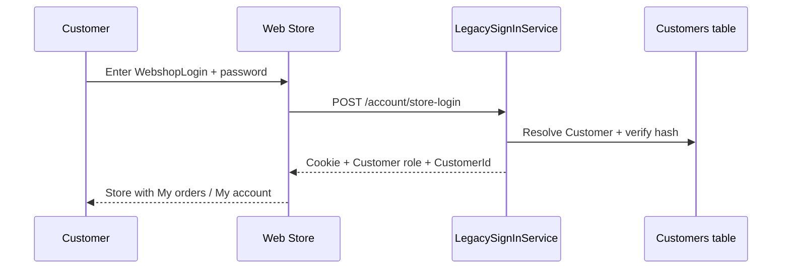
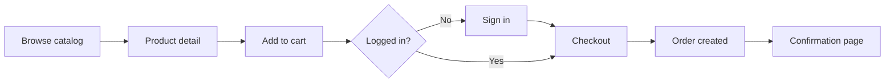
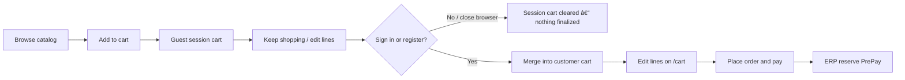

# Web Store — Functional Specification

<p style="display:flex;flex-wrap:nowrap;gap:0.35rem;align-items:center;overflow-x:auto;margin:0.5rem 0 0;"></p>

> [!IMPORTANT]
> **Executive Summary:** B2B storefront for catalog, cart, checkout (**Mollie mock PrePay** until the client sends API keys — see [SPEC_MOLLIE_PAYMENTS_open.md](./SPEC_MOLLIE_PAYMENTS_open.md)), and **customer account area** (profile + **order history**). Customer never uses `/admin` for their own purchases — that is staff-only ([SPEC_ADMIN.md](./SPEC_ADMIN.md)).

### Coverage statistics

| Category | Count | Status | Notes |
|----------|-------|--------|-------|
| **Auth flows** | 2 | ✅ | Customer `/sign-in`; staff `/admin/login` (separate ERP tables) |
| **Account area** | 3 | ✅ | `/my-account`, `/orders`, `/orders/{id}` |
| **Checkout** | PrePay | ✅ | Cart → **Mollie mock** (required until client keys) → payment-return → confirmation |

### Implementation quality

| Aspect | Status | Details |
|--------|--------|---------|
| **Catalog UX** | ✅ | `IStoreCatalogPort` — lazy products per category; icons on demand |
| **Checkout** | ✅ | `CheckoutUseCase` + **`Mollie:UseMock`** until client delivers keys; stock on pay |
| **Customer login** | ✅ | Legacy `WebshopLogin` + hash/salt → role `Customer` |
| **Order history** | ✅ | Header **My orders** → `/orders`; detail `/orders/{id}` |
| **Staff entry** | ✅ | Header **Admin** → `/admin/login` (`StaffUsers`) |

---

## Overview

| Artifact | Path | Role |
|----------|------|------|
| **Store UI** | `WebShopABMATIC.Client/Components/Pages/Store/` | Blazor storefront |
| **Admin data** | ERP tables via repositories | Maintained in admin panel |
| **Admin spec** | [SPEC_ADMIN.md](./SPEC_ADMIN.md) | Staff panel + auth §2 |

### Implementation status

| Area | Blazor | Backend |
|------|--------|---------|
| **Catalog browse** | ✅ `Catalog.razor` | `StoreCatalogService` |
| **Product detail** | ✅ `ProductDetail.razor` | Same port |
| **Cart / checkout** | ✅ `Cart.razor` | `StoreCartService` + `ICheckoutPort` |
| **Orders list** | ✅ `Orders.razor` | `ICheckoutPort.GetCustomerOrdersAsync` |
| **Order detail / confirmation** | ✅ | `GetOrderSummaryAsync` |
| **Customer sign-in** | ✅ `SignIn.razor` | `POST /account/store-login` |
| **Admin entry** | ✅ Header **Admin** | `POST /account/admin-login` |

### Backend architecture (hexagonal)

Store pages inject **inbound ports** only — same hexagonal stack as admin:

```text
Catalog.razor / ProductDetail.razor / Cart.razor
  → IStoreCatalogPort / ICheckoutPort     (Application/Ports)
  → StoreCatalogService / CheckoutUseCase (Infrastructure + Application)
  → WebShopABMATICDbContext + IProductMediaPort + order/stock ports
```

Cart state: `StoreCartService` (client). Checkout quote/place-order: `CheckoutUseCase` (server). No DbContext in Razor.

---

## 🛒 1. Visual design and catalog imagery

The storefront uses a **light blue** theme (`--primary: #0ea5e9`, soft backgrounds). Product cards show image, name, price, and stock hint.

### 1.1 Live catalog (ERP)

Catalog rows come from live `abmatic_test` — products with `ShowOnWebshop = true`, prices from `ProductPrices`, stock from `ProductStockLocation`, images from Azure Blob / `AzureFiles` ([DATA_AZUREBLOB.md](./DATA_AZUREBLOB.md)). ERP product names stay as stored (often Dutch). Guests see **list price** (or Out of stock / Price on request) — §5.1.

Historical HTML UX mocks (not the live store): `docs/mocks/`.

### 1.2 Screen regions

| Region | Purpose |
|--------|---------|
| **Header** | Logo, search, account menu, cart badge (`StoreHeader`) |
| **Category / sidebar** | `WebshopStructure` navigation (Adminsence-style layout) |
| **Product grid** | Cards with image, price, stock line |
| **Product detail** | Image, description, options, quantity, add to cart |
| **Cart / checkout** | Line items, freight select, address, payment, place order |
| **Account** | Profile, orders history |
| **Footer** | Staff link to `/admin/login` |

---

## 🔐 2. Authentication and login

### 2.1 Customer identity model

| Concept | Entity / field | Description |
|---------|----------------|-------------|
| **Store login** | `Customer.WebshopLogin` / email | Shop username |
| **Password** | `PasswordWebshop` + `SaltWebshop` | Legacy hash (not AspNetUsers at runtime) |
| **Role** | `AppRoles.Customer` | Policy `CustomerOnly` for store routes |

> [!NOTE]
> Customers typically get credentials from admin (`WebshopLogin`). Self-register exists at `/sign-up` when enabled.

### 2.2 Login flow


```mermaid
sequenceDiagram
  participant C as Customer
  participant S as Web Store
  participant L as LegacySignInService
  participant DB as Customers table

  C->>S: Enter WebshopLogin + password
  S->>L: POST /account/store-login
  L->>DB: Resolve Customer + verify hash
  L-->>S: Cookie + Customer role + CustomerId
  S-->>C: Store with My orders / My account
```

| Step | Behaviour |
|------|-----------|
| 1 | Customer opens **Login** → `/sign-in` |
| 2 | Enters webshop login + password |
| 3 | Cookie session (`.WebShopABMATIC.Auth.Session`); `CustomerId` for pricing, addresses, orders |
| 4 | Header shows **My orders** + account name |

**Runtime:** `Customers.WebshopLogin` + hash/salt on `abmatic_test`.

**Session rules (store):**
- Session cookie (`IsPersistent=false`) — ends when the browser is closed.
- Sliding idle **15 minutes** (cookie + `store-session-timeout.js` → `/account/logout`).
- Auth validity = **cookie only** — Blazor never revives identity from prerender persisted state.
- Interactive catalog uses `InteractiveServer` with **prerender on** so HTML (nav/links) renders before the Blazor circuit connects.

### 2.3 Logout

- Header **Sign out** → `/account/logout`. Guest may browse catalog; checkout needs login.

### 2.4 Staff access from store

- Header **Admin** → `/admin/login` with **StaffUsers** credentials (separate from customer).
- Customers must not access `/admin/*` (`AdminOrManager` policy).
- **Customer order history is never in admin for that buyer’s self-service** — use store **My orders**.

---

## 📋 3. Registrations and master data (what the store consumes)

The store does not own master data; it **reads** configurations maintained in the admin panel.

### 3.1 Data dependencies

| Admin registration | Store usage |
|--------------------|-------------|
| **Product** + `ShowOnWebshop` | Visible catalog |
| **ProductPrice** | Current valid sales price per product |
| **ProductQuantityTier** | Volume discount at quantity breaks |
| **ProductOption** | Configurable lines on product detail |
| **WebshopStructure** / **WebshopProductStructure** | Navigation and category filters |
| **Customer** | Login, company name, default terms |
| **CustomerDeliveryAddress** | Checkout ship-to selection |
| **CustomerProductDiscount** | Customer-specific price override |
| **CustomerType** | Default discount %, delivery defaults |
| **DeliveryType** | Checkout delivery options and costs |
| **PaymentMethod** | Checkout payment choice |
| **VatType** | Line and order VAT calculation |
| **ProductStockLocation** | Stock hints and cart validation |

### 3.2 Customer-facing “registrations”

| Action | Who | Result |
|--------|-----|--------|
| **Account created** | Admin | New `Customer` + `WebshopLogin` |
| **Delivery address added** | Customer (profile) or Admin | `CustomerDeliveryAddress` |
| **Order placed** | Customer | New `Order` + `OrderLine` rows |
| **Password change** | Customer | Update legacy webshop hash/salt on `Customers` (no AspNet Identity) |

---

## 🧩 4. Storefront functionality

### 4.1 Catalog and search

| Feature | Description | Validation / rules |
|---------|-------------|-------------------|
| **Product list** | Grid of products with image, name, price | Only `ShowOnWebshop = true` |
| **Category tree** | Left sidebar (`ProductStructure` / optional `WebshopStructure`) | Leaf nodes show product grid; parents show child tiles (CD4) |
| **Facet filters** | Checkbox sidebar on **leaf** categories from product attributes | Data: `[Products].[ProductAttribuut]` + `[Products].[ProductAttribuutItem]` (`Waarde` per product). Distinct values + counts for products in the leaf. Enabled when the leaf has attribute data. **Layout unchanged** (`Catalog.razor` + `StoreFacetSidebar`). Query: `attr=id:value|…`. Guests may browse/filter. See [PLAN_CATALOG_FILTERS.md](./PLAN_CATALOG_FILTERS.md). **Not** `ProductOption`. **Not** legacy `ProductProperty`. |
| **Search** | Header modal | Server `SearchProductsAsync` (name prefix) |
| **Sort** | As offered in UI | Optional; not a separate server sort API yet |

### 4.2 Product detail

| Feature | Description |
|---------|-------------|
| **Hero image** | From product media or default asset |
| **Meta line** | `ProductId`, `ShowOnWebshop`, tags |
| **Description** | Cascade: `WebshopDescriptionNl` → `DescriptionNl` → `DescriptionEn` → `DescriptionFr` (first non-empty). When ERP has none, UI shows **No description** (muted). Staff fill webshop/ERP description fields to show real text. |
| **Price** | Current `ProductPrice.GrossSalesPrice` (customer discounts applied) |
| **Options** | Required/optional `ProductOption` via `StoreProductOptionsForm` (UI gates add) |
| **Stock line** | Available qty from default stock location |
| **Quantity** | Spinner before add to cart |
| **Add to cart** | Creates/updates cart line with options. **Guests allowed**. UI stays on product/catalog (header cart badge updates); open `/cart` when ready. Login/register required only to **place order & pay** |

### 4.3 Cart

| Feature | Description |
|---------|-------------|
| **Route** | `/cart` — guests and customers see lines; checkout (quote / place order) requires customer sign-in |
| **Line items** | Product, qty, unit price, option surcharges; guest or customer may change qty / remove before pay |
| **Update qty** | Recalculate tiers and totals |
| **Remove line** | Allowed before place-order (guest or logged-in) |
| **Subtotal / VAT** | List-price estimate for guests; customer quote (discounts + freight) when signed in |
| **Persistence** | **Session storage only** (guest + customer keys). Cleared on **Sign out** or when the browser session ends — no localStorage cart |
| **Sidebar** | Guest: sign-in / create-account CTA. Customer: delivery, ERP freight, payment method, **Place order & pay** |

### 4.4 Checkout

| Step | Fields / logic |
|------|----------------|
| **Delivery address** | Select `CustomerDeliveryAddress` or default |
| **Delivery type / freight** | From ERP only — see [DATA_FREIGHT_DELIVERY.md](./DATA_FREIGHT_DELIVERY.md). Customer `DeliveryTypeId` (`Klant.LeverigsType`) → `OrderDeliveryTypeProduct` products → `ProductPrices.GrossSalesPrice`. **No hardcoded fee.** Missing link/price → **€0**. User selects at most one freight product (Dutch `ProdName`). |
| **Payment method** | ERP `PaymentMethods` listed on cart. **Only** a recognized online/Mollie PrePay row is **selectable** (name heuristic, or PrePay fallback labeled **iDEAL / card (Mollie)**). Cash, wire, invoice and other methods stay **visible but disabled**. PostPay path exists in application code but is **not** customer-selectable on the live storefront today. Provider details: [SPEC_MOLLIE_PAYMENTS_open.md](./SPEC_MOLLIE_PAYMENTS_open.md). |
| **Review** | Lines, delivery fee, VAT, total |
| **CTA** | **Place order & pay** when quote is clean; otherwise **Cannot place order — fix stock or options** |
| **Submit** | Create `Order`, `OrderLine`; delivery line when fee &gt; 0 (`IsLeveringsTypeProduct`); PrePay → create Mollie (mock) payment + redirect |
| **Route sequence (PrePay)** | `/cart` → payment URL (`/checkout/mollie-mock` while `Mollie:UseMock`) → `/orders/{id}/payment-return` (status check; auto-redirect after first interactive render via `forceLoad`) → `/orders/{id}/confirmation` |

**Confirmation (`OrderConfirmation.razor`):** uses the same store chrome as cart/catalog — **`StoreLayout`** (header + category sidebar + main). Content is the approved **Payment received** summary (order number/date, payment status, real lines, ERP freight, VAT, total). Freight from `OrderDeliveryTypeProduct` + `ProductPrices` (missing → **€0**). Not a header-only / full-bleed payment shell.

### 4.5 Account area (logged-in customer)

| Screen | Route | Content |
|--------|-------|---------|
| **My orders** | `/orders` | List of this customer’s orders + payment status |
| **Order detail** | `/orders/{id}` | Lines, totals, Mollie id when PrePay |
| **Order confirmation** | `/orders/{id}/confirmation` | Same `StoreLayout` as shopping (sidebar); Payment received card + Continue shopping |
| **My account** | `/my-account` | Profile + link to My orders; password change |
| **Nav** | `StoreHeader` | **My orders** + account name when role `Customer` |

> [!IMPORTANT]
> After checkout, the customer stays in the **store** account area. Staff use `/admin/orders` to see **all** customers’ orders.

---

## 📦 5. Stock validation

Stock behaviour must stay **consistent** with admin rules ([SPEC_ADMIN.md §4](SPEC_ADMIN.md#4-stock-validation-and-alerts)).

### 5.1 Display rules (catalog and detail)

| Condition | UI behaviour | Implementation |
|-----------|----------------|----------------|
| `available > 0` + list price | Show **€…** to guests and customers (list price; customer discounts when logged in) | `StoreProductCard` / detail — **not** “login to see price” |
| `available > 0` + no ERP price | **Price on request** | `!HasPrice` (`HasNoPrice` or missing `ProductPrice`) |
| `available > MinQuantity` (or min = 0) | Optional green “N in stock” on legacy cards | `StoreProductDto` from default location |
| `available <= MinQuantity` and `> 0` | Orange **low** class | `IsLowStock` — uses DB `MinQuantity`, not hardcoded 10 |
| `available = 0` | **Out of stock** (card label + cart button disabled) | `IsOutOfStock` — do **not** use “Unavailable” |
| Product not on webshop | Hidden | `ShowOnWebshop != true` |

**Login:** required to **place order & pay** (and to see customer discounts / delivery options), **not** to browse, view list price, or add to cart (§9.1–9.2).

**Implemented** in `StoreCatalogService`, `StoreProductCard.razor`, `ProductCartButton.razor`, `StoreSearchModal.razor`, `ProductDetail.razor`, `StorePriceFormatter.FormatListPrice`.

### 5.2 Cart and checkout validation

| Rule | When | Action |
|------|------|--------|
| **Soft cart hold** | Add to cart (guest or customer) | Browser cart only — **does not** increment ERP `ReservedQuantity` |
| **Reserve on pay** | PrePay after order create | ✅ `ApplyReservationFromOrderAsync` (release if pay fails / expires / cancel) |
| **Abandon guest cart** | Browser/session closed without place-order | Guest session cart cleared — **no ERP order**, no reservation to release |
| **Abandon unpaid PrePay** | Payment not completed | ✅ `ReleaseReservationAsync` + `ReservationExpirationService` (~30 min) |
| **Sufficient stock** | Quote + place order | ✅ Reject if `requestedQty > available` (`CheckoutUseCase.BuildQuoteAsync`) |
| **Stale cart (stock hit 0 later)** | Cart still has the line | ✅ Keep line; show **blocking** UI (danger alert, Out of stock / “only N left”, disabled checkout). Do **not** auto-remove. |
| **Remove before pay** | Cart UI | ✅ Guest and customer may remove lines / change qty before place-order |
| **Consume on fulfilment** | Status with `AffectsStock` / sale on pay | ✅ via `IStockMovementService` |
| **Multi-location** | Warehouse selection (future) | Pick `ProductStockLocation` with `IsDefault` or nearest |

**UI:** `Cart.razor` — blocking quote errors disable **Place order** (label: “Cannot place order — fix stock or options”); line badge + Remove link. Server re-checks stock **and** required options on quote/`PlaceOrderAsync` (§8).

### 5.3 Order status interaction

| `OrderStatus` flag | Effect on stock |
|--------------------|-----------------|
| `ReserveStock = true` | Reserve quantity when order enters status |
| `AffectsStock = true` | Deduct on-hand when order reaches status |

Configured by staff in admin → **Sales** → **Order status**.

---

## 💰 6. Pricing and discounts

| Source | Applied when |
|--------|--------------|
| **ProductPrice** (valid date range) | All customers — base list price |
| **ProductQuantityTier** | Line quantity meets `MinimumQuantity` |
| **CustomerProductDiscount** | Logged-in customer, matching product |
| **CustomerType** base discount | Default % for customer segment |

**Display:** Show struck-through list price when discount applies (planned).

---

## 📊 7. Dashboards (customer vs operations)

### 7.1 Customer-facing (store)

| View | Purpose |
|------|---------|
| **Order history** | Status, date, total, lines |
| **Open orders** | Awaiting acceptance / shipment |
| **Quick reorder** | Copy lines from past `Order` (planned) |

No financial YTD dashboard on the store — that remains **admin** ([SPEC_ADMIN.md §5](SPEC_ADMIN.md#5-dashboards-and-reporting)).

### 7.2 Operational visibility (admin only)

Store activity appears on the **admin dashboard**:

- Orders this month / pending acceptance
- Products on webshop count
- Low stock alerts affecting catalog availability

---

## ✅ 8. Validations summary

| Area | Rule |
|------|------|
| **Login** | Legacy cookie: `Customers.WebshopLogin` + hash/salt → role `Customer` (not AspNet Identity) |
| **Catalog** | `ShowOnWebshop`; inactive products excluded |
| **Cart qty** | Integer &gt; 0; max per tier if configured |
| **Stock** | Available quantity ≥ line qty at quote/checkout (`CheckoutUseCase`) |
| **Required options** | ✅ UI gates add-to-cart; **server** re-validates on quote/place-order — every `IsRequired` option must have non-empty `ValueText`; dropdown options must use a valid `ProductOptionValueId` |
| **Checkout** | Delivery address required; freight from ERP (or €0); payment method required |
| **VAT** | Valid `VatType` on lines |
| **Authorization** | Customer may only see own `Order` and `CustomerId` data |

---

## 🔄 9. User journeys


```mermaid
flowchart LR
  Browse[Browse catalog] --> Detail[Product detail]
  Detail --> Cart[Add to cart]
  Cart --> Login{Logged in?}
  Login -->|No| SignIn[Sign in]
  SignIn --> Checkout[Checkout]
  Login -->|Yes| Checkout
  Checkout --> Order[Order created]
  Order --> Confirm[Confirmation page]
```

### 9.1 Guest vs logged-in

| Capability | Guest | Logged-in customer |
|------------|-------|-------------------|
| Browse catalog | ✅ (including attribute facets when data exists — target model) | ✅ |
| View prices | **List price** (or Price on request / Out of stock) | List + customer discounts |
| Add to cart | ✅ session storage (browser session) | ✅ same session storage while logged in |
| Change qty / remove lines | ✅ | ✅ |
| Place order & pay | ❌ → `/sign-in` or `/sign-up` (returnUrl `/cart`) | ✅ |
| Order history | ❌ | ✅ |

> Guest UI must **not** show “Meld u aan om uw prijs te zien” / “login to see price” on product cards. Login is for **checkout**, not for browsing or adding to cart.

### 9.2 Business rule — guest cart → login → pay (or abandon)

Canonical store rule (client-facing):

1. **Browse & buy into cart without login** — guest clicks Add to cart; lines stay in the cart (session soft hold).
2. **Keep shopping** — guest may add more, change quantities, or remove lines without signing in.
3. **Checkout gate** — to place the order and pay, the user must **sign in** or **create an account**. Guest cart lines merge into the customer cart on login.
4. **Edit before pay** — after login (and before payment completes), the customer may still remove or adjust lines on `/cart`, then **Place order & pay**.
5. **Abandon without purchase** — if the guest never logs in / never places an order and **closes the browser** (session ends), the guest cart is cleared. **No ERP order** is created and **no ERP stock reservation** existed for that cart.
6. **ERP reservation** — stock is reserved in ERP only when a **PrePay order** is placed (`ApplyReservationFromOrderAsync`). Unpaid / canceled / expired payments release via webhook + `ReservationExpirationService`.

Implementation: `StoreCartService` (guest session + customer local + merge), `Cart.razor`, `ProductDetail` / `ProductCartButton`, `CheckoutUseCase`.


```mermaid
flowchart LR
  Browse[Browse catalog] --> Add[Add to cart]
  Add --> GuestCart[Guest session cart]
  GuestCart --> More[Keep shopping / edit lines]
  More --> Gate{Sign in or register?}
  Gate -->|No / close browser| Clear[Session cart cleared — nothing finalized]
  Gate -->|Yes| Merge[Merge into customer cart]
  Merge --> Edit[Edit lines on /cart]
  Edit --> Pay[Place order and pay]
  Pay --> Reserve[ERP reserve PrePay]
```
---

## 🗺️ 10. Delivery status (store)

| Area | Status |
|------|--------|
| Blazor storefront + hexagonal ports | ✅ |
| Legacy customer login (`WebshopLogin`) | ✅ |
| Live catalog + Azure Blob images | ✅ |
| Cart, checkout, stock + required-option validation | ✅ |
| Freight from ERP (no hardcoded fee) | ✅ — [DATA_FREIGHT_DELIVERY.md](./DATA_FREIGHT_DELIVERY.md) |
| Customer account + order history | ✅ |
| Mollie PrePay | ✅ **mock** until client keys — [SPEC_MOLLIE_PAYMENTS_open.md](./SPEC_MOLLIE_PAYMENTS_open.md) |

Open backlog: [SPEC_IMPLEMENTATION_ROADMAP_open.md](./SPEC_IMPLEMENTATION_ROADMAP_open.md).

---

## 📁 11. Related files

| File | Description |
|------|-------------|
| `WebShopABMATIC.Client/Components/Pages/Store/` | Live Blazor storefront |
| `docs/mocks/` | Historical HTML UX mocks |
| [DATA_FREIGHT_DELIVERY.md](./DATA_FREIGHT_DELIVERY.md) | Freight DE-PARA |
| [DATA_AZUREBLOB.md](./DATA_AZUREBLOB.md) | Product images |

---

## Documentation

- 🏠 [Main Documentation](../README.md) — Project overview and requirements

---

**© 2026 AdminSense. All rights reserved.**
