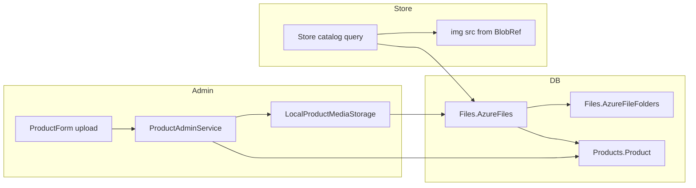

# Product media — Azure Files model (legacy-aligned)

   

> [!IMPORTANT]
> **Executive Summary:** Product images in WebShopABMATIC follow the **legacy ABMATIC pattern**: files are registered in `[Files].[AzureFiles]` and linked to `[Products].[Product]` via `ProductId` — not via a column on `Product`. Phase 1 uses a **fictitious Azure Blob** (local filesystem under `wwwroot/media/products/`) with the same `BlobRef` contract, so admin forms, seed data, and the storefront can be built now and swapped to real Azure Blob Storage later without changing the database model.

### Coverage statistics

| Category | Count | Status | Notes |
|----------|-------|--------|-------|
| **Legacy tables** | 2 | ✅ In schema | `AzureFiles`, `AzureFileFolders` |
| **Product link** | 1 | ✅ Designed | `AzureFiles.ProductId` (logical, no FK) |
| **Admin form upload** | 1 | ⏳ Planned | `ProductForm` + media port |
| **Store image source** | 1 | ⏳ Planned | Query `AzureFiles` instead of hardcoded paths |
| **Seed demo rows** | 10+ | ⏳ Planned | HDD 1–6 + webshop products |

### Implementation quality

| Aspect | Status | Details |
|--------|--------|---------|
| **EF entities** | ✅ Complete | `AzureFile`, `AzureFileFolder` mapped |
| **DB on MULLER** | 🟡 Schema only | `AzureFiles` exists; **0 rows** today |
| **Admin save** | ❌ Not wired | `ProductAdminService` saves text fields only |
| **Store catalog** | ❌ Not wired | `StoreCatalog` uses static `/images/product*.png` |
| **Real Azure Blob** | ⏳ Phase 2 | Replace storage adapter only |

---

## 1. Legacy model (how ABMATIC linked products to files)

### 1.1 Relationship direction

The link is **from file → product**, not from product → file:

```text
Products.Product (ProductId)
        ↑
        │  ProductId (nullable int)
        │
Files.AzureFiles
  ├── BlobRef          → blob key or public URL
  ├── ThumbRef         → thumbnail (optional)
  ├── IsPrimaryImage   → catalog hero image
  ├── PublishToWeb     → visible on storefront
  └── AzureFileFolderId → folder (Files.AzureFileFolders)
```

| Design choice | Legacy behaviour |
|---------------|------------------|
| Column on `Product` for image | **No** — no `ImageUrl`, no `AzureFileId` on `Product` |
| Foreign key `AzureFiles → Product` | **No** — logical link only; app enforces integrity |
| One product, many files | **Yes** — multiple `AzureFiles` per `ProductId` |
| Storefront image | Row with `IsPrimaryImage = 1` and `PublishToWeb = 1` |

### 1.2 Other file tables (not used for catalog images)

| Table | Role | Product catalog? |
|-------|------|----------------|
| `Files.StoredFiles` | Binary `varbinary(max)` in SQL Server | ❌ Attachments (orders, emails) |
| `Products.ProductManuals` | `ProductId` + `Path` for PDFs/manuals | ❌ Manuals, not shop photos |
| `Files.AzureFileFolders` | Organises `AzureFiles` (`IsForProduct`, etc.) | ✅ Required parent for product files |

---

## 2. Current state in WebShopABMATIC vNext

### 2.1 What exists today

| Layer | Behaviour |
|-------|-----------|
| **Database** | `Files.AzureFiles` created by EF migration; **empty** on `WebShopABMATIC` (MULLER) |
| **Admin `ProductForm`** | No image field; saves `Product` fields only |
| **`ProductEditDto`** | No media properties |
| **Store `StoreCatalog`** | Hardcoded `ImageUrl` → `wwwroot/images/product1.png` … `product6.png` |
| **`seeds.sql`** | Seeds `Products.Product` only; **no** `AzureFiles` rows |

### 2.2 Why align with legacy instead of a new column

- Same contract as the original ABMATIC ERP and existing schema.
- Supports multiple files per product (gallery, manuals, datasheets) without schema churn.
- `BlobRef` already abstracts storage — local path today, Azure container tomorrow.

---

## 3. Fictitious Azure Blob (Phase 1)

No Azure subscription is required for the first implementation. **Behaviour and table shape match production**; only the storage backend is local.

### 3.1 Local storage layout

| Item | Value |
|------|--------|
| **Physical path** | `Web/wwwroot/media/products/{productId}/` |
| **Public URL** | `/media/products/{productId}/{fileName}` |
| **`BlobRef` value** | Logical key, e.g. `products/42/primary.png` or the public URL above |
| **`ThumbRef`** | Same file initially, or omitted until thumbnail generation exists |

### 3.2 Storage adapter (planned)

```text
IProductMediaPort
  ├── SavePrimaryImageAsync(productId, stream, fileName) → AzureFiles row + file on disk
  ├── GetPrimaryImageAsync(productId) → BlobRef / public URL
  └── DeletePrimaryImageAsync(productId) → soft-delete or replace row

LocalProductMediaStorage   ← Phase 1 (fictitious blob)
AzureBlobProductMediaStorage ← Phase 2 (real SDK)
```

Swapping Phase 1 → Phase 2 changes **only** the infrastructure adapter; `AzureFiles`, DTOs, and UI stay the same.

### 3.3 Minimum `AzureFiles` row per product image

| Column | Typical value |
|--------|----------------|
| `ProductId` | `Products.Product.ProductId` |
| `Name` | Original or display file name |
| `Extension` | `.jpg`, `.png`, `.webp` |
| `AzureFileFolderId` | Seed folder “Products” (`IsForProduct = 1`) |
| `BlobRef` | Fictitious blob key or `/media/products/...` URL |
| `ThumbRef` | Optional thumbnail key |
| `IsPrimaryImage` | `true` for catalog hero |
| `PublishToWeb` | `true` when shown on storefront |
| `Description` | Short label or empty string |
| `Created` | UTC timestamp |
| `CreatedByUserId` | Current staff user id |
| `SendToCustomer` / `SendOnSupplierOrder` | `false` for catalog images |

### 3.4 Seed folder (`AzureFileFolders`)

One demo folder satisfies `AzureFileFolderId` NOT NULL semantics:

| Field | Value |
|-------|--------|
| `Name` | `Products` |
| `IsForProduct` | `true` |
| Other `IsFor*` flags | `false` |
| `SortOrder` | `1` |

Demo seed can link HDD 1–6 `AzureFiles` rows to seeded `ProductId` values with `BlobRef` pointing at existing mock assets (`/images/product1.png`, etc.) or copied files under `/media/products/`.

---

## 4. Planned application changes

### 4.1 Admin — product form

| Step | Create product | Edit product |
|------|----------------|--------------|
| 1 | Save `Product` → obtain `ProductId` | Load `Product` + primary `AzureFiles` |
| 2 | If upload present → save file locally | Show image preview from `BlobRef` |
| 3 | Insert `AzureFiles` with `ProductId`, flags | Replace file → update or supersede row |
| 4 | — | Clear upload → optional delete / unpublish |

**UI additions:** `InputFile`, preview ``, validation (size, extension).

### 4.2 Application layer

| Artifact | Purpose |
|----------|---------|
| `ProductEditDto.PrimaryImageUrl` | Read-only preview for form |
| `IProductMediaPort` | Upload, resolve URL, delete |
| `ProductAdminService` | Orchestrate product + media on save |

### 4.3 Storefront

Replace hardcoded `StoreCatalog` image paths:

```sql
-- Primary storefront image (conceptual query)
SELECT BlobRef
FROM Files.AzureFiles
WHERE ProductId = @id
  AND IsPrimaryImage = 1
  AND PublishToWeb = 1
  AND (Deleted IS NULL OR Deleted = 0)
```

Map `BlobRef` to a browser URL (local `/media/...` or future SAS URL).

### 4.4 Seed script (`scripts/seeds.sql`)

After `Products` insert:

1. Insert `AzureFileFolders` (id = 1, Products).
2. For each webshop SKU with a mock image, insert `AzureFiles` with matching `ProductId`, `IsPrimaryImage = 1`, `PublishToWeb = 1`, `BlobRef = '/images/productN.png'` (or `/media/products/N/primary.png`).

---

## 5. Data flow (end-to-end)



---

## 6. Phase 2 — real Azure Blob Storage

| Concern | Phase 1 (now) | Phase 2 (production) |
|---------|---------------|----------------------|
| Bytes on disk | `wwwroot/media/products/` | Azure Blob container |
| `BlobRef` | Local key or site URL | Container + blob name |
| Thumbnails | Optional copy / skip | Azure Functions or SDK resize |
| CDN | Static files middleware | Azure CDN + SAS or public container |
| Configuration | None | `AzureStorage:ConnectionString`, container name |

**No migration** of `AzureFiles` rows expected — only `BlobRef` values may be rewritten if blobs are uploaded to Azure.

---

## 7. Scope and limitations (Phase 1)

| In scope | Out of scope (later) |
|----------|----------------------|
| One **primary** image per product | Multi-image gallery UI |
| Local fictitious blob | Real Azure SDK upload |
| `AzureFiles` + `PublishToWeb` | `StoredFiles` binary-in-SQL for catalog |
| Admin create/edit + seed + store read | Image cropping, virus scan, CDN rules |

---

## 8. Implementation order (recommended)

1. **Document** — this file ✅  
2. **Seed** — `AzureFileFolders` + `AzureFiles` in `seeds.sql` for demo products  
3. **Infrastructure** — `IProductMediaPort` + `LocalProductMediaStorage`  
4. **Admin** — extend DTO, service, `ProductForm` upload  
5. **Store** — catalog/detail read image from `AzureFiles`  
6. **Docs** — update [DEMO_SEED_DATA.md](DEMO_SEED_DATA.md) and [INFRASTRUCTURE.md](INFRASTRUCTURE.md) media section  

---

## Documentation

- 🏠 [Main Documentation](../README.md) — Project overview and requirements

---

**© 2026 AdminSense. All rights reserved.**
