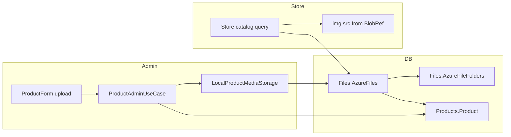

# Product media — Azure Files model (legacy-aligned)

   

> [!IMPORTANT]
> **Executive Summary:** Product images in WebShopABMATIC follow the **legacy ABMATIC pattern**: files are registered in `[Files].[AzureFiles]` and linked to `[Products].[Product]` via `ProductId` — not via a column on `Product`. Phase 1 uses a **fictitious Azure Blob** (local filesystem under `wwwroot/media/products/`) with the same `BlobRef` contract, so admin forms, seed data, and the storefront can be built now and swapped to real Azure Blob Storage later without changing the database model.

### Coverage statistics

<table>
<colgroup>
<col style="width:24%">
<col style="width:8%">
<col style="width:14%">
<col style="width:54%">
</colgroup>
<thead>
<tr><th>Category</th><th>Count</th><th>Status</th><th>Notes</th></tr>
</thead>
<tbody>
<tr><td><strong>Legacy tables</strong></td><td>2</td><td>✅ In schema</td><td><code>AzureFiles</code>, <code>AzureFileFolders</code></td></tr>
<tr><td><strong>Product link</strong></td><td>1</td><td>✅ Designed</td><td><code>AzureFiles.ProductId</code> (logical, no FK)</td></tr>
<tr><td><strong>Admin form upload</strong></td><td>1</td><td>✅ Done</td><td><code>ProductForm</code> + media port</td></tr>
<tr><td><strong>Store image source</strong></td><td>1</td><td>✅ Done</td><td><code>StoreCatalogService</code> via <code>IProductMediaPort</code></td></tr>
<tr><td><strong>Seed demo rows</strong></td><td>10</td><td>✅ Done</td><td>All <code>ShowOnWebshop</code> products in <code>seeds.sql</code></td></tr>
</tbody>
</table>

### Implementation quality

<table>
<colgroup>
<col style="width:32%">
<col style="width:14%">
<col style="width:54%">
</colgroup>
<thead>
<tr><th>Aspect</th><th>Status</th><th>Details</th></tr>
</thead>
<tbody>
<tr><td><strong>EF entities</strong></td><td>✅ Complete</td><td><code>AzureFile</code>, <code>AzureFileFolder</code> mapped</td></tr>
<tr><td><strong>DB on Azure SQL</strong></td><td>✅ Seeded</td><td><code>AzureFileFolders</code> + <code>AzureFiles</code> via <code>seeds.sql</code></td></tr>
<tr><td><strong>Admin save</strong></td><td>✅ Wired</td><td><code>ProductAdminUseCase</code> + <code>IProductMediaPort</code> (local blob Phase 1)</td></tr>
<tr><td><strong>Store catalog</strong></td><td>✅ Done</td><td><code>StoreCatalogService</code> via <code>IProductMediaPort</code>; static fallback if no row</td></tr>
<tr><td><strong>Real Azure Blob</strong></td><td>⏳ Phase 2</td><td>Replace storage adapter only</td></tr>
</tbody>
</table>

---

## 1. Legacy model (how ABMATIC linked products to files)

### 1.1 Relationship direction

The link is **from file → product**, not from product → file:

```text
Products.Product (ProductId)
        ↑
        │  ProductId (nullable int)
        │
Files.AzureFiles
  ├── BlobRef          → blob key or public URL
  ├── ThumbRef         → thumbnail (optional)
  ├── IsPrimaryImage   → catalog hero image
  ├── PublishToWeb     → visible on storefront
  └── AzureFileFolderId → folder (Files.AzureFileFolders)
```

<table>
<colgroup>
<col style="width:38%">
<col style="width:62%">
</colgroup>
<thead>
<tr><th>Design choice</th><th>Legacy behaviour</th></tr>
</thead>
<tbody>
<tr><td>Column on <code>Product</code> for image</td><td><strong>No</strong> — no <code>ImageUrl</code>, no <code>AzureFileId</code> on <code>Product</code></td></tr>
<tr><td>Foreign key <code>AzureFiles → Product</code></td><td><strong>No</strong> — logical link only; app enforces integrity</td></tr>
<tr><td>One product, many files</td><td><strong>Yes</strong> — multiple <code>AzureFiles</code> per <code>ProductId</code></td></tr>
<tr><td>Storefront image</td><td>Row with <code>IsPrimaryImage = 1</code> and <code>PublishToWeb = 1</code></td></tr>
</tbody>
</table>

### 1.2 Other file tables (not used for catalog images)

<table>
<colgroup>
<col style="width:32%">
<col style="width:38%">
<col style="width:30%">
</colgroup>
<thead>
<tr><th>Table</th><th>Role</th><th>Product catalog?</th></tr>
</thead>
<tbody>
<tr><td><code>Files.StoredFiles</code></td><td>Binary <code>varbinary(max)</code> in SQL Server</td><td>❌ Attachments (orders, emails)</td></tr>
<tr><td><code>Products.ProductManuals</code></td><td><code>ProductId</code> + <code>Path</code> for PDFs/manuals</td><td>❌ Manuals, not shop photos</td></tr>
<tr><td><code>Files.AzureFileFolders</code></td><td>Organises <code>AzureFiles</code> (<code>IsForProduct</code>, etc.)</td><td>✅ Required parent for product files</td></tr>
</tbody>
</table>

---

## 2. Current state in WebShopABMATIC vNext

### 2.1 What exists today

<table>
<colgroup>
<col style="width:28%">
<col style="width:72%">
</colgroup>
<thead>
<tr><th>Layer</th><th>Behaviour</th></tr>
</thead>
<tbody>
<tr><td><strong>Database</strong></td><td><code>Files.AzureFiles</code> seeded for all webshop products (<code>ShowOnWebshop = 1</code>)</td></tr>
<tr><td><strong>Admin ProductForm</strong></td><td>Image upload + preview via <code>IProductMediaPort</code></td></tr>
<tr><td><strong>ProductEditDto</strong></td><td><code>PrimaryImageUrl</code> for preview</td></tr>
<tr><td><strong>Store Catalog</strong></td><td>Reads primary image from <code>AzureFiles</code>; fallback <code>/images/productN.png</code></td></tr>
<tr><td><strong>seeds.sql</strong></td><td><code>AzureFileFolders</code> (id=1 Products) + <code>AzureFiles</code> per webshop SKU</td></tr>
</tbody>
</table>

### 2.2 Why align with legacy instead of a new column

- Same contract as the original ABMATIC ERP and existing schema.
- Supports multiple files per product (gallery, manuals, datasheets) without schema churn.
- `BlobRef` already abstracts storage — local path today, Azure container tomorrow.

---

## 3. Fictitious Azure Blob (Phase 1)

No Azure subscription is required for the first implementation. **Behaviour and table shape match production**; only the storage backend is local.

### 3.1 Local storage layout

<table>
<colgroup>
<col style="width:22%">
<col style="width:78%">
</colgroup>
<thead>
<tr><th>Item</th><th>Value</th></tr>
</thead>
<tbody>
<tr><td><strong>Physical path</strong></td><td><code>Web/wwwroot/media/products/{productId}/</code></td></tr>
<tr><td><strong>Public URL</strong></td><td><code>/media/products/{productId}/{fileName}</code></td></tr>
<tr><td><strong>BlobRef value</strong></td><td>Logical key, e.g. <code>products/42/primary.png</code> or the public URL above</td></tr>
<tr><td><strong>ThumbRef</strong></td><td>Same file initially, or omitted until thumbnail generation exists</td></tr>
</tbody>
</table>

### 3.2 Storage adapter (planned)

```text
IProductMediaPort
  ├── SavePrimaryImageAsync(productId, stream, fileName) → AzureFiles row + file on disk
  ├── GetPrimaryImageAsync(productId) → BlobRef / public URL
  └── DeletePrimaryImageAsync(productId) → soft-delete or replace row

LocalProductMediaStorage   ← Phase 1 (fictitious blob)
AzureBlobProductMediaStorage ← Phase 2 (real SDK)
```

Swapping Phase 1 → Phase 2 changes **only** the infrastructure adapter; `AzureFiles`, DTOs, and UI stay the same.

### 3.3 Minimum `AzureFiles` row per product image

<table>
<colgroup>
<col style="width:32%">
<col style="width:68%">
</colgroup>
<thead>
<tr><th>Column</th><th>Typical value</th></tr>
</thead>
<tbody>
<tr><td><code>ProductId</code></td><td><code>Products.Product.ProductId</code></td></tr>
<tr><td><code>Name</code></td><td>Original or display file name</td></tr>
<tr><td><code>Extension</code></td><td><code>.jpg</code>, <code>.png</code>, <code>.webp</code></td></tr>
<tr><td><code>AzureFileFolderId</code></td><td>Seed folder “Products” (<code>IsForProduct = 1</code>)</td></tr>
<tr><td><code>BlobRef</code></td><td>Fictitious blob key or <code>/media/products/...</code> URL</td></tr>
<tr><td><code>ThumbRef</code></td><td>Optional thumbnail key</td></tr>
<tr><td><code>IsPrimaryImage</code></td><td><code>true</code> for catalog hero</td></tr>
<tr><td><code>PublishToWeb</code></td><td><code>true</code> when shown on storefront</td></tr>
<tr><td><code>Description</code></td><td>Short label or empty string</td></tr>
<tr><td><code>Created</code></td><td>UTC timestamp</td></tr>
<tr><td><code>CreatedByUserId</code></td><td>Current staff user id</td></tr>
<tr><td><code>SendToCustomer</code> / <code>SendOnSupplierOrder</code></td><td><code>false</code> for catalog images</td></tr>
</tbody>
</table>

### 3.4 Seed folder (`AzureFileFolders`)

One demo folder satisfies `AzureFileFolderId` NOT NULL semantics:

<table>
<colgroup>
<col style="width:28%">
<col style="width:72%">
</colgroup>
<thead>
<tr><th>Field</th><th>Value</th></tr>
</thead>
<tbody>
<tr><td><code>Name</code></td><td><code>Products</code></td></tr>
<tr><td><code>IsForProduct</code></td><td><code>true</code></td></tr>
<tr><td>Other <code>IsFor*</code> flags</td><td><code>false</code></td></tr>
<tr><td><code>SortOrder</code></td><td><code>1</code></td></tr>
</tbody>
</table>

Demo seed can link HDD 1–6 `AzureFiles` rows to seeded `ProductId` values with `BlobRef` pointing at existing mock assets (`/images/product1.png`, etc.) or copied files under `/media/products/`.

---

## 4. Planned application changes

### 4.1 Admin — product form

<table>
<colgroup>
<col style="width:8%">
<col style="width:46%">
<col style="width:46%">
</colgroup>
<thead>
<tr><th>Step</th><th>Create product</th><th>Edit product</th></tr>
</thead>
<tbody>
<tr><td>1</td><td>Save <code>Product</code> → obtain <code>ProductId</code></td><td>Load <code>Product</code> + primary <code>AzureFiles</code></td></tr>
<tr><td>2</td><td>If upload present → save file locally</td><td>Show image preview from <code>BlobRef</code></td></tr>
<tr><td>3</td><td>Insert <code>AzureFiles</code> with <code>ProductId</code>, flags</td><td>Replace file → update or supersede row</td></tr>
<tr><td>4</td><td>—</td><td>Clear upload → optional delete / unpublish</td></tr>
</tbody>
</table>

**UI additions:** `InputFile`, preview ``, validation (size, extension).

### 4.2 Application layer

<table>
<colgroup>
<col style="width:38%">
<col style="width:62%">
</colgroup>
<thead>
<tr><th>Artifact</th><th>Purpose</th></tr>
</thead>
<tbody>
<tr><td><code>ProductEditDto.PrimaryImageUrl</code></td><td>Read-only preview for form</td></tr>
<tr><td><code>IProductMediaPort</code></td><td>Upload, resolve URL, publish flag (outbound port)</td></tr>
<tr><td><code>ProductAdminUseCase</code></td><td>Orchestrate product domain + media on save</td></tr>
</tbody>
</table>

### 4.3 Storefront

Replace hardcoded image paths in `StoreCatalogService`:

```sql
-- Primary storefront image (conceptual query)
SELECT BlobRef
FROM Files.AzureFiles
WHERE ProductId = @id
  AND IsPrimaryImage = 1
  AND PublishToWeb = 1
  AND (Deleted IS NULL OR Deleted = 0)
```

Map `BlobRef` to a browser URL (local `/media/...` or future SAS URL).

### 4.4 Seed script (`scripts/seeds.sql`)

After `Products` insert:

1. Insert `AzureFileFolders` (id = 1, Products).
2. For each webshop SKU (`ShowOnWebshop = 1`), insert `AzureFiles` with matching `ProductId`, `IsPrimaryImage = 1`, `PublishToWeb = 1`, `BlobRef = '/images/productN.png'` (cycles 1–6 for accessories/services).

---

## 5. Data flow (end-to-end)



---

## 6. Phase 2 — real Azure Blob Storage

<table>
<colgroup>
<col style="width:22%">
<col style="width:39%">
<col style="width:39%">
</colgroup>
<thead>
<tr><th>Concern</th><th>Phase 1 (now)</th><th>Phase 2 (production)</th></tr>
</thead>
<tbody>
<tr><td>Bytes on disk</td><td><code>wwwroot/media/products/</code></td><td>Azure Blob container</td></tr>
<tr><td><code>BlobRef</code></td><td>Local key or site URL</td><td>Container + blob name</td></tr>
<tr><td>Thumbnails</td><td>Optional copy / skip</td><td>Azure Functions or SDK resize</td></tr>
<tr><td>CDN</td><td>Static files middleware</td><td>Azure CDN + SAS or public container</td></tr>
<tr><td>Configuration</td><td>None</td><td><code>AzureStorage:ConnectionString</code>, container name</td></tr>
</tbody>
</table>

**No migration** of `AzureFiles` rows expected — only `BlobRef` values may be rewritten if blobs are uploaded to Azure.

---

## 7. Scope and limitations (Phase 1)

<table>
<colgroup>
<col style="width:50%">
<col style="width:50%">
</colgroup>
<thead>
<tr><th>In scope</th><th>Out of scope (later)</th></tr>
</thead>
<tbody>
<tr><td>One <strong>primary</strong> image per product</td><td>Multi-image gallery UI</td></tr>
<tr><td>Local fictitious blob</td><td>Real Azure SDK upload</td></tr>
<tr><td><code>AzureFiles</code> + <code>PublishToWeb</code></td><td><code>StoredFiles</code> binary-in-SQL for catalog</td></tr>
<tr><td>Admin create/edit + seed + store read</td><td>Image cropping, virus scan, CDN rules</td></tr>
</tbody>
</table>

---

## 8. Implementation order (recommended)

1. **Document** — this file ✅  
2. **Seed** — `AzureFileFolders` + `AzureFiles` in `seeds.sql` for demo products ✅  
3. **Infrastructure** — `IProductMediaPort` + `LocalProductMediaService` ✅  
4. **Admin** — extend DTO, service, `ProductForm` upload ✅  
5. **Store** — catalog/detail read image from `AzureFiles` ✅  
6. **Docs** — update [DATA_DEMO_SEED.md](DATA_DEMO_SEED.md) and [SPEC_INFRASTRUCTURE.md](SPEC_INFRASTRUCTURE.md) media section ✅  
7. **Phase 2** — real Azure Blob adapter (prod go-live, last) ⬜

---

## Documentation

- 🏠 [Main Documentation](../README.md) — Project overview and requirements

---

**© 2026 AdminSense. All rights reserved.**
