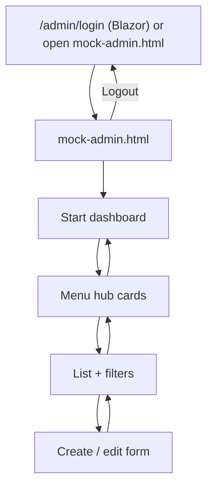

# WebShopABMATIC — Admin mock prototype guide

  

This document explains the **admin HTML prototype** in `readme/docs/`, how it maps to the **AB-MATIC reference layout**, and what each **sidebar menu / entity / screen** represents in the real Blazor admin app.

> **Scope:** Admin panel only. The storefront (`/store`, cart, checkout) is implemented separately in Blazor — not covered by this mock walkthrough.

Visual reference (AB-MATIC admin shell): [adminsenceweb.azurewebsites.net](https://adminsenceweb.azurewebsites.net/)

---

## Prototype files

| File | Role | Open from |
|------|------|-----------|
| [`readme/docs/mock-admin.html`](docs/mock-admin.html) | Staff **admin panel** (AB-MATIC layout) — **primary entry** | Browser direct |
| [`readme/docs/mock-payments.html`](docs/mock-payments.html) | **Mollie hosted checkout** mock (reference for payment UX) | Browser direct |

Legacy aliases (ignore for validation):

| File | Note |
|------|------|
| `readme/docs/mock-loja.html` | Old storefront mock — **out of scope** for this guide |
| `readme/docs/mock-shopcart.html` | Redirect → `mock-loja.html` |

**Blazor admin entry:** `/admin/login` — staff login on `Settings.StaffUsers`. Demo after seed: `admin@webshop.com` / `demo`.

---

## Reference layout — three screen types

The admin mock follows the same three-level pattern as the AB-MATIC reference app. Screenshots live in `readme/images/`.

### 1. Main dashboard — `main_screen.png`

**What it shows (reference):** Dark sidebar, top bar with user greeting and red **Logout**, and a **2×2 grid of portfolio cards** with KPIs, progress bars, and status pills. Sidebar footer shows **date** and **version**.

**WebShop mock equivalent:** `readme/docs/mock-admin.html` → view `#view-dashboard` (sidebar item **Start**).

| Reference element | Mock implementation |
|-------------------|---------------------|
| Sidebar + brand box | `.sidebar` + `.brand-box` (“WS WEBSHOP ABMATIC”) |
| Top bar + Logout | `.top-bar` → “Hello, ANNA RODRIGUEZ” + logout link |
| Portfolio cards | Four cards: Webshop catalog, Sales & orders, Stock operations, Financial YTD |
| Sidebar footer | Current date + `v1.0 · WebShopABMATIC` |

**Purpose:** Landing page for staff after login. Summarises catalog health, order pipeline, stock KPIs, and financial YTD — with shortcuts (e.g. **Manage** on Webshop catalog → **Webshop** hub).

**Blazor equivalent:** `/admin` (`AdminDashboard`).

---

### 2. Sub-menu hub — `menu_screen.png`

**What it shows (reference):** **Back to start**, page title + subtitle, and a **grid of entity cards**. Each card has a coloured icon, title, short description, and a full-width **“X form”** button.

**WebShop mock equivalent:** `readme/docs/mock-admin.html` → view `#view-hub` (sidebar items **Webshop**, **Catalog**, **Customers**, **Sales**, **Stock**, **Settings**, **My profile**).

| Reference element | Mock implementation |
|-------------------|---------------------|
| Back to start | `#hub-back` — `btn-outline-secondary btn-sm` + `oi-arrow-left` |
| Hub title / subtitle | `#hub-title`, `#hub-subtitle` (driven by JS `hubs` object) |
| Entity cards | `.hub-card` grid — one card per database entity |
| Form button | `.btn-form` → opens list or form for that entity |

**Purpose:** Second navigation level. Each sidebar section groups related entities; staff pick which table to manage before opening the list or form.

**Blazor equivalent:** `/admin/hub/webshop`, `/admin/hub/catalog`, etc.

---

### 3. Internal list & filters — `forms_screen.png`

**What it shows (reference):** Page title, green **Refresh**, **filter panel** (dropdowns + search + checkbox), **Apply Filters** (blue) / **Clear** (red), and a **dark-header striped table** with icon-only edit actions.

**WebShop mock equivalent:** `readme/docs/mock-admin.html` → views `#view-list` and `#view-form`.

| Reference element | Mock implementation |
|-------------------|---------------------|
| Refresh | `btn btn-success btn-sm` + `bi-arrow-repeat` |
| Filter panel | `.filter-panel` — Menu, Entity, Search, Modified only |
| Apply / Clear | `btn btn-primary` / `btn btn-danger` (no `btn-sm`) |
| Data grid | `table-dark` + `table-striped table-hover` + pencil edit |
| Edit form | `#view-form` — card with Save / Cancel |

**Purpose:** Standard CRUD list pattern for every entity. Filters narrow rows; edit opens the create/edit form. Full button and icon rules: [`PATTERNS_UI_QUICK_START.md`](PATTERNS_UI_QUICK_START.md).

**Blazor equivalent:** e.g. `/admin/products`, `/admin/customers`, `/admin/orders`.

---

## Navigation flow (admin only)

---

## Admin shell (shared by all screens)

| UI part | Behaviour |
|---------|-----------|
| **Sidebar** | Fixed 240px; Open Iconic icons; active item highlighted |
| **Start** | Dashboard portfolios |
| **Webshop … Settings** | Hub pages with entity cards |
| **My profile** | Staff profile shortcut |
| **Top bar** | Logged-in staff name + **Logout** |
| **Footer** | Today’s date + version string |

Logged-in user in the mock: **Anna Rodriguez** (`StaffUser`, `Admin = true`, `ProductBeheer = true`).

**Blazor:** `AdminSidebar.razor` — same menu structure; cookie auth via `LegacyAuthenticationStateProvider`.

---

## Sidebar menus — summary

| Menu | What it manages | Hub entities |
|------|-----------------|--------------|
| **Start** | KPI dashboard | — (portfolio cards only) |
| **Webshop** | Storefront navigation and product grouping | `WebshopStructure`, `WebshopProductStructure` |
| **Catalog** | Products, pricing, options, suppliers | `Product`, `ProductPrice`, `ProductQuantityTier`, `ProductOption`, `PriceListCategory`, `Manufacturer`, `Supplier` |
| **Customers** | B2B accounts, addresses, discounts | `Customer`, `CustomerDeliveryAddress`, `CustomerProductDiscount`, `CustomerType` |
| **Sales** | Orders and fulfilment setup | `Order` (+ `OrderLine`), `OrderStatus`, `DeliveryType` |
| **Stock** | Warehouses and per-location quantities | `ProductStockLocation`, `StockLocation` |
| **Settings** | Payments, staff, VAT | `PaymentMethod`, `StaffUser`, `UserGroup`, `VatType` |
| **My profile** | Current staff user | `StaffUser` (form only) |

---

## Entity screens — menu, table, list, form

Below: one section per entity exposed in the admin mock. **Table** = SQL/EF entity purpose (short). **List** = columns in the mock grid. **Form** = fields shown in the prototype (full forms grow in Blazor).

---

### Start (dashboard)

**Mock view:** `#view-dashboard` in `mock-admin.html`  
**Blazor:** `/admin`

**Purpose:** Read-only overview — no direct table editing. Cards link into hubs (e.g. Webshop **Manage**).

| Card | Data source (conceptual) | Staff action |
|------|--------------------------|--------------|
| Webshop catalog | `Product.ShowOnWebshop`, `WebshopStructure` | Jump to Webshop hub |
| Sales & orders | `Order`, `Order.IsAccepted` | Monitor acceptance rate |
| Stock operations | `ProductStockLocation` | Review low stock → `/admin/product-stock?lowStock=true` |
| Financial YTD | Accounting aggregates | Revenue / costs snapshot |

---

### Webshop menu

#### WebshopStructure

**Table:** `[Products].[WebshopStructures]` — hierarchical **store navigation tree** (menu nodes). Columns: `Id`, `NameNl`, `ParentTaskId`, `SortOrder`.

**List screen:** Id, NameNl, ParentTaskId, SortOrder, Actions.

**Form screen:** NameNl, parent, sort order — defines catalog menu structure used by the storefront when enabled.

**Blazor:** `/admin/webshop-structures`

---

#### WebshopProductStructure

**Table:** `[Products].[WebshopProductStructures]` — **product category labels** for the webshop in NL/FR/EN.

**List screen:** Id, NameEn, NameFr, NameNl, Actions.

**Form screen:** Multilingual names + optional parent.

**Blazor:** `/admin/webshop-product-structures`

---

### Catalog menu

#### Product

**Table:** `[Products].[Product]` — master **product** record: names/descriptions (NL/FR/EN), part numbers, supplier/manufacturer, webshop flags (`ShowOnWebshop`), EAN, pricing flags, etc.

**List screen:** ProductId, NameEn, ShowOnWebshop, SupplierId, ManufacturerId, Actions.

**Form screen:** NameEn, OrderPartNumber, SupplierId, ManufacturerId, WebshopDescriptionNl, ShowOnWebshop, EanCode.

**Blazor:** `/admin/products`

---

#### ProductPrice

**Table:** `[Products].[ProductPrices]` — **price rows** per product with validity dates and sales/purchase amounts.

**List / form:** Product picker, gross/net prices, valid-from / valid-to.

**Blazor:** `/admin/product-prices`

---

#### ProductQuantityTier

**Table:** `[Products].[ProductQuantityTiers]` — **volume discounts** per `ProductId`.

**Blazor:** `/admin/product-tiers`

---

#### ProductOption

**Table:** `[Products].[ProductOptions]` — **configurable options** on a product.

**Blazor:** `/admin/product-options`

---

#### PriceListCategory

**Table:** `[Products].[PriceListCategories]` — **price list sections** for PDF/Excel exports.

**Blazor:** `/admin/price-list-categories`

---

#### Manufacturer / Supplier

**Tables:** `[Crm].[Manufacturer]`, `[Crm].[Supplier]` — master data linked from `Product`.

**Blazor:** `/admin/manufacturers`, `/admin/suppliers`

---

### Customers menu

#### Customer

**Table:** `[Klanten].[Klant]` / `[Customers].[Customers]` — B2B account + **webshop credentials** (`LoginWebshop`, `PasswordWebshop`, `SaltWebshop`).

**List screen:** CustomerId, CustomerName, WebshopLogin, CustomerTypeId, Actions.

**Form screen:** CustomerName, CustomerEmail, WebshopLogin, CustomerTypeId, DeliveryTypeId, CustomerStreet.

**Blazor:** `/admin/customers` — store sign-in uses the same legacy columns via `/sign-in` (not part of this mock).

---

#### CustomerDeliveryAddress / CustomerProductDiscount / CustomerType

**Blazor:** `/admin/delivery-addresses`, `/admin/customer-discounts`, `/admin/customer-types`

---

### Sales menu

#### Order (+ OrderLine)

**Table:** `[Projects].[Orders]` + `[Projects].[OrderLines]` — sales orders created from checkout or admin.

**Blazor:** `/admin/orders` — payment status + Mollie ids on advance payments.

---

#### OrderStatus / DeliveryType

**Blazor:** `/admin/order-statuses`, `/admin/delivery-types`

---

### Stock menu

#### ProductStockLocation

**Table:** `[Products].[ProductStockLocations]` — quantity, reserved, min/max per location.

**List screen:** Product, StockLocationId, Quantity, MinQuantity, Actions. **Low stock filter:** `?lowStock=true`.

**Blazor:** `/admin/product-stock` — dashboard low-stock KPI reads the same legacy rows.

---

#### StockLocation

**Blazor:** `/admin/stock-locations`, `/admin/stock/overview`, `/admin/stock/movements`, `/admin/stock/adjustment`

---

### Settings menu

#### PaymentMethod / StaffUser / UserGroup / VatType

**Blazor:** `/admin/payment-methods`, `/admin/staff-users`, `/admin/user-groups`, `/admin/vat-types`

**Staff login:** `Settings.StaffUsers` — plaintext `Password` in legacy DB; Blazor form at `/admin/login` posts to `/account/admin-login`.

---

### My profile menu

Same `StaffUser` table — **form only** (`formOnly: true` in mock) for the logged-in user.

**Blazor:** `/admin/profile`

---

## Mollie payment mock (reference only)

[`readme/docs/mock-payments.html`](docs/mock-payments.html) illustrates the **hosted checkout** and **confirmation** screens. The real flow is implemented in Blazor (`CheckoutUseCase`, `ProcessMollieWebhookUseCase`) with `Mollie:UseMock=true` for local dev.

---

## Validation checklist (admin mock)

Open `readme/docs/mock-admin.html` directly (no storefront step):

1. **Start** — matches `main_screen.png` layout (sidebar, top bar, 4 cards, footer).
2. **Catalog** hub — matches `menu_screen.png` (back link, cards, form buttons).
3. **Product** → list — matches `forms_screen.png` (filters, Apply/Clear, dark table, edit icon).
4. **Edit** → form with Save/Cancel per UI patterns.
5. **Stock** hub → ProductStockLocation with low-stock narrative on dashboard card.
6. **Logout** — returns to mock entry (Blazor: `/account/logout`).

Optional Blazor cross-check (profile **WebShopABMATIC**, HTTPS **44357**):

1. `/admin/login` → `admin@webshop.com` / `demo`
2. `/admin` KPIs align with [DATA_SUMMARY.md](./DATA_SUMMARY.md) on `abmatic_test`

---

## Documentation

- 🏠 [Main Documentation](../README.md) — Project overview and requirements
- 📊 [Demo data](./DATA_SUMMARY.md) — seeded tables and row counts
- 🗂️ [Data model](./DATA_DUTCH_ENGLISH_MODEL.md) — Dutch → English mapping

---

**© 2026 AdminSense. All rights reserved.**
