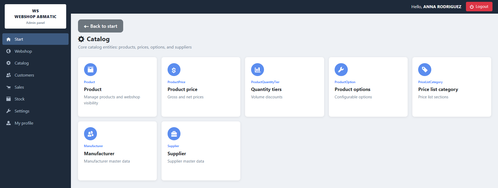
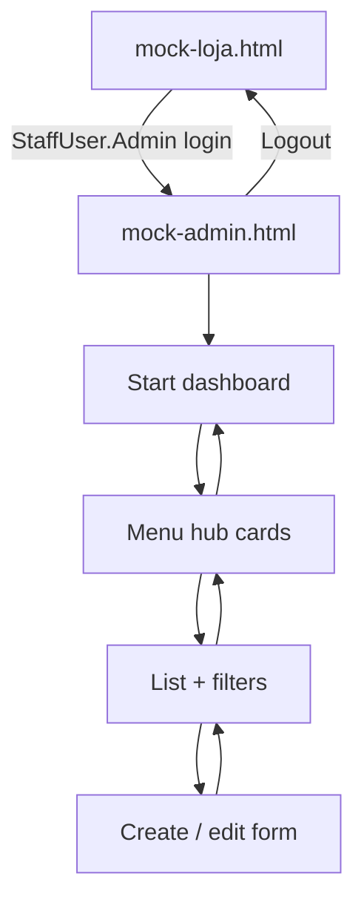

# WebShopABMATIC — Mock Prototype Guide

 

This document explains the **HTML prototypes** in `docs/`, how they map to the **reference layout** (AB-MATIC admin shell), and what each **sidebar menu / entity / screen** will do in the real application.

Visual reference (AB-MATIC admin shell): [adminsenceweb.azurewebsites.net](https://adminsenceweb.azurewebsites.net/)

---

## Prototype files

| File | Role | Open from |
|------|------|-----------|
| [`docs/mock-loja.html`](../docs/mock-loja.html) | Customer **storefront** (catalog, cart, checkout) — **entry point** | Browser direct |
| [`docs/mock-admin.html`](../docs/mock-admin.html) | Staff **admin panel** (AB-MATIC layout) | Store **Admin Panel** button or direct |
| [`docs/mock-shopcart.html`](../docs/mock-shopcart.html) | Redirect → `mock-loja.html` | Legacy alias |

**Admin entry:** In the store, sign in with the **StaffUser.Admin** demo account (`anna.rodriguez@webshop.com`). The **Admin Panel** button appears in the header and opens `mock-admin.html`.

---

## Reference layout — three screen types

The admin mock follows the same three-level pattern as the AB-MATIC reference app. Screenshots live in `readme/images/`.

### 1. Main dashboard — `main_screen.png`

**What it shows (reference):** Dark sidebar, top bar with user greeting and red **Logout**, and a **2×2 grid of portfolio cards** with KPIs, progress bars, and status pills. Sidebar footer shows **date** and **version**.

**WebShop mock equivalent:** `docs/mock-admin.html` → view `#view-dashboard` (sidebar item **Start**).

| Reference element | Mock implementation |
|-------------------|---------------------|
| Sidebar + brand box | `.sidebar` + `.brand-box` (“WS WEBSHOP ABMATIC”) |
| Top bar + Logout | `.top-bar` → “Hello, ANNA RODRIGUEZ” + link to store |
| Portfolio cards | Four cards: Webshop catalog, Sales & orders, Stock operations, Financial YTD |
| Sidebar footer | Current date + `v1.0 · WebShopABMATIC` |

**Purpose:** Landing page for staff after login. Summarises webshop catalog health, order pipeline, stock alerts, and financial YTD — with shortcuts (e.g. **Manage** on Webshop catalog → **Webshop** hub).

---

### 2. Sub-menu hub — `menu_screen.png`

**What it shows (reference):** **Back to start**, page title + subtitle, and a **grid of entity cards**. Each card has a coloured icon, title, short description, and a full-width **“X form”** button.

**WebShop mock equivalent:** `docs/mock-admin.html` → view `#view-hub` (sidebar items **Webshop**, **Catalog**, **Customers**, **Sales**, **Stock**, **Settings**, **My profile**).

| Reference element | Mock implementation |
|-------------------|---------------------|
| Back to start | `#hub-back` — `btn-outline-secondary btn-sm` + `oi-arrow-left` |
| Hub title / subtitle | `#hub-title`, `#hub-subtitle` (driven by JS `hubs` object) |
| Entity cards | `.hub-card` grid — one card per database entity |
| Form button | `.btn-form` → opens list or form for that entity |

**Purpose:** Second navigation level. Each sidebar section groups related entities; staff pick which table to manage before opening the list or form.

---

### 3. Internal list & filters — `forms_screen.png`

**What it shows (reference):** Page title, green **Refresh**, **filter panel** (dropdowns + search + checkbox), **Apply Filters** (blue) / **Clear** (red), and a **dark-header striped table** with icon-only edit actions.

**WebShop mock equivalent:** `docs/mock-admin.html` → views `#view-list` and `#view-form`.

| Reference element | Mock implementation |
|-------------------|---------------------|
| Refresh | `btn btn-success btn-sm` + `bi-arrow-repeat` |
| Filter panel | `.filter-panel` — Menu, Entity, Search, Modified only |
| Apply / Clear | `btn btn-primary` / `btn btn-danger` (no `btn-sm`) |
| Data grid | `table-dark` + `table-striped table-hover` + pencil edit |
| Edit form | `#view-form` — card with Save / Cancel |

**Purpose:** Standard CRUD list pattern for every entity. Filters narrow rows; edit opens the create/edit form. Full button and icon rules: [`PATTERNS_UI_QUICK_START.md`](PATTERNS_UI_QUICK_START.md).

---

## Navigation flow

---

## Storefront mock — `mock-loja.html`

Customer-facing prototype (not AB-MATIC-styled; focused on domain entities).

| Screen area | Entities used | Purpose |
|-------------|---------------|---------|
| Header | `Customer.WebshopLogin`, `StaffUser` | Sign in; **Admin Panel** visible only for staff admin |
| Navigation | `WebshopStructure` | Category tree for catalog browsing |
| Product grid | `Product`, `ProductPrice`, `ShowOnWebshop` | Products visible on the webshop |
| Product detail | `ProductOption`, `ProductStockLocation` | Options and stock hint |
| Cart / checkout | `Order`, `OrderLine`, `DeliveryType`, `PaymentMethod` | Place order flow |
| My orders | `Order`, `OrderStatus` | Customer order history |

---

## Admin shell (shared by all screens)

| UI part | Behaviour |
|---------|-----------|
| **Sidebar** | Fixed 240px; Open Iconic icons; active item highlighted |
| **Start** | Dashboard portfolios |
| **Webshop … Settings** | Hub pages with entity cards |
| **My profile** | Staff profile shortcut |
| **Top bar** | Logged-in staff name + **Logout** (returns to store mock) |
| **Footer** | Today’s date + version string |

Logged-in user in the mock: **Anna Rodriguez** (`StaffUser`, `Admin = true`, `ProductBeheer = true`).

---

## Sidebar menus — summary

| Menu | What it manages | Hub entities |
|------|-----------------|--------------|
| **Start** | KPI dashboard | — (portfolio cards only) |
| **Webshop** | Storefront navigation and product grouping | `WebshopStructure`, `WebshopProductStructure` |
| **Catalog** | Products, pricing, options, suppliers | `Product`, `ProductPrice`, `ProductQuantityTier`, `ProductOption`, `PriceListCategory`, `Manufacturer`, `Supplier` |
| **Customers** | B2B accounts, addresses, discounts | `Customer`, `CustomerDeliveryAddress`, `CustomerProductDiscount`, `CustomerType` |
| **Sales** | Orders and fulfilment setup | `Order` (+ `OrderLine`), `OrderStatus`, `DeliveryType` |
| **Stock** | Warehouses and per-location quantities | `ProductStockLocation`, `StockLocation` |
| **Settings** | Payments, staff, VAT | `PaymentMethod`, `StaffUser`, `UserGroup`, `VatType` |
| **My profile** | Current staff user | `StaffUser` (form only) |

---

## Entity screens — menu, table, list, form

Below: one section per entity exposed in the admin mock. **Table** = SQL/EF entity purpose (short). **List** = columns in the mock grid. **Form** = fields shown in the prototype (full forms will grow in Blazor).

---

### Start (dashboard)

**Mock view:** `#view-dashboard` in `mock-admin.html`

**Purpose:** Read-only overview — no direct table editing. Cards link into hubs (e.g. Webshop **Manage**).

**Widgets:**

| Card | Data source (conceptual) | Staff action |
|------|--------------------------|--------------|
| Webshop catalog | `Product.ShowOnWebshop`, `WebshopStructure` | Jump to Webshop hub |
| Sales & orders | `Order`, `Order.IsAccepted` | Monitor acceptance rate |
| Stock operations | `ProductStockLocation` | Review low stock |
| Financial YTD | Accounting aggregates | Revenue / costs snapshot |

---

### Webshop menu

#### WebshopStructure

**Table:** `[Products].[WebshopStructures]` — hierarchical **store navigation tree** (menu nodes shown on the public site). Columns: `Id`, `NameNl`, `ParentTaskId`, `SortOrder`.

**List screen:** Id, NameNl, ParentTaskId, SortOrder, Actions.

**Form screen:** (generic in mock) NameNl, parent, sort order — defines left/top catalog menu on the storefront.

**Store link:** Drives category chips in `mock-loja.html` (“WebshopStructure navigation”).

---

#### WebshopProductStructure

**Table:** `[Products].[WebshopProductStructures]` — **product category labels** for the webshop in NL/FR/EN. Columns: `Id`, `NameEn`, `NameFr`, `NameNl`, `ParentTaskId`.

**List screen:** Id, NameEn, NameFr, NameNl, Actions.

**Form screen:** Multilingual names + optional parent — groups products on the shop without changing ERP product structure.

---

### Catalog menu

#### Product

**Table:** `[Products].[Product]` — master **product** record: names/descriptions (NL/FR/EN), part numbers, supplier/manufacturer, webshop flags (`ShowOnWebshop`, `WebshopDescriptionNl`), EAN, pricing flags, document visibility, weight, etc.

**List screen:** ProductId, NameEn, ShowOnWebshop, SupplierId, ManufacturerId, Actions.

**Form screen (detailed in mock):** NameEn, OrderPartNumber, SupplierId, ManufacturerId, WebshopDescriptionNl, ShowOnWebshop, EanCode.

**Store link:** Only products with `ShowOnWebshop = true` appear in `mock-loja.html`.

---

#### ProductPrice

**Table:** `[Products].[ProductPrices]` — **price rows** per product with validity dates, gross/net purchase and sales prices, assembly/installation prices, discount formulas.

**List screen:** Id, ProductId, GrossSalesPrice, NetPurchasePrice, Actions.

**Form screen:** Product picker, price amounts, valid-from / valid-to (planned).

**Purpose:** Maintain list and webshop prices; storefront reads current valid row via `ProductPrice`.

---

#### ProductQuantityTier

**Table:** `[Products].[ProductQuantityTiers]` — **volume discounts**: `MinimumQuantity`, `Discount` per `ProductId`.

**List screen:** Id, ProductId, MinimumQuantity, Discount, Actions.

**Form screen:** Product, minimum qty, discount %.

**Purpose:** Tier pricing on quotes, orders, and optionally webshop quantity breaks.

---

#### ProductOption

**Table:** `[Products].[ProductOptions]` — **configurable options** on a product (name, value type, required flag, sort order, price formulas).

**List screen:** Id, ProductId, NameEn, IsRequired, Actions.

**Form screen:** Name, value type, required, sort order.

**Store link:** Options block on product detail in `mock-loja.html`.

---

#### PriceListCategory

**Table:** `[Products].[PriceListCategories]` — **price list sections** (name, sort order, `HasOptions`, colour) for PDF/Excel price lists.

**List screen:** Id, Name, SortOrder, HasOptions, Actions.

**Form screen:** Name, sort order, has-options flag.

---

#### Manufacturer

**Table:** `[Crm].[Manufacturer]` — **manufacturer** master: name, contact, address, VAT number.

**List screen:** ManufacturerId, Name, Email, VatNumber, Actions.

**Form screen:** Name, contact fields, VAT.

**Purpose:** Linked from `Product.ManufacturerId`; shown as brand on catalog cards.

---

#### Supplier

**Table:** `[Crm].[Supplier]` — **supplier** master: name, contacts, price list name, inactive flag.

**List screen:** SupplierId, Name, IsInactive, PriceListName, Actions.

**Form screen:** Name, price list, active flag.

**Purpose:** Linked from `Product.SupplierId`; used in purchasing and price imports.

---

### Customers menu

#### Customer

**Table:** `[Customers].[Customers]` — **B2B customer** account: name, address, VAT, type, delivery type, contacts, and **webshop credentials** (`WebshopLogin`, password hash/salt).

**List screen:** CustomerId, CustomerName, WebshopLogin, CustomerTypeId, Actions.

**Form screen (detailed in mock):** CustomerName, CustomerEmail, WebshopLogin, CustomerTypeId, DeliveryTypeId, CustomerStreet.

**Store link:** `WebshopLogin` used for customer sign-in on `mock-loja.html`.

---

#### CustomerDeliveryAddress

**Table:** `[Crm].[CustomerDeliveryAddresses]` — **shipping addresses** per customer: name, street, number, city, notes.

**List screen:** Id, CustomerId, Name, Straat, CityId, Actions.

**Form screen:** Customer, label, address lines, city.

**Purpose:** Selected at checkout as `Order.LeveradresId` / delivery destination.

---

#### CustomerProductDiscount

**Table:** `[Crm].[CustomerProductDiscounts]` — **customer-specific discount** on a product (percentage, validity, notes).

**List screen:** Id, CustomerId, ProductId, DiscountPercentage, Actions.

**Form screen:** Customer, product, discount %, valid dates.

**Purpose:** Overrides list price for named customers on quotes and webshop (when implemented).

---

#### CustomerType

**Table:** `[Customers].[CustomerTypes]` — **customer segment** (dealer, contractor, consumer): base discount, default delivery type, VAT rules.

**List screen:** KlantTypeId, CustomerTypeName, BaseDiscount, DeliveryTypeId, Actions.

**Form screen:** Name, base discount, default delivery type.

**Purpose:** Drives pricing tier and defaults on new `Customer` records.

---

### Sales menu

#### Order (+ OrderLine)

**Table:** `[Projects].[Orders]` — **sales order** header: project link, acceptance flag, delivery type, discounts, VAT, dates, notes. Lines in `[Projects].[OrderLines]`: product, qty, unit price, assembly/installation, totals.

**List screen:** Id, CreatedAt, ProjectId, DeliveryTypeId, IsAccepted, Actions.

**Form screen:** (planned) Header fields + line grid for products/qty/prices.

**Store link:** Created from checkout in `mock-loja.html`; staff accept and progress here.

---

#### OrderStatus

**Table:** `[Projects].[OrderStatuses]` — **workflow status** names with stock behaviour (`ReserveStock`, `AffectsStock`), sort order, reporting flags.

**List screen:** Id, Name, ReserveStock, AffectsStock, Actions.

**Form screen:** Name, stock flags, sort order.

**Purpose:** Defines order pipeline shown to customers and staff.

---

#### DeliveryType

**Table:** `[Projects].[DeliveryTypes]` — **fulfilment methods** (pickup, delivery, installation): names, default flag, installation cost inclusion.

**List screen:** Id, Name, IncludeInstallationCost, IsDefault, Actions.

**Form screen:** Name, flags.

**Store link:** Checkout delivery selector in `mock-loja.html`; default on `CustomerType` / `Customer`.

---

### Stock menu

#### ProductStockLocation

**Table:** `[Products].[ProductStockLocations]` — **stock level** of a product at a location: quantity, reserved, min/max, last count.

**List screen:** Id, ProductId, StockLocationId, Quantity, MinQuantity, Actions.

**Form screen:** Product, location, quantities, thresholds.

**Purpose:** Low-stock alerts on dashboard; availability hint on storefront.

---

#### StockLocation

**Table:** `[Products].[StockLocations]` — **warehouse or storage site** (`Name`, `IsWarehouse`).

**List screen:** Id, Name, IsWarehouse, Actions.

**Form screen:** Name, warehouse flag.

**Purpose:** Master list for `ProductStockLocation.StockLocationId`.

---

### Settings menu

#### PaymentMethod

**Table:** `[Settings].[PaymentMethods]` — **payment options** (NL/FR/EN names, pre-pay vs post-pay).

**List screen:** Id, NameEn, IsPrePay, IsPostPay, Actions.

**Form screen:** Names, pre/post pay flags.

**Store link:** Checkout payment choice in `mock-loja.html`.

---

#### StaffUser

**Table:** `[Settings].[StaffUsers]` — **internal user** with module flags (`Admin`, `ProductBeheer`, `Bestellingen`, …), login, name, group.

**List screen:** Id, Login, FirstName, Admin, ProductBeheer, Actions.

**Form screen:** Login, name, permission checkboxes.

**Purpose:** Admin access control; mock user Anna Rodriguez opens admin from the store.

---

#### UserGroup

**Table:** `[Settings].[UserGroups]` — **staff teams** (installation, service, transport) linked to planning and order status groups.

**List screen:** Id, Name, IsInstallationTeam, Actions.

**Form screen:** Name, team type flags.

---

#### VatType

**Table:** `[Accounting].[VatTypes]` — **VAT rates** and invoice text (NL/FR/EN), default flag, Peppol codes.

**List screen:** Id, Name, Percentage, IsDefault, Actions.

**Form screen:** Name, percentage, default, invoice text.

**Purpose:** Applied on `Order` / `OrderLine` and checkout totals.

---

### My profile menu

#### StaffUser (profile)

Same table as **Settings → StaffUser**, opened **directly in form view** (`formOnly: true` in mock) so the logged-in user can edit their own profile without passing through the full staff list.

---

## Validation checklist

Open `docs/mock-loja.html` and walk through:

1. **Store** → demo login **StaffUser.Admin** → **Admin Panel** visible.
2. **Admin Start** — matches `main_screen.png` layout (sidebar, top bar, 4 cards, footer).
3. **Catalog** hub — matches `menu_screen.png` (back link, cards, form buttons).
4. **Product** → list — matches `forms_screen.png` (filters, Apply/Clear, dark table, edit icon).
5. **Edit** → form with Save/Cancel per UI patterns.
6. **Logout** → returns to store.

---

## Documentation

- 🏠 [Main Documentation](../README.md) — Project overview and requirements

---

**© 2026 AdminSense. All rights reserved.**
