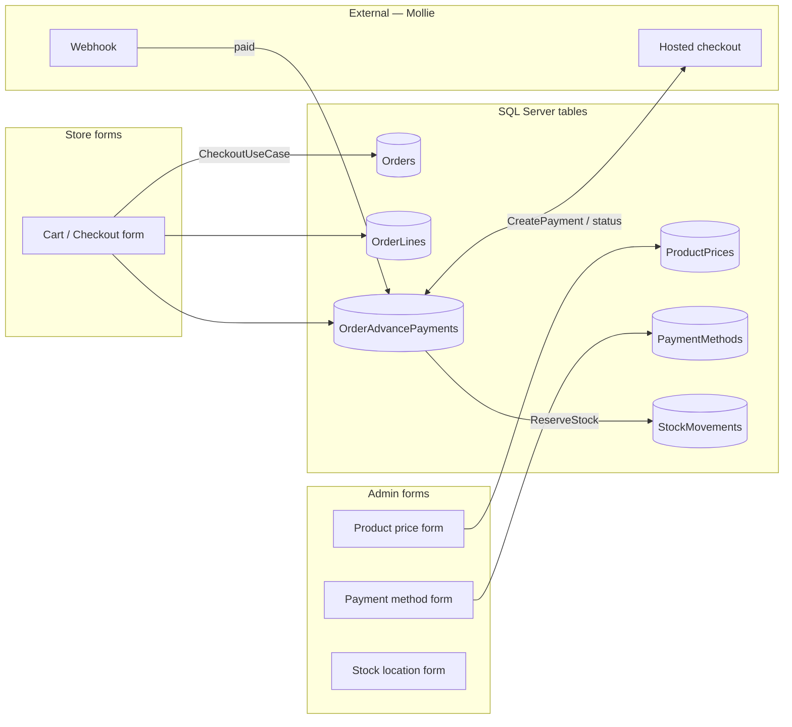
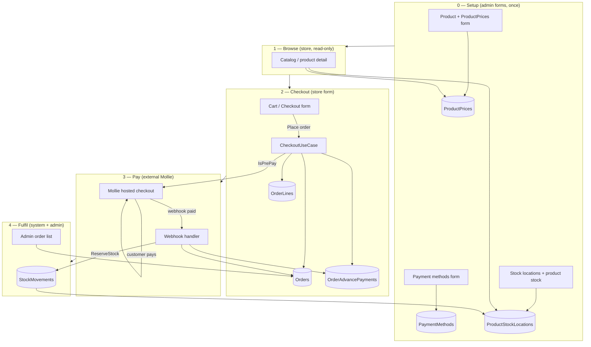
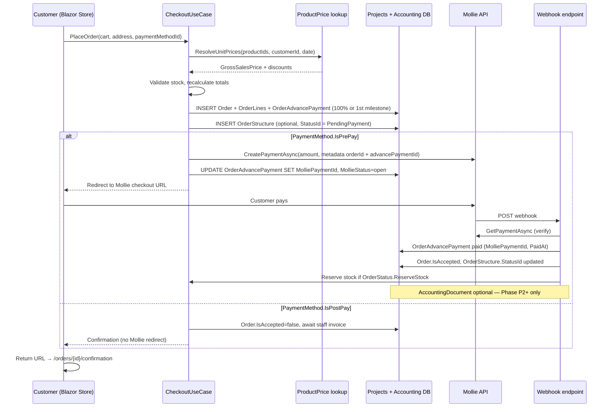
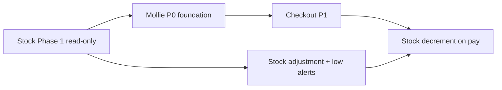

# Stock operations & storefront payments — proposal

    

> [!IMPORTANT] 
> **Executive summary:** Originally an analysis proposal — **core stock writes, checkout, Mollie (dev mock), manual adjustment, and low-stock alerts are now implemented** (see **§0** and [open_IMPLEMENTATION_ROADMAP.md](./open_IMPLEMENTATION_ROADMAP.md)). **Dev priority:** Phase E stock ops. **Prod go-live (last):** 3b SMTP, B.9 Mollie E2E, M.5 Azure Blob.

> **Live tracker:** [open_IMPLEMENTATION_ROADMAP.md](./open_IMPLEMENTATION_ROADMAP.md)

---

## 0. Implementation log (delivered)

_Last updated: May 2026 — see [open_IMPLEMENTATION_ROADMAP.md](./open_IMPLEMENTATION_ROADMAP.md) for current phase status._

### 0.1 Stock movement service (sale + manual)

| Item | Status | Implementation |
|------|--------|----------------|
| `IStockMovementService` | ✅ | `Application/Ports/Outbound/IStockMovementService.cs` |
| `StockMovementService` | ✅ | `Infrastructure/Stock/StockMovementService.cs` — single transaction: `StockMovement` + `ProductStockLocation.Quantity` |
| PrePay stock decrement | ✅ | After `PaymentPaid` — `ProcessMollieWebhookUseCase` + `GetOrderSummaryAsync` fallback |
| PostPay stock decrement | ✅ | Immediately after `CreateWebshopOrderAsync` in `CheckoutUseCase` |
| Idempotency | ✅ | Skip if movements already exist for order line ids |
| Negative stock on write | ✅ Blocked | All-or-nothing; no negative `Quantity` on sales/adjustments |
| Manual adjustment | ✅ | `ApplyManualAdjustmentAsync` — signed qty + required reason |

### 0.2 Manual adjustment UI + API

| Item | Route / API | Status |
|------|-------------|--------|
| Admin form | `/admin/stock/adjustment` | ✅ |
| Hub card | Stock hub → **Stock adjustment** | ✅ |
| REST | `POST /api/admin/stock/adjustments` | ✅ |
| Preview | `GET /api/admin/stock/adjustments/preview` | ✅ |
| Use case | `IStockAdjustmentPort` / `StockAdjustmentUseCase` | ✅ |

**Rule:** Business stock corrections use the adjustment screen — not direct quantity edits on the product-stock grid (grid remains master-data CRUD).

### 0.3 Low stock: `MinQuantity`, alerts, dashboard, storefront

| Item | Status | Notes |
|------|--------|-------|
| **Min quantity cadastro** | ✅ | `/admin/product-stock` → `ProductStockLocation.MinQuantity` |
| **Low-stock filter** | ✅ | `/admin/product-stock?lowStock=true` + **All / Low stock** toggle |
| **Red row highlight** | ✅ | `table-danger` when `Quantity <= MinQuantity` |
| **Stock overview link** | ✅ | Review → `?lowStock=true` |
| **Dashboard table** | ✅ | `/admin` — **Products below minimum** with product, location, on hand, min, badges |
| **In-app notifications** | ✅ | `StockLowAlerts` table (`ApplicationDbContext`); created on threshold cross after sale/adjustment/save |
| **Dismiss alerts** | ✅ | Dashboard **Dismiss all** → `MarkStockAlertsReadAsync` |
| **Storefront low stock** | ✅ | Catalog + product detail use `MinQuantity` from default location (`IsLowStock`, `IsOutOfStock`) — not hardcoded `< 10` |
| **Email push** | ✅ dev / ⬜ prod | In-app ✅; dev mock ✅; prod SMTP worker last |

**Alert rule:** `Quantity <= MinQuantity`. Notification fires when stock **crosses** below minimum or while low with no unread alert for that `ProductStockLocationId`.

### 0.4 Mollie & checkout (Part II — code complete, ops pending)

| Item | Status |
|------|--------|
| `MolliePaymentAdapter`, webhook, `OrderAdvancePayment` columns | ✅ |
| `CheckoutUseCase`, stock validation, audit `CheckoutStarted` / `PaymentPaid` | ✅ |
| `Mollie:ApiKey` + public webhook URL + E2E test | ⬜ See roadmap **B.9** — configure after Mollie dev account |

### 0.5 Still pending (from original proposal)

| Feature | Phase | Reference |
|---------|-------|-----------|
| `ReservedQuantity` / `OrderStatus.ReserveStock` workflow | 4 | §3.7 — **we decrement on pay, not reserve** |
| SignalR `StockUpdated` | optional | Roadmap Phase F |
| Audit `StockAdjust` badge | 6 | [AUDITS_open.md](./AUDITS_open.md) |
| Demo seed: movements + PO (full) | 1 | §5 — partial in seeds |

### 0.6 Stock hub extension — transfer, PO, GRN (Jun/2026)

| Item | Route / API | Status |
|------|-------------|--------|
| Transfer between locations | `/admin/stock/transfers/new` | ✅ |
| Transfer API | `POST /api/admin/stock/transfers` | ✅ |
| Purchase orders | `/admin/stock/purchase-orders` | ✅ |
| PO receive (GRN) | `/admin/stock/purchase-orders/{id}/receive` | ✅ |
| GRN API | `POST /api/admin/stock/purchase-orders/{id}/receive` | ✅ |
| `ApplyPurchaseOrderReceiveAsync` | `StockMovementService` | ✅ |

**Mollie (storefront):** code + dev mock ✅ — real `test_…` API key + public webhook when you create a Mollie dev account ([open_MOLLIE_PAYMENTS_open.md](./open_MOLLIE_PAYMENTS_open.md) **B.9**).

---

# Part I — Stock operations

## 1. Current state vs. gap

### 1.1 What exists today

| Area | Status | Notes |
|------|--------|-------|
| **Tables in DB** | ✅ | `StockLocations`, `ProductStockLocations`, `StockMovements`, `StockOrder*`, `Orders`, `OrderAdvancePayments` |
| **EF entities** | ✅ | `Model/Entities/*.cs` + `WebShopABMATICDbContext` |
| **Stock writes** | ✅ | `IStockMovementService` — sales (PostPay + PrePay paid) + manual adjustment |
| **Admin hub** | ✅ | Overview, movement journal, **stock adjustment**, product-stock, stock locations |
| **Low stock** | ✅ | `MinQuantity`, filtered grid, dashboard table, in-app `StockLowAlerts`, storefront `IsLowStock` |
| **Dashboard KPIs** | ✅ | Low/out counts + **products below minimum** table + notification banner |
| **Demo seed** | 🟡 Partial | Movements + minimal PO in seeds; not full PO/GRN demo |
| **Storefront** | ✅ | Real prices, stock display, checkout decrements stock; **no reservation** model yet |


| Area | Table | Role |
|------|-------|------|
| **Catalog / price** | `Product`, `ProductPrices` | What we sell; unit price for store + checkout |
| **Customer sale** | `Orders`, `OrderLines` | Webshop order header + lines (from checkout form) |
| **Payment** | `OrderAdvancePayments` | Mollie payment id, status, paid date, checkout URL |
| **Payment config** | `PaymentMethods` | Pre-pay (Mollie) vs post-pay (invoice) — admin form |
| **Stock on hand** | `ProductStockLocations`, `StockLocations` | Current quantity per warehouse |
| **Stock history** | `StockMovements` | Ledger; optional link to `OrderLine` when order affects stock |
| **Supplier buy** | `StockOrder`, `StockOrderLines`, `StockOrderDeliveries` | Purchase orders — separate from customer `Orders` |
| **External** | **Mollie** | Hosted checkout + webhook — outside our database |

**Design principles:**

- `ProductStockLocation.Quantity` = on-hand stock; `StockMovements` = audit trail.
- **`StockOrder*`** = buying from supplier · **`Orders` / `OrderLines`** = selling to customer.
- Online pay: checkout → `OrderAdvancePayment` → **Mollie** → webhook marks paid → **`StockMovement`** (decrement on pay).

### 1.3 Current implementation gap

| Area | Schema | App today | Gap |
|------|--------|-----------|-----|
| **ProductPrices** | ✅ | Store + checkout wired | Keep seeds in sync |
| **Orders + OrderLines** | ✅ | Store checkout creates rows | Admin payment columns (Phase C) |
| **OrderAdvancePayments + Mollie** | ✅ | Integrated in code | Ops: API key + webhook E2E |
| **Stock movements on sale** | ✅ | `ApplySaleFromOrderAsync` | — |
| **Manual adjustment** | ✅ | `/admin/stock/adjustment` + API | Audit `StockAdjust` badge |
| **Low stock alerts** | ✅ | In-app `StockLowAlerts` | Email push optional |
| **Transfer / PO / GRN** | ✅ | `/admin/stock/transfers/new`, `/admin/stock/purchase-orders`, receive form |
| **Reservation model** | ✅ columns | Not used | §3.7 deferred — direct decrement instead |

### 1.4 Entity ↔ form model (how tables get their data)

In vNext, most legacy tables correspond to a **Razor form** (admin or store). Others are **system-generated** when a use case runs (checkout, webhook, stock rule). This is the same hexagonal pattern as Product: **form → port → use case → repository → table**.

#### Legend

| Symbol | Meaning |
|--------|---------|
| 📝 **Form** | User fills a screen; Save writes the table |
| ⚙️ **System** | Use case inserts/updates rows; no dedicated edit form |
| 🔗 **External** | Data lives outside our DB (Mollie PSP) |

#### Master data — staff forms (admin)

| Form / screen | Route (existing or proposed) | Table(s) written | Who |
|---------------|------------------------------|------------------|-----|
| Product | `/admin/products` | `Product` | Admin |
| Product price | `/admin/product-prices` | `ProductPrices`, optionally `ProductPriceSalesDiscounts` | Admin |
| Payment method | `/admin/payment-methods` | `PaymentMethods` | Admin |
| Payment term | *(CRM admin TBD)* | `PaymentTerms` | Admin |
| Stock location | `/admin/stock-locations` | `StockLocations` | Admin |
| Product stock snapshot | `/admin/product-stock` | `ProductStockLocations` | Admin |
| Supplier / manufacturer | `/admin/suppliers`, … | `Supplier`, … | Admin |
| Purchase order | `/admin/stock/purchase-orders` *(proposed)* | `StockOrder`, `StockOrderLines` | Admin |
| Receive delivery | `/admin/stock/purchase-orders/{id}/receive` *(proposed)* | `StockOrderDeliveries`, `StockMovements`, `ProductStockLocations` | Admin |
| Manual adjustment | `/admin/stock/adjustment` | `StockMovements`, `ProductStockLocations` | Admin |
| Order (staff edit) | `/admin/orders` | `Orders`, `OrderLines` | Admin |

#### Store — customer forms

| Form / screen | Route | Table(s) written | Who |
|---------------|-------|------------------|-----|
| Catalog / product detail | `/`, `/product/{id}` | *(read only)* | Customer |
| **Cart / checkout** | `/cart` | **`Orders`**, **`OrderLines`**, **`OrderAdvancePayment`** | Customer → **CheckoutUseCase** |
| Order history | `/orders`, `/orders/{id}` | *(read only)* | Customer |

#### System-generated (no manual form)

| Trigger | Table(s) | Notes |
|---------|----------|-------|
| Checkout submit | `Orders`, `OrderLines`, `OrderAdvancePayment` | Built from cart + pricing port |
| Mollie webhook **paid** | `OrderAdvancePayment`, audit `PaymentPaid`, **`StockMovement`** | `ApplySaleFromOrderAsync` when PrePay |
| PostPay checkout | `Order` + lines + **`StockMovement`** | Immediate decrement — no manager approval |
| Product-stock save / manual adjust | `StockLowAlerts` (app DB) | When `Quantity <= MinQuantity` |
| Payment confirmed + `OrderStatus.ReserveStock` | `ReservedQuantity` *(not implemented)* | §3.7 deferred — we decrement instead |
| PO receive (GRN) | `StockMovements`, line delivery fields | From receive form; movement rows calculated |

#### External — Mollie (not a table)

| Artifact | Where it lives | Our link |
|----------|----------------|----------|
| Payment session `tr_…` | **Mollie cloud** | Stored on `OrderAdvancePayment.MolliePaymentId` |
| Hosted checkout URL | **Mollie cloud** | Redirect customer from `/cart` |
| Payment status | **Mollie cloud** | Webhook → use case updates `OrderAdvancePayment` |



### 1.5 Complete sales cycle (customer view + Mollie external)

End-to-end cycle tying **forms**, **tables**, **stock**, and **Mollie** (outside the database):



**How to read this:**

| Phase | What the customer/staff sees | What gets written |
|-------|------------------------------|-------------------|
| **0 Setup** | Admin maintains catalog, prices, payment methods, stock | Master tables via **forms** |
| **1 Browse** | Store catalog, stock hint, price from `ProductPrices` | Read only |
| **2 Checkout** | Cart: address, delivery, payment method, **Place order** | `Orders` + `OrderLines` + `OrderAdvancePayment` via **checkout form** |
| **3 Pay** | Redirect to **Mollie** (iDEAL, card, …) — **outside our app** | Webhook updates **`OrderAdvancePayment`** |
| **4 Fulfil** | Confirmation page; staff sees order in admin | Stock reservation → `StockMovement` |

> **Key idea:** **§1.2** is the macro entity view. **Forms** (§1.4) and **Mollie** (external) complete the picture for the client.

---

## 2. Proposed admin hub extension (stock)

Extend sidebar **Stock** (`/admin/hub/stock`) with operational screens (not only master CRUD):

| # | Card | Route | Type | Status |
|---|------|-------|------|--------|
| 1 | Stock overview | `/admin/stock/overview` | Dashboard | ✅ |
| 2 | Movement journal | `/admin/stock/movements` | Consultation + filter | ✅ |
| 3 | **Stock adjustment** | `/admin/stock/adjustment` | Form (creates movement) | ✅ |
| 4 | Transfer between locations | `/admin/stock/transfers/new` | Form (2 movements) | ✅ |
| 5 | Purchase orders | `/admin/stock/purchase-orders` | List + form | ✅ |
| 6 | PO delivery booking | `/admin/stock/purchase-orders/{id}/receive` | Form | ✅ |
| 7 | Stock locations | `/admin/stock-locations` | CRUD | ✅ |
| 8 | Product stock | `/admin/product-stock` | CRUD + **low-stock filter** | ✅ |

---

## 3. Feature proposals (detailed)

### 3.1 Stock overview dashboard — ✅ **Implemented**

**Route:** `/admin/stock/overview` · `IStockOverviewPort` / `StockOverviewUseCase`

**Widgets (delivered):**

| Widget | Query / rule | Action |
|--------|--------------|--------|
| Total SKUs in stock | Count where `Quantity > 0` | ✅ |
| Low stock | `Quantity <= MinQuantity` | Link to `/admin/product-stock?lowStock=true` ✅ |
| Out of stock / overstock | `Quantity <= 0` / `> MaxQuantity` | ✅ |
| Reserved vs available | Sum `ReservedQuantity` | ✅ |
| Movements today / 7d | `StockMovements.Timestamp` | Link to journal ✅ |
| Open POs | `StockOrder.IsCompleted = false` | ✅ (read-only KPI) |

---

### 3.2 Movement journal (consultation) — ✅ **Implemented**

**Route:** `/admin/stock/movements` · `IStockMovementAdminPort`

Webshop sales link **`OrderLineId`** on movement rows created by `ApplySaleFromOrderAsync`.

---

### 3.3 Manual stock adjustment — ✅ **Implemented**

**Route:** `/admin/stock/adjustment` · **API:** `POST /api/admin/stock/adjustments`

**Delivered:**

- `IStockAdjustmentPort` / `StockAdjustmentUseCase` → `IStockMovementService.ApplyManualAdjustmentAsync`
- Product + stock location + signed quantity + required reason (max 150 chars)
- Live preview of current balance; blocks negative result
- Hub card **Stock adjustment** in Stock hub

**Audit:** CRUD interceptor logs `Create`/`Update` on movement rows — dedicated **`StockAdjust`** badge still ⬜ ([AUDITS_open.md](./AUDITS_open.md)).

---

### 3.4 Transfer between locations — ✅ **Implemented**

**Route:** `/admin/stock/transfers/new` · **API:** `POST /api/admin/stock/transfers`

**Delivered:**

- `IStockTransferPort` / `StockTransferUseCase` → `IStockMovementService.ApplyLocationTransferAsync`
- Paired out/in `StockMovement` rows + atomic `ProductStockLocation` update
- Hub card **Stock transfer**

---

### 3.5 Purchase orders (supplier) — ✅ **Implemented**

**Route:** `/admin/stock/purchase-orders` · `IStockOrderAdminPort` / `StockOrderAdminUseCase`

**Delivered:**

- List with open-only filter, search, pagination
- Header: supplier, dates, notes, completed flag
- Lines grid: product id/name, qty ordered, unit price, line total
- `StockOrderRepository` — save header + sync lines; delete blocked when deliveries exist
- Hub card **Purchase orders**

---

### 3.6 Receive delivery (GRN) — ✅ **Implemented**

**Route:** `/admin/stock/purchase-orders/{id}/receive` · **API:** `POST /api/admin/stock/purchase-orders/{id}/receive`

**Delivered:**

- `IStockPoReceivePort` / `StockPoReceiveUseCase` → `ApplyPurchaseOrderReceiveAsync`
- Inserts `StockOrderDelivery`, updates line delivered/processed qty, inbound `StockMovement`, bumps `ProductStockLocation`
- Marks `StockOrder.IsCompleted` when all lines fulfilled
- Link from PO list and overview KPI

---

### 3.7 Reservations & sales integration — **Recommend: Phase 4 (or defer)**

**Purpose:** Link webshop/admin sales to stock (`IsReservation`, `ReservedQuantity`, `OrderLineId` on movement).

**Triggers:**

- Order accepted → reserve quantity
- Order shipped → movement out, release reservation
- Order cancelled → release reservation

**Depends on:** Stable order fulfilment workflow (today orders are edit-only in admin).

**Effort:** Very high · **Value:** Critical for production store · **Risk:** High

**Recommendation:** **Deferred** — checkout now **decrements on pay** via `IStockMovementService` (see §0.1). Full reserve/ship/cancel workflow remains future work.

---

### 3.8 Low stock alerts & notifications — ✅ **Implemented**

**Purpose:** Warn admin/manager when `ProductStockLocation.Quantity <= MinQuantity`.

| Layer | Delivered |
|-------|-----------|
| **Cadastro** | `MinQuantity` on `/admin/product-stock` |
| **Admin grid** | Filter `?lowStock=true`, red rows, product name column |
| **Dashboard** | Table **Products below minimum**, notification banner, dismiss all |
| **In-app alerts** | `StockLowAlerts` (`ApplicationDbContext`); `ILowStockAlertService` |
| **Triggers** | After sale, manual adjustment, product-stock save |
| **Storefront** | `StoreProductDto.IsLowStock` / `IsOutOfStock` from default location `MinQuantity` |
| **Email** | ⬜ Not wired |

**Services:** `LowStockAlertService`, `LowStockReadRepository`, `MarkStockAlertsReadAsync` on dashboard port.

---

## 4. Dashboard integration (`/admin`) — stock KPIs

**Delivered on `/admin`:**

| KPI / UI | Source | Status |
|----------|--------|--------|
| Low / out counts | `ProductStockLocation` | ✅ Stock card |
| Movements last 7 days | `StockMovements` | ✅ |
| Open purchase orders | `StockOrder` | ✅ KPI only |
| **Products below minimum** table | Join product + location | ✅ |
| **Unread stock alerts** banner | `StockLowAlerts` | ✅ |
| Stock value (optional) | Qty × `ProductPrice` | ⬜ |

---

## 5. Seed data proposal (`seeds.sql` extension)

To demo screens without `ABMATIC.bacpac`:

| Data | Rows | Purpose |
|------|------|---------|
| **`ProductPrices`** | 1 row per webshop product (10) | **Fix store/admin pricing** — currently missing entirely |
| **`PaymentMethods`** | iDEAL/card (pre-pay) + invoice (post-pay) | Replace hardcoded cart dropdown |
| **`PaymentTerms`** | Default 30 days | Satisfy `Order.BetaaltermijnId` FK |
| **`OrderStatuses`** | Pending / Paid / Accepted + `ReserveStock` flags | Fulfilment + stock rules |
| 5–10 `StockMovements` | In/out/reservation mix | Movement journal |
| 1 open `StockOrder` + 3 lines | Supplier from seed | PO list |
| 1 `StockOrderDelivery` | Partial delivery | Receive flow demo |
| **`OrderAdvancePayments`** | 1× 100% on 2–3 demo orders | ✅ Payment schedule + Mollie ids in `seeds.sql` |
| **`StockLowAlerts`** | 1 row per low-stock SKU (3 unread) | ✅ Dashboard banner / table |
| **`AuditLogs`** | 12 demo rows | ✅ Audit grid + checkout/Mollie trail |
| **`EmailQueues`** | `Outbound`, `LowStockAlerts` | ✅ Placeholder for future email push |
| **`AccountingDocuments`** | 1 paid invoice linked to order | Show `BetaaldOp` / payment method |
| Tie 1 movement to `OrderLineId` | Optional | Show sales link column |

**ProductPrices seed example (concept):**

```sql
INSERT INTO [Products].[ProductPrices]
    ([FromAddress], [ProductId], [GrossSalesPrice], [BasePrice], [AssemblyPrice], [InstallationPrice], ...)
VALUES
    (GETUTCDATE(), 1, 49.99, 49.99, 0, 0, ...),
    (GETUTCDATE(), 2, 59.99, 59.99, 0, 0, ...);
-- one active row per ProductId; align with former hardcoded StoreCatalogService formula
```

**Effort:** Small–medium once pricing port and Phase 1 queries exist.

---

## 6. Hexagonal implementation map (when approved)

For each approved feature, repeat the existing admin pattern:

```
Web/*List.razor or *Overview.razor
  → IStockXxxPort              (Application/Ports/Inbound)
  → StockXxxUseCase            (Application/UseCases/Admin/Stock)
  → IStockXxxRepository        (Application/Ports/Outbound)
  → StockXxxRepository         (Infrastructure/Persistence/Repositories)
  → optional Domain rules      (Domain/Inventory/...)
```

**Suggested Application folders:**

- `Application/Admin/Stock/Overview/` — DTOs
- `Application/Admin/Stock/Movements/`
- `Application/Admin/Stock/PurchaseOrders/`
- `Application/UseCases/Admin/Stock/`

**Do not** put movement write logic only in Razor or only in repositories — use cases own transactions.

---

## 7. Recommendation matrix (what to do now)

| Feature | Do now? | Phase | Rationale |
|---------|---------|-------|-----------|
| Stock overview dashboard | ✅ Done | 1 | `/admin/stock/overview` |
| Movement journal (consultation) | ✅ Done | 1 | `/admin/stock/movements` |
| Extend dashboard KPIs (movements, open POs) | ✅ Done | 1 | + low-stock table & alerts |
| Demo seed for movements + 1 PO | 🟡 Partial | 1 | Some seed rows exist |
| Manual adjustment | ✅ Done | 2 | `/admin/stock/adjustment` |
| Low stock filter + notifications | ✅ Done | 2 | §3.8 |
| Storefront `MinQuantity` display | ✅ Done | 2 | Catalog + product detail |
| Transfer between locations | ⏳ Later | 2 | §3.4 |
| Purchase order CRUD | ⏳ Later | 3 | §3.5 |
| Receive delivery / GRN | ⏳ Later | 3 | §3.6 |
| Sales reservation integration | ❌ Defer | 4 | Direct decrement implemented instead |
| Negative stock on write | ✅ Blocked | 2 | Documented in §0.1 |

---

## 8. Part I — decision summary

See **§7 recommendation matrix** for stock phases 1–4. Part I can proceed independently for read-only dashboards and movement journal.

---

## 9. Part II — scope

Checkout and Mollie use the **macro tables in §1.2** (`Orders`, `OrderLines`, `OrderAdvancePayments`, `ProductPrices`). Only schema addition discussed: **Mollie columns** on `OrderAdvancePayments` (§14).

---

# Part II — Store checkout, orders & Mollie payments

## 10. Target customer flow (when customer clicks “Place order”)



**Principles:**

1. **Order exists before redirect** — so we always have an internal id even if the customer abandons Mollie.
2. **Webhook is source of truth** — return URL is UX only; never mark paid solely from redirect.
3. **Idempotent webhook handler** — Mollie may retry; same `payment id` must not double-reserve stock.
4. **Pre-pay vs post-pay** — `PaymentMethod.IsPrePay` / `IsPostPay` decides Mollie vs invoice-on-account (`PaymentTerm` / `BetaaltermijnId`).
5. **Use legacy tables first** — checkout form → `Order` + `OrderLine` + `OrderAdvancePayment`; Mollie is **external** (§1.2, §1.5).

---

## 10.1 Sales cycle ↔ forms (quick reference)

Same cycle as **§1.5**, as a numbered checklist for review:

| Step | Actor | UI | DB / external |
|------|-------|-----|---------------|
| 1 | Admin | Product price form | `ProductPrices` |
| 2 | Admin | Payment method form | `PaymentMethods` |
| 3 | Customer | Catalog | read `ProductPrices`, `ProductStockLocations` |
| 4 | Customer | **Checkout form** (`/cart`) | insert `Orders`, `OrderLines`, `OrderAdvancePayments` |
| 5 | Customer | **Mollie** hosted page *(external)* | — |
| 6 | Mollie | Webhook → our API | update `OrderAdvancePayments`, `Orders` |
| 7 | System | — | optional `StockMovements` if paid + `ReserveStock` |
| 8 | Admin | Order list | read/update `Orders` |

## 11. Pricing pipeline (ProductPrices → checkout)

Checkout **must not** use `StoreCatalogService`'s hardcoded prices. Proposed resolution order (match legacy ABMATIC as far as practical):

| Step | Source | Rule |
|------|--------|------|
| 1 | `ProductPrices` | Active row: `FromAddress <= today` AND (`ValidTo` IS NULL OR `ValidTo >= today`) |
| 2 | `ProductPriceSalesDiscounts` | Quantity tier on that price row |
| 3 | `CustomerProductDiscounts` | Customer-specific % off |
| 4 | `CustomerTypes.BaseDiscount` | Customer type base discount |
| 5 | `Order.GeneralDiscount` / line `Discount` | Applied at order build time |

**Hexagonal slice:**

```
IStoreCatalogPort / ICheckoutPort
  → IProductPricingPort              (Application/Ports/Outbound)
  → ProductPricingRepository         (queries ProductPrices + discounts)
```

**Seed gap:** `seeds.sql` inserts 12 products and 34 orders with **inline `UnitPrice` on lines** but **zero `ProductPrices` rows** — admin product-price screen and store catalog will disagree until seeded.

**Admin hub:** `/admin/product-prices` already exists — after seed, staff can maintain prices that the store reads.

---

## 12. Mollie library — what we will use

Official .NET client: **[Viincenttt/MollieApi](https://github.com/Viincenttt/MollieApi)** (NuGet **`Mollie.Api`**, latest stable ~4.x). Optional **`Mollie.Api.AspNet`** for webhook parsing and signature validation in ASP.NET Core.

| Capability | Library surface | Our usage |
|------------|-----------------|-----------|
| Register clients | `builder.Services.AddMollieApi(options => { options.ApiKey = ...; })` | `Web/Program.cs` + `appsettings` / user secrets |
| Create payment | `IPaymentClient.CreatePaymentAsync(PaymentRequest)` | Checkout after order insert |
| Hosted checkout | `paymentResponse.Links.Checkout.Href` | Browser redirect from Blazor |
| Verify status | `IPaymentClient.GetPaymentAsync(paymentId)` | Webhook handler + return page |
| Refunds (later) | `IRefundClient` | Admin refund action — Phase P3 |
| Webhooks (ASP.NET) | `[FromMollieWebhook]`, `MollieSignatureFilter` | Minimal API or controller endpoint |
| Reference sample | [Mollie.WebApplication.Blazor](https://github.com/Viincenttt/MollieApi/tree/development/samples/Mollie.WebApplication.Blazor) | Patterns for Blazor + payments |

**Minimal create-payment example (from library README):**

```csharp
var paymentRequest = new PaymentRequest {
    Amount = new Amount(Currency.EUR, orderTotal),
    Description = $"WebShop order #{orderId}",
    RedirectUrl = $"{baseUrl}/orders/{orderId}/payment-return",
    WebhookUrl = $"{baseUrl}/api/webhooks/mollie/payments",
    Metadata = JsonSerializer.Serialize(new { orderId }),
    Method = selectedMollieMethod // optional; omit to let customer choose on Mollie page
};
PaymentResponse response = await paymentClient.CreatePaymentAsync(paymentRequest);
// Redirect user to response.Links.Checkout.Href
```

**Configuration (not committed):**

```json
"Mollie": {
  "ApiKey": "test_xxxxxxxx",
  "WebhookSecret": "...",
  "UseTestMode": true
}
```

Use Mollie **test API keys** in development; live keys only in production Key Vault / user secrets.

---

## 13. Hexagonal mapping — checkout & payments

Do **not** call `IPaymentClient` from Razor pages. Follow the same pattern as admin use cases:

```
Web/Components/Pages/Store/Cart.razor, CheckoutReturn.razor
  → ICheckoutPort                    (Application/Ports/Inbound)
  → CheckoutUseCase                  (Application/UseCases/Store)
  → IProductPricingPort              (ProductPrices + discounts)
  → IStoreOrderRepository            (Order, OrderLine, OrderAdvancePayment, OrderStructure)
  → IAccountingDocumentRepository    (create/update invoice + BetaaldOp — Phase P1b or P2)
  → IMolliePaymentPort               (Application/Ports/Outbound — abstraction)
  → MolliePaymentAdapter             (Infrastructure/Payments — wraps IPaymentClient)
  → IStockReservationPort            (Phase 4 / on payment paid)
```

**Suggested new Application folders:**

| Folder | Contents |
|--------|----------|
| `Application/Store/Checkout/` | `CheckoutRequestDto`, `CheckoutResultDto`, `OrderConfirmationDto` |
| `Application/Ports/Inbound/` | `ICheckoutPort`, `IPaymentWebhookPort`, `IStoreOrderQueryPort` |
| `Application/Ports/Outbound/` | `IMolliePaymentPort`, `IProductPricingPort`, `IStoreOrderRepository`, `IAccountingDocumentRepository` |
| `Application/UseCases/Store/` | `CheckoutUseCase`, `ProcessMolliePaymentWebhookUseCase` |
| `Infrastructure/Payments/` | `MolliePaymentAdapter`, webhook signature helper |
| `Domain/Orders/` (optional) | `Order` aggregate rules — totals, allowed transitions |

**`IMolliePaymentPort` (sketch):**

```csharp
public interface IMolliePaymentPort
{
    Task<MolliePaymentCreated> CreatePaymentAsync(CreateMolliePaymentCommand cmd, CancellationToken ct);
    Task<MolliePaymentStatus> GetPaymentAsync(string molliePaymentId, CancellationToken ct);
}
```

Infrastructure implements this with injected `IPaymentClient` from `AddMollieApi`. Application never references `Mollie.Api` types — only our DTOs.

---

## 14. Data model — use legacy tables + minimal Mollie extension

### 14.1 What legacy already gives us (no new “Order” tables)

| Concern | Legacy table | Key fields |
|---------|--------------|------------|
| Order header | `Projects.Orders` | `ProjectId`, `IsAccepted`, `BetaaltermijnId`, `DeliveryTypeId`, `OrderNumber` |
| Line items | `Projects.OrderLines` | `ProductId`, `Quantity`, `UnitPrice`, `TotalExclVat`, `TotalInclVat` |
| **Payment schedule** | **`Projects.OrderAdvancePayments`** | `OrderId`, `Name`, `Percent`, `Amount`, `InvoicedAt`, `IsFinalInvoice`, `SortOrder` |
| Dossier / status | `Projects.OrderStructures` | `OrderId`, `StatusId`, `TotalAmount`, milestone dates |
| **Paid in accounting** | **`Accounting.AccountingDocuments`** | `OrderId`, **`BetaaldOp`**, **`BetalingswijzeId`**, `DocumentTotalAmount`, `IsVoorschotFactuur` |
| Payment method | `Settings.PaymentMethods` | `IsPrePay`, `IsPostPay`, names NL/FR/EN |
| Payment terms | `Crm.PaymentTerms` | `AantalDagen` → `Order.BetaaltermijnId` |
| Unit prices | `Products.ProductPrices` | `GrossSalesPrice`, validity dates |

**Legacy payment semantics (ABMATIC):**

1. **`OrderAdvancePayment`** (*DossierVoorschot*) — defines **milestones** (e.g. 30% deposit, 70% on delivery). For a simple webshop cart, one row at **100%** named “Online payment” is enough.
2. **`AccountingDocument`** — when money is received, staff (or our webhook handler) sets **`BetaaldOp`** and links **`BetalingswijzeId`** to the `PaymentMethod` used (iDEAL, card, …).
3. **`Order.IsAccepted`** — business acceptance separate from payment; webhook may set both or only payment-related fields — **confirm with business**.

### 14.2 What Mollie adds (only PSP-specific data)

Legacy schema has **no** `MolliePaymentId`. Options:

| Option | Approach | Recommendation |
|--------|----------|----------------|
| **A (recommended)** | Add nullable columns to **`OrderAdvancePayments`**: `MolliePaymentId`, `MolliePaymentStatus`, `MolliePaidAt`, `MollieCheckoutUrl` | Keeps PSP data on the **payment milestone** row; supports retries (new row per attempt) |
| B | Same columns on **`AccountingDocuments`** | Fits if you always create an invoice document before Mollie |
| C | New `[Projects].[OrderPayments]` table | Only if A/B are rejected — duplicates `OrderAdvancePayment` role |

We **do not** need a parallel order header — **`Orders` + `OrderAdvancePayments` + `AccountingDocuments`** already form the legacy payment story.

**Webshop checkout mapping:**

| Step | Table / action |
|------|----------------|
| Create order | `INSERT Orders`, `OrderLines`, `OrderStructure` |
| Pre-pay total | `INSERT OrderAdvancePayment` (100%, `Amount` = cart total) |
| Start Mollie | `UPDATE OrderAdvancePayment` with `MolliePaymentId`, redirect URL |
| Webhook paid | `UPDATE OrderAdvancePayment.MolliePaidAt`; `INSERT` or `UPDATE AccountingDocument` with `BetaaldOp`, `BetalingswijzeId`; `Order.IsAccepted = 1` |
| Post-pay | Skip Mollie; `OrderAdvancePayment` without Mollie ids; staff invoices later |

### 14.3 `PaymentMethod` → Mollie behaviour

| Admin `PaymentMethod` | Store behaviour |
|----------------------|-----------------|
| `IsPrePay = true` (e.g. iDEAL, card) | Mollie hosted checkout for `OrderAdvancePayment.Amount` |
| `IsPostPay = true` (e.g. invoice 30 days) | No Mollie; use `PaymentTerm`; order awaits staff |
| Neither flag | Hide from web checkout |

### 14.4 `OrderStatus` + stock

Use seeded/admin **`OrderStatuses`** — flags already on entity:

| Flag | When |
|------|------|
| `ReserveStock = true` | After payment confirmed (webhook) |
| `AffectsStock = true` | When order ships / completes (later fulfilment) |

Set `OrderStructure.StatusId` (or processing type’s default status) on create and update on payment.

---

## 15. Storefront screens (proposed)

| # | Route | Purpose | Phase |
|---|-------|---------|-------|
| 1 | `/cart` | Existing — wire to real delivery addresses + `PaymentMethod` from DB | P1 |
| 2 | `/checkout` | *(optional split)* Address, delivery type, payment method, review | P1 |
| 3 | `/orders/{id}/payment-return` | After Mollie redirect — poll/show “processing” until webhook or timeout | P1 |
| 4 | `/orders/{id}/confirmation` | Success summary + order lines | P1 |
| 5 | `/orders` | Customer order history (replace placeholder) | P2 |
| 6 | `/orders/{id}` | Detail + payment status badge | P2 |

**Cart changes (`PlaceOrderAsync`):**

1. Call `ICheckoutPort.PlaceOrderAsync(...)` instead of `CartService.Clear()`.
2. If result contains `CheckoutUrl`, `Navigation.NavigateTo(checkoutUrl, forceLoad: true)` (external Mollie URL).
3. If post-pay, navigate to confirmation directly.

**Validation (server-side, in use case):**

- Authenticated customer with `CustomerId`  
- Delivery address belongs to customer (`CustomerDeliveryAddress`)  
- Stock available ≥ line qty (read `ProductStockLocation`)  
- Recalculate totals from **`ProductPrices`** (+ customer discounts) — **never trust client cart prices**

---

## 16. Admin extensions (orders + payments)

| Screen | Route | Primary tables |
|--------|-------|----------------|
| Order list enhancement | `/admin/orders` | `Orders` + join `OrderAdvancePayments` (Mollie status) + `AccountingDocuments.BetaaldOp` |
| Order advance payments | `/admin/orders/{id}/advance-payments` | `OrderAdvancePayments` (read/edit schedule) |
| Accounting documents | `/admin/accounting-documents` *(new hub card?)* | `AccountingDocuments`, lines |
| Product prices | `/admin/product-prices` *(exists)* | `ProductPrices` — **ensure seeded** |
| Payment methods | `/admin/payment-methods` *(exists)* | `PaymentMethods` |
| Refund (later) | action on paid order | Mollie `IRefundClient` + credit `AccountingDocument` |

Stock **movement journal** (Part I §3.2) links via `OrderLineId` once checkout creates real lines.

---

## 17. Payment phases (Part II roadmap)

| Phase | Scope | Depends on | Effort |
|-------|--------|------------|--------|
| **P0 — Foundation** | NuGet, `AddMollieApi`, config, `IMolliePaymentPort`, **`IProductPricingPort`**, seed **`ProductPrices`** | — | Small |
| **P1 — Happy path** | Persist `Order` + `OrderLine` + `OrderAdvancePayment`, Mollie redirect, webhook, **`BetaaldOp`** | P0 | High |
| **P1b — Accounting doc** | Create `AccountingDocument` on pay (or on order) — full legacy parity | P1 | Medium |
| **P2 — Store account** | `/orders` list/detail for customer; admin payment columns | P1 | Medium |
| **P3 — Refunds & edge cases** | Refund API, expired payments, retry payment, email notifications | P1 | Medium |
| **P4 — Stock link** | On paid / PostPay → `StockMovement` decrement (§0.1) | P1 | ✅ **Done in code** |

**Suggested build order with Part I:**



Stock overview and movement journal can ship **in parallel** with payment foundation — they do not block checkout.

---

## 18. Part II — recommendation matrix

| Feature | Do now? | Phase | Rationale |
|---------|---------|-------|-----------|
| Seed **`ProductPrices`** + wire store catalog | ✅ Done | P0 | |
| Add `Mollie.Api` + config + port/adapter | ✅ Done | P0 | Ops: test key + webhook |
| Checkout uses **`Orders` + `OrderLines` + `OrderAdvancePayments`** | ✅ Done | P1 | |
| Mollie columns on **`OrderAdvancePayments`** | ✅ Done | P1 | Migration applied |
| Webhook → paid + audit | ✅ Done | P1 | `BetaaldOp` / invoice parity optional |
| Wire **`PaymentMethod`** from DB | ✅ Done | P1 | |
| Stock decrement on paid / PostPay | ✅ Done | P4 | `IStockMovementService` |
| Manual stock adjustment | ✅ Done | D | §0.2 |
| Low stock alerts + dashboard | ✅ Done | D | §3.8 |
| Customer order history | 🟡 Maybe | P2 | Phase C roadmap |
| Admin: advance payments on order detail | 🟡 Maybe | P2 | Phase C |
| Refunds | ⏳ Later | P3 | |
| Stock reservation (`ReservedQuantity`) | ⏳ Later | P4 | §3.7 deferred |

---

## 19. Open questions — stock (Part I)

1. **Negative stock:** Does legacy ABMATIC allow `ProductStockLocation.Quantity < 0`?
2. **Movement sign convention:** Is positive `Quantity` always “in” and negative “out”, or always positive with `IsReservation`?
3. **ProductStockLocatieId:** Movements point to `ProductStockLocation.Id` — confirm UI selects product+location vs. internal id.
4. **PO numbering:** Is there an auto-numbering table (`Settings.AutoNumberings`) for `StockOrder`?
5. **Permissions:** Should adjustments be **Admin-only** and consultations **AdminOrManager**?
6. **Azure data:** Will you import `ABMATIC.bacpac` to Azure for realistic PO/movement volumes before building Phase 3?

---

## 20. Open questions — orders, pricing & Mollie (Part II)

1. **`OrderAdvancePayment` vs full invoice on checkout:** For webshop, is **100% single advance** enough, or multi-milestone (deposit + balance)?
2. **`InvoicedAt` vs `MolliePaidAt`:** Does `InvoicedAt` mean “invoice sent” (before payment)? Confirm before mapping webhook.
3. **`AccountingDocument` on pay:** Create invoice document immediately when Mollie pays, or only after staff acceptance?
4. **`OrderStructure`:** Create dossier row for every web order, or only `Orders` header?
5. **`ProjectId`:** Continue using seed pattern “Webshop — {Customer}” (`Project.IsStandardProject`)?
6. **Pricing rules:** Which discount layers apply on web (customer product discount, type base discount, all)?
7. **Currency:** Always EUR?
8. **Mollie methods:** Fixed (iDEAL + card) or all enabled on profile?
9. **Post-pay:** All B2B customers allowed, or only certain `CustomerType`?
10. **Webhook URL in dev:** ngrok / Azure tunnel / staging?
11. **Mollie id storage:** Approve columns on **`OrderAdvancePayments`** (recommended) vs new table?
12. **`OrderStatus` ids:** Import from `ABMATIC.bacpac` or define minimal seed set?

---

## 21. Suggested next steps

### Completed (see §0)

Stock Phase 1 read-only, checkout + Mollie (code), stock writes, manual adjustment, low-stock alerts.

### Recommended next

1. **Mollie prod go-live** — `Mollie:ApiKey`, webhook URL, E2E test ([open_IMPLEMENTATION_ROADMAP.md](./open_IMPLEMENTATION_ROADMAP.md) **B.9 — prod, last**).
2. **Audit `StockAdjust`** badge on movement operations ([AUDITS_open.md](./AUDITS_open.md)).
3. **Phase C** — customer/admin order visibility ([open_IMPLEMENTATION_ROADMAP.md](./open_IMPLEMENTATION_ROADMAP.md)).
4. **Transfer / PO / GRN** — §3.4–3.6 when purchasing team needs admin flows.
5. **Optional:** SignalR (roadmap Phase F). **Prod last:** SMTP worker (Phase 3b), Mollie E2E (B.9).

### Original approval checklist (historical)

<details>
<summary>Part I — Stock Phase 1 (done)</summary>

1. Add cards to `AdminHubRegistry` for Overview and Movement journal. ✅
2. Read-only ports + repositories + Razor pages. ✅
3. Extend `seeds.sql` with sample movements. 🟡
4. Dashboard KPIs. ✅ (+ low-stock table 2026)
</details>

<details>
<summary>Part II — Payments P0 + P1 (done in code)</summary>

1. Seed prices, payment methods, terms, order statuses. ✅
2. `IProductPricingPort` + store catalog. ✅
3. Mollie NuGet + adapter + webhook. ✅
4. `CheckoutUseCase` persisting orders. ✅
5. Cart checkout + redirect. ✅
</details>

---

## 22. References

| Resource | URL |
|----------|-----|
| Mollie .NET client (GitHub) | https://github.com/Viincenttt/MollieApi |
| Mollie API docs | https://docs.mollie.com |
| Blazor sample in repo | https://github.com/Viincenttt/MollieApi/tree/development/samples/Mollie.WebApplication.Blazor |
| Internal store spec | [SPEC_WEB_STORE.md](./SPEC_WEB_STORE.md) |
| Hexagonal layout | [SPEC_INFRASTRUCTURE.md](./SPEC_INFRASTRUCTURE.md) §1.2 |

---

## Documentation

- 🏠 [Main Documentation](../README.md) — Project overview and requirements

---

**© 2026 AdminSense. All rights reserved.**
