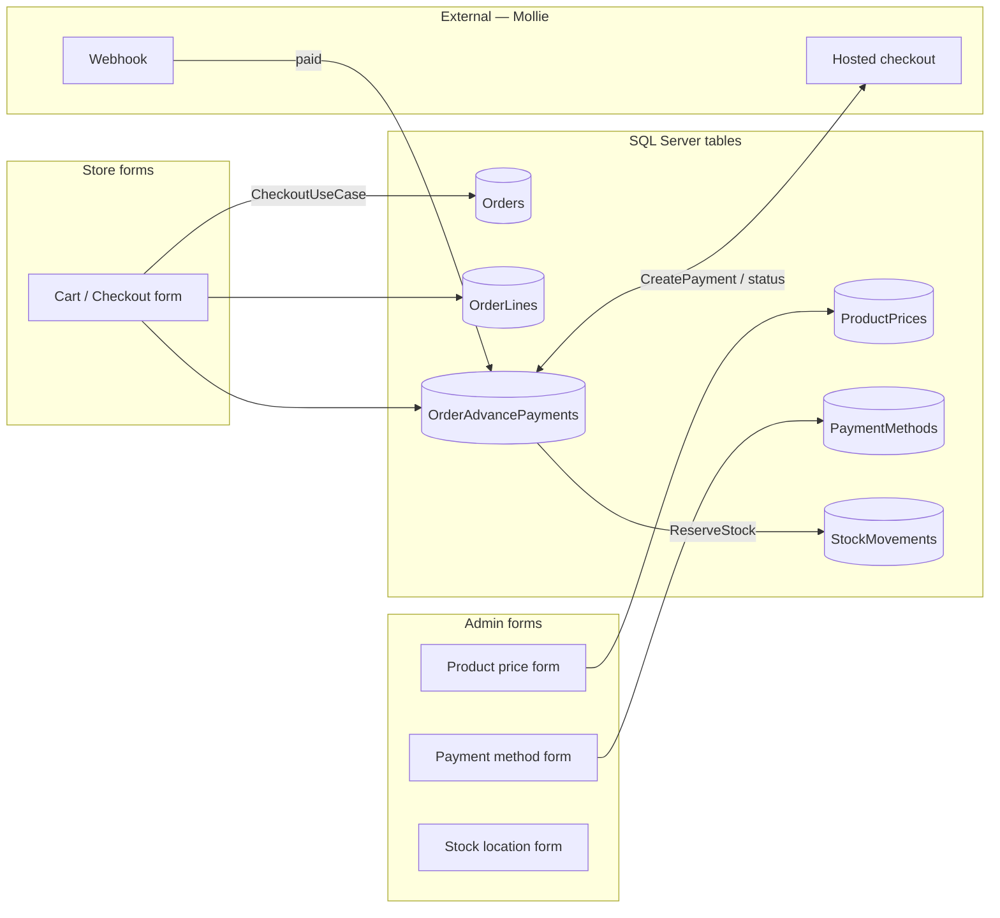
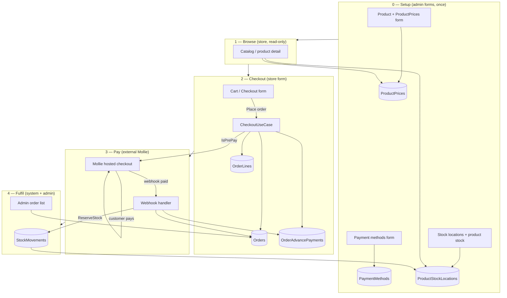
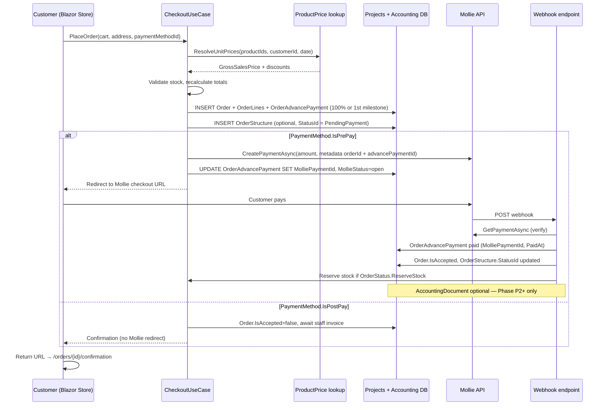
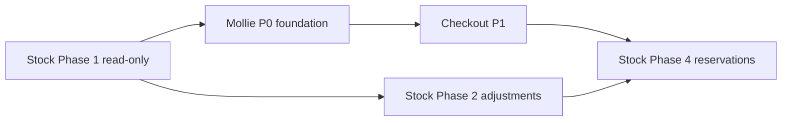

# Stock operations & storefront payments — proposal

   

> [!IMPORTANT]
> **Executive summary:** This document is an **analysis-only** proposal — no development until you approve it. **One macro data diagram (§1.2)** covers stock, sales order, pricing, and the payment link to **Mollie (external)**. **§1.4–§1.5** show forms and the full sales cycle for the client.

# Part I — Stock operations

---

## 1. Current state vs. gap

### 1.1 What exists today

| Area | Status | Notes |
|------|--------|-------|
| **Tables in DB** | ✅ Schema | `StockLocations`, `ProductStockLocations`, `StockMovements`, `StockOrder`, `StockOrderLines`, `StockOrderDeliveries` |
| **EF entities** | ✅ Mapped | `Model/Entities/*.cs` + `WebShopABMATICDbContext` |
| **Admin CRUD** | 🟡 Partial | `/admin/stock-locations`, `/admin/product-stock` — quantity snapshot only |
| **Dashboard KPIs** | 🟡 Partial | Low stock / out of stock from `ProductStockLocation`; no movement or PO metrics |
| **Demo seed** | ❌ | `seeds.sql` does **not** insert movements or stock orders |
| **Storefront** | ❌ | Catalog reads stock level; no reservation/movement integration |


| Area | Table | Role |
|------|-------|------|
| **Catalog / price** | `Product`, `ProductPrices` | What we sell; unit price for store + checkout |
| **Customer sale** | `Orders`, `OrderLines` | Webshop order header + lines (from checkout form) |
| **Payment** | `OrderAdvancePayments` | Amount to pay; stores **Mollie payment id** *(proposed column)* |
| **Payment config** | `PaymentMethods` | Pre-pay (Mollie) vs post-pay (invoice) — admin form |
| **Stock on hand** | `ProductStockLocations`, `StockLocations` | Current quantity per warehouse |
| **Stock history** | `StockMovements` | Ledger; optional link to `OrderLine` when order affects stock |
| **Supplier buy** | `StockOrder`, `StockOrderLines`, `StockOrderDeliveries` | Purchase orders — separate from customer `Orders` |
| **External** | **Mollie** | Hosted checkout + webhook — outside our database |

**Design principles:**

- `ProductStockLocation.Quantity` = on-hand stock; `StockMovements` = audit trail.
- **`StockOrder*`** = buying from supplier · **`Orders` / `OrderLines`** = selling to customer.
- Online pay: checkout → `OrderAdvancePayment` → **Mollie** → webhook marks paid → optional `StockMovement`.

### 1.3 Current implementation gap

| Area | Schema | App / seed today | Gap |
|------|--------|------------------|-----|
| **ProductPrices** | ✅ | Admin CRUD ✅ · **`seeds.sql` empty** · Store uses fake prices | Seed + wire store pricing |
| **Orders + OrderLines** | ✅ | Seeded for admin demo · Store **does not create** | Checkout must insert |
| **OrderAdvancePayments** | ✅ | Not seeded · not used | Payment row + Mollie link |
| **PaymentMethods** | ✅ | Admin CRUD ✅ · not in seeds · cart hardcoded | Seed + checkout dropdown |
| **Mollie** | — | Not integrated | NuGet + webhook (Part II) |
| **Stock movements / PO demo** | ✅ | Not seeded | Part I Phase 1 seed |
| **Store checkout** | — | `Cart.razor` clears cart only | Full Part II |

When the customer clicks **Place order**: price from `ProductPrices` → save `Order` + `OrderLine` + `OrderAdvancePayment` → redirect **Mollie** (pre-pay) → webhook marks paid → optional stock reservation.

### 1.4 Entity ↔ form model (how tables get their data)

In vNext, most legacy tables correspond to a **Razor form** (admin or store). Others are **system-generated** when a use case runs (checkout, webhook, stock rule). This is the same hexagonal pattern as Product: **form → port → use case → repository → table**.

#### Legend

| Symbol | Meaning |
|--------|---------|
| 📝 **Form** | User fills a screen; Save writes the table |
| ⚙️ **System** | Use case inserts/updates rows; no dedicated edit form |
| 🔗 **External** | Data lives outside our DB (Mollie PSP) |

#### Master data — staff forms (admin)

| Form / screen | Route (existing or proposed) | Table(s) written | Who |
|---------------|------------------------------|------------------|-----|
| Product | `/admin/products` | `Product` | Admin |
| Product price | `/admin/product-prices` | `ProductPrices`, optionally `ProductPriceSalesDiscounts` | Admin |
| Payment method | `/admin/payment-methods` | `PaymentMethods` | Admin |
| Payment term | *(CRM admin TBD)* | `PaymentTerms` | Admin |
| Stock location | `/admin/stock-locations` | `StockLocations` | Admin |
| Product stock snapshot | `/admin/product-stock` | `ProductStockLocations` | Admin |
| Supplier / manufacturer | `/admin/suppliers`, … | `Supplier`, … | Admin |
| Purchase order | `/admin/stock/purchase-orders` *(proposed)* | `StockOrder`, `StockOrderLines` | Admin |
| Receive delivery | `/admin/stock/purchase-orders/{id}/receive` *(proposed)* | `StockOrderDeliveries`, `StockMovements`, `ProductStockLocations` | Admin |
| Manual adjustment | `/admin/stock/adjustments/new` *(proposed)* | `StockMovements`, `ProductStockLocations` | Admin |
| Order (staff edit) | `/admin/orders` | `Orders`, `OrderLines` | Admin |

#### Store — customer forms

| Form / screen | Route | Table(s) written | Who |
|---------------|-------|------------------|-----|
| Catalog / product detail | `/`, `/product/{id}` | *(read only)* | Customer |
| **Cart / checkout** | `/cart` | **`Orders`**, **`OrderLines`**, **`OrderAdvancePayment`** | Customer → **CheckoutUseCase** |
| Order history | `/orders`, `/orders/{id}` | *(read only)* | Customer |

#### System-generated (no manual form)

| Trigger | Table(s) | Notes |
|---------|----------|-------|
| Checkout submit | `Orders`, `OrderLines`, `OrderAdvancePayment` | Built from cart + pricing port |
| Mollie webhook **paid** | `OrderAdvancePayment` (Mollie ids, paid date), `Order.IsAccepted` | No user form |
| Payment confirmed + `OrderStatus.ReserveStock` | `StockMovements`, `ProductStockLocations.ReservedQuantity` | Part I §3.7 |
| PO receive (GRN) | `StockMovements`, line delivery fields | From receive form; movement rows calculated |

#### External — Mollie (not a table)

| Artifact | Where it lives | Our link |
|----------|----------------|----------|
| Payment session `tr_…` | **Mollie cloud** | Stored on `OrderAdvancePayment.MolliePaymentId` *(proposed column)* |
| Hosted checkout URL | **Mollie cloud** | Redirect customer from `/cart` |
| Payment status | **Mollie cloud** | Webhook → use case updates `OrderAdvancePayment` |



### 1.5 Complete sales cycle (customer view + Mollie external)

End-to-end cycle tying **forms**, **tables**, **stock**, and **Mollie** (outside the database):



**How to read this:**

| Phase | What the customer/staff sees | What gets written |
|-------|------------------------------|-------------------|
| **0 Setup** | Admin maintains catalog, prices, payment methods, stock | Master tables via **forms** |
| **1 Browse** | Store catalog, stock hint, price from `ProductPrices` | Read only |
| **2 Checkout** | Cart: address, delivery, payment method, **Place order** | `Orders` + `OrderLines` + `OrderAdvancePayment` via **checkout form** |
| **3 Pay** | Redirect to **Mollie** (iDEAL, card, …) — **outside our app** | Webhook updates **`OrderAdvancePayment`** |
| **4 Fulfil** | Confirmation page; staff sees order in admin | Stock reservation → `StockMovement` |

> **Key idea:** **§1.2** is the macro entity view. **Forms** (§1.4) and **Mollie** (external) complete the picture for the client.

---

## 2. Proposed admin hub extension (stock)

Extend sidebar **Stock** (`/admin/hub/stock`) with operational screens (not only master CRUD):

| # | Card | Route (proposed) | Type | Primary tables |
|---|------|------------------|------|----------------|
| 1 | Stock overview | `/admin/stock/overview` | Dashboard | `ProductStockLocation`, `StockLocation` |
| 2 | Movement journal | `/admin/stock/movements` | Consultation + filter | `StockMovements` |
| 3 | Manual adjustment | `/admin/stock/adjustments/new` | Form (creates movement) | `StockMovements`, `ProductStockLocation` |
| 4 | Transfer between locations | `/admin/stock/transfers/new` | Form (2 movements) | `StockMovements`, `ProductStockLocation` |
| 5 | Purchase orders | `/admin/stock/purchase-orders` | List + form | `StockOrder`, `StockOrderLines` |
| 6 | PO delivery booking | `/admin/stock/purchase-orders/{id}/receive` | Form | `StockOrderDeliveries`, lines, movements |
| 7 | *(existing)* Stock locations | `/admin/stock-locations` | CRUD | `StockLocations` |
| 8 | *(existing)* Product stock | `/admin/product-stock` | CRUD | `ProductStockLocations` |

---

## 3. Feature proposals (detailed)

### 3.1 Stock overview dashboard — **Recommend: Phase 1**

**Purpose:** Single screen for warehouse staff — replaces jumping between product-stock rows.

**Widgets:**

| Widget | Query / rule | Action |
|--------|--------------|--------|
| Total SKUs in stock | Count `ProductStockLocation` where `Quantity > 0` | Drill-down list |
| Low stock | `Quantity <= MinQuantity` | Link to product-stock filtered |
| Out of stock | `Quantity <= 0` | Same |
| Overstock | `Quantity > MaxQuantity` (where Max > 0) | Optional alert list |
| Reserved vs available | Sum `ReservedQuantity`; available = Qty − Reserved | Table by location |
| Movements today | Count `StockMovements` where `Timestamp >= today` | Link to journal |
| Open POs | `StockOrder` where `IsCompleted = false` | Link to PO list |
| PO awaiting delivery | Lines where `Geleverd = false` or `QuantityDelivered < QuantityOrdered` | Link to PO |

**Hexagonal slice:**

- Inbound: `IStockOverviewPort`
- Use case: `StockOverviewUseCase`
- Outbound: `IStockOverviewRepository` (read-only queries / DTO projections)

**Effort:** Medium · **Value:** High · **Risk:** Low (read-only)

---

### 3.2 Movement journal (consultation) — **Recommend: Phase 1**

**Purpose:** Answer “what happened to product X in warehouse Y?” — core **tela de consulta**.

**UI pattern:** Same as Product list — filters + grid (no inline edit on historical rows).

**Filters:**

- Date range (`Timestamp`)
- Product (search / ProductId)
- Stock location (`ProductStockLocatieId` → join location name)
- Movement type: In / Out / Reservation (`IsReservation`, sign of `Quantity`)
- Linked sales line (`OrderLineId` not null)

**Grid columns:**

| Column | Source |
|--------|--------|
| Date/time | `Timestamp` |
| Product | join `Product.NameEn` / part number |
| Location | join `StockLocation.Name` via `ProductStockLocation` |
| Quantity | `Quantity` (+/− styling) |
| Reservation | `IsReservation` |
| Sales order line | `OrderLineId` (link when implemented) |
| Notes | `Notes` |

**Effort:** Medium · **Value:** High · **Risk:** Low (read-only)

---

### 3.3 Manual stock adjustment — **Recommend: Phase 2**

**Purpose:** Correct inventory after count, breakage, or data fix — **creates movement + updates balance**.

**Form fields:**

- Product, Stock location (or `ProductStockLocation` row)
- Adjustment quantity (+ in / − out)
- Reason / `Notes` (required)
- Optional: reference to `LastCountedAt` / cycle count

**Business rules (domain):**

1. Validate product/location exists and is active.
2. New `Quantity` on `ProductStockLocation` must not go below zero (unless you allow negative stock like legacy).
3. Insert `StockMovement` with signed `Quantity`, `IsReservation = false`.
4. Update `ProductStockLocation.Quantity` in same transaction.
5. Set `LastModified` / user audit (extend with `CreatedByStaffUserId` if you add column later).

**Hexagonal slice:**

- Domain: `StockMovement` value object or `ProductStockLocation.Adjust(decimal delta, string reason)`
- Inbound: `IStockAdjustmentPort`
- Outbound: `IStockMovementRepository`, `IProductStockLocationRepository` (unit of work)

**Effort:** Medium–High · **Value:** High · **Risk:** Medium (writes; needs transaction + tests)

---

### 3.4 Transfer between locations — **Recommend: Phase 2**

**Purpose:** Move stock from warehouse A to B without double-counting.

**Flow:**

1. User selects product, **from** location, **to** location, quantity.
2. Service writes **two** `StockMovement` rows (out −Q, in +Q) or one transfer pair with shared reference id (if you add `TransferGroupId` later).
3. Updates two `ProductStockLocation` rows atomically.

**Effort:** Medium · **Value:** Medium · **Risk:** Medium

**Alternative:** Defer and use two manual adjustments (simpler, worse audit).

---

### 3.5 Purchase orders (supplier) — **Recommend: Phase 3**

**Purpose:** Plan replenishment — header + lines before goods arrive.

**List screen:** `StockOrder` — supplier, dates, `IsCompleted`, total, line count.

**Form:**

- Header: `SupplierId`, `ExpectedDeliveryDate`, `Notes`, `InternalNotes`
- Lines grid: `ProductId`, `QuantityOrdered`, `PurchaseUnitPrice`, `ProductName`, flags `Besteld`, `Geleverd`

**Consultation-only variant (lighter Phase 2):** List + detail read-only if you import legacy data from `ABMATIC.bacpac` on Azure first.

**Effort:** High · **Value:** High for purchasing team · **Risk:** Medium (many fields, supplier FK)

---

### 3.6 Receive delivery (GRN) — **Recommend: Phase 3**

**Purpose:** When supplier delivers, book **`StockOrderDelivery`** and increase stock.

**Flow:**

1. Open PO → select line → enter delivery note `DeliveryDocumentNumber`, `Date`, `Quantity`.
2. Insert `StockOrderDelivery`.
3. Update line: `QuantityDelivered`, `Geleverd`, `DeliveredAt`, `QuantityProcessedToStock`.
4. Create **inbound** `StockMovement` (+quantity) and bump `ProductStockLocation.Quantity`.
5. Mark `StockOrder.IsCompleted` when all lines fully delivered/processed.

**Effort:** High · **Value:** High · **Risk:** High (must match legacy partial-delivery semantics)

---

### 3.7 Reservations & sales integration — **Recommend: Phase 4 (or defer)**

**Purpose:** Link webshop/admin sales to stock (`IsReservation`, `ReservedQuantity`, `OrderLineId` on movement).

**Triggers:**

- Order accepted → reserve quantity
- Order shipped → movement out, release reservation
- Order cancelled → release reservation

**Depends on:** Stable order fulfilment workflow (today orders are edit-only in admin).

**Effort:** Very high · **Value:** Critical for production store · **Risk:** High

**Recommendation:** **Defer** until checkout persists orders reliably — see **Part II** for the checkout/payment path that unblocks this.

---

## 4. Dashboard integration (`/admin`) — stock KPIs

Extend existing **Stock operations** portfolio card (already shows low-stock count):

| KPI | Source | Phase |
|-----|--------|-------|
| Movements last 7 days | `StockMovements` | 1 |
| Open purchase orders | `StockOrder` | 3 |
| Qty on purchase order (not received) | `StockOrderLines` | 3 |
| Stock value (optional) | Qty × last `ProductPrice` | 4 |

Reuse `IAdminDashboardRepository` or add `IStockDashboardPort` to keep dashboard queries isolated.

---

## 5. Seed data proposal (`seeds.sql` extension)

To demo screens without `ABMATIC.bacpac`:

| Data | Rows | Purpose |
|------|------|---------|
| **`ProductPrices`** | 1 row per webshop product (10) | **Fix store/admin pricing** — currently missing entirely |
| **`PaymentMethods`** | iDEAL/card (pre-pay) + invoice (post-pay) | Replace hardcoded cart dropdown |
| **`PaymentTerms`** | Default 30 days | Satisfy `Order.BetaaltermijnId` FK |
| **`OrderStatuses`** | Pending / Paid / Accepted + `ReserveStock` flags | Fulfilment + stock rules |
| 5–10 `StockMovements` | In/out/reservation mix | Movement journal |
| 1 open `StockOrder` + 3 lines | Supplier from seed | PO list |
| 1 `StockOrderDelivery` | Partial delivery | Receive flow demo |
| **`OrderAdvancePayments`** | 1× 100% on 2–3 demo orders | Payment schedule demo |
| **`AccountingDocuments`** | 1 paid invoice linked to order | Show `BetaaldOp` / payment method |
| Tie 1 movement to `OrderLineId` | Optional | Show sales link column |

**ProductPrices seed example (concept):**

```sql
INSERT INTO [Products].[ProductPrices]
    ([FromAddress], [ProductId], [GrossSalesPrice], [BasePrice], [AssemblyPrice], [InstallationPrice], ...)
VALUES
    (GETUTCDATE(), 1, 49.99, 49.99, 0, 0, ...),
    (GETUTCDATE(), 2, 59.99, 59.99, 0, 0, ...);
-- one active row per ProductId; align with former hardcoded StoreCatalogService formula
```

**Effort:** Small–medium once pricing port and Phase 1 queries exist.

---

## 6. Hexagonal implementation map (when approved)

For each approved feature, repeat the existing admin pattern:

```
Web/*List.razor or *Overview.razor
  → IStockXxxPort              (Application/Ports/Inbound)
  → StockXxxUseCase            (Application/UseCases/Admin/Stock)
  → IStockXxxRepository        (Application/Ports/Outbound)
  → StockXxxRepository         (Infrastructure/Persistence/Repositories)
  → optional Domain rules      (Domain/Inventory/...)
```

**Suggested Application folders:**

- `Application/Admin/Stock/Overview/` — DTOs
- `Application/Admin/Stock/Movements/`
- `Application/Admin/Stock/PurchaseOrders/`
- `Application/UseCases/Admin/Stock/`

**Do not** put movement write logic only in Razor or only in repositories — use cases own transactions.

---

## 7. Recommendation matrix (what to do now)

| Feature | Do now? | Phase | Rationale |
|---------|---------|-------|-----------|
| Stock overview dashboard | ✅ Yes | 1 | Read-only, high visibility, uses existing `ProductStockLocation` seed |
| Movement journal (consultation) | ✅ Yes | 1 | Core “tela de consulta”; no write risk |
| Extend dashboard KPIs (movements, open POs) | ✅ Yes | 1 | Small addition to existing card |
| Demo seed for movements + 1 PO | ✅ Yes | 1 | Makes UI testable |
| Manual adjustment | 🟡 Maybe | 2 | Needed for real ops; requires transactions |
| Transfer between locations | 🟡 Maybe | 2 | Nice; can start with adjustments |
| Purchase order CRUD | ⏳ Later | 3 | Large form; value if purchasing uses admin |
| Receive delivery / GRN | ⏳ Later | 3 | Depends on PO module |
| Sales reservation integration | ❌ Defer | 4 | **Unblocked after Part II checkout + payment** |
| Negative stock / legacy edge cases | ❌ Decide | — | Confirm with business before Phase 2 writes |

---

## 8. Part I — decision summary

See **§7 recommendation matrix** for stock phases 1–4. Part I can proceed independently for read-only dashboards and movement journal.

---

## 9. Part II — scope

Checkout and Mollie use the **macro tables in §1.2** (`Orders`, `OrderLines`, `OrderAdvancePayments`, `ProductPrices`). Only schema addition discussed: **Mollie columns** on `OrderAdvancePayments` (§14).

---

# Part II — Store checkout, orders & Mollie payments

## 10. Target customer flow (when customer clicks “Place order”)



**Principles:**

1. **Order exists before redirect** — so we always have an internal id even if the customer abandons Mollie.
2. **Webhook is source of truth** — return URL is UX only; never mark paid solely from redirect.
3. **Idempotent webhook handler** — Mollie may retry; same `payment id` must not double-reserve stock.
4. **Pre-pay vs post-pay** — `PaymentMethod.IsPrePay` / `IsPostPay` decides Mollie vs invoice-on-account (`PaymentTerm` / `BetaaltermijnId`).
5. **Use legacy tables first** — checkout form → `Order` + `OrderLine` + `OrderAdvancePayment`; Mollie is **external** (§1.2, §1.5).

---

## 10.1 Sales cycle ↔ forms (quick reference)

Same cycle as **§1.5**, as a numbered checklist for review:

| Step | Actor | UI | DB / external |
|------|-------|-----|---------------|
| 1 | Admin | Product price form | `ProductPrices` |
| 2 | Admin | Payment method form | `PaymentMethods` |
| 3 | Customer | Catalog | read `ProductPrices`, `ProductStockLocations` |
| 4 | Customer | **Checkout form** (`/cart`) | insert `Orders`, `OrderLines`, `OrderAdvancePayments` |
| 5 | Customer | **Mollie** hosted page *(external)* | — |
| 6 | Mollie | Webhook → our API | update `OrderAdvancePayments`, `Orders` |
| 7 | System | — | optional `StockMovements` if paid + `ReserveStock` |
| 8 | Admin | Order list | read/update `Orders` |

## 11. Pricing pipeline (ProductPrices → checkout)

Checkout **must not** use `StoreCatalogService`'s hardcoded prices. Proposed resolution order (match legacy ABMATIC as far as practical):

| Step | Source | Rule |
|------|--------|------|
| 1 | `ProductPrices` | Active row: `FromAddress <= today` AND (`ValidTo` IS NULL OR `ValidTo >= today`) |
| 2 | `ProductPriceSalesDiscounts` | Quantity tier on that price row |
| 3 | `CustomerProductDiscounts` | Customer-specific % off |
| 4 | `CustomerTypes.BaseDiscount` | Customer type base discount |
| 5 | `Order.GeneralDiscount` / line `Discount` | Applied at order build time |

**Hexagonal slice:**

```
IStoreCatalogPort / ICheckoutPort
  → IProductPricingPort              (Application/Ports/Outbound)
  → ProductPricingRepository         (queries ProductPrices + discounts)
```

**Seed gap:** `seeds.sql` inserts 12 products and 34 orders with **inline `UnitPrice` on lines** but **zero `ProductPrices` rows** — admin product-price screen and store catalog will disagree until seeded.

**Admin hub:** `/admin/product-prices` already exists — after seed, staff can maintain prices that the store reads.

---

## 12. Mollie library — what we will use

Official .NET client: **[Viincenttt/MollieApi](https://github.com/Viincenttt/MollieApi)** (NuGet **`Mollie.Api`**, latest stable ~4.x). Optional **`Mollie.Api.AspNet`** for webhook parsing and signature validation in ASP.NET Core.

| Capability | Library surface | Our usage |
|------------|-----------------|-----------|
| Register clients | `builder.Services.AddMollieApi(options => { options.ApiKey = ...; })` | `Web/Program.cs` + `appsettings` / user secrets |
| Create payment | `IPaymentClient.CreatePaymentAsync(PaymentRequest)` | Checkout after order insert |
| Hosted checkout | `paymentResponse.Links.Checkout.Href` | Browser redirect from Blazor |
| Verify status | `IPaymentClient.GetPaymentAsync(paymentId)` | Webhook handler + return page |
| Refunds (later) | `IRefundClient` | Admin refund action — Phase P3 |
| Webhooks (ASP.NET) | `[FromMollieWebhook]`, `MollieSignatureFilter` | Minimal API or controller endpoint |
| Reference sample | [Mollie.WebApplication.Blazor](https://github.com/Viincenttt/MollieApi/tree/development/samples/Mollie.WebApplication.Blazor) | Patterns for Blazor + payments |

**Minimal create-payment example (from library README):**

```csharp
var paymentRequest = new PaymentRequest {
    Amount = new Amount(Currency.EUR, orderTotal),
    Description = $"WebShop order #{orderId}",
    RedirectUrl = $"{baseUrl}/orders/{orderId}/payment-return",
    WebhookUrl = $"{baseUrl}/api/webhooks/mollie/payments",
    Metadata = JsonSerializer.Serialize(new { orderId }),
    Method = selectedMollieMethod // optional; omit to let customer choose on Mollie page
};
PaymentResponse response = await paymentClient.CreatePaymentAsync(paymentRequest);
// Redirect user to response.Links.Checkout.Href
```

**Configuration (not committed):**

```json
"Mollie": {
  "ApiKey": "test_xxxxxxxx",
  "WebhookSecret": "...",
  "UseTestMode": true
}
```

Use Mollie **test API keys** in development; live keys only in production Key Vault / user secrets.

---

## 13. Hexagonal mapping — checkout & payments

Do **not** call `IPaymentClient` from Razor pages. Follow the same pattern as admin use cases:

```
Web/Components/Pages/Store/Cart.razor, CheckoutReturn.razor
  → ICheckoutPort                    (Application/Ports/Inbound)
  → CheckoutUseCase                  (Application/UseCases/Store)
  → IProductPricingPort              (ProductPrices + discounts)
  → IStoreOrderRepository            (Order, OrderLine, OrderAdvancePayment, OrderStructure)
  → IAccountingDocumentRepository    (create/update invoice + BetaaldOp — Phase P1b or P2)
  → IMolliePaymentPort               (Application/Ports/Outbound — abstraction)
  → MolliePaymentAdapter             (Infrastructure/Payments — wraps IPaymentClient)
  → IStockReservationPort            (Phase 4 / on payment paid)
```

**Suggested new Application folders:**

| Folder | Contents |
|--------|----------|
| `Application/Store/Checkout/` | `CheckoutRequestDto`, `CheckoutResultDto`, `OrderConfirmationDto` |
| `Application/Ports/Inbound/` | `ICheckoutPort`, `IPaymentWebhookPort`, `IStoreOrderQueryPort` |
| `Application/Ports/Outbound/` | `IMolliePaymentPort`, `IProductPricingPort`, `IStoreOrderRepository`, `IAccountingDocumentRepository` |
| `Application/UseCases/Store/` | `CheckoutUseCase`, `ProcessMolliePaymentWebhookUseCase` |
| `Infrastructure/Payments/` | `MolliePaymentAdapter`, webhook signature helper |
| `Domain/Orders/` (optional) | `Order` aggregate rules — totals, allowed transitions |

**`IMolliePaymentPort` (sketch):**

```csharp
public interface IMolliePaymentPort
{
    Task<MolliePaymentCreated> CreatePaymentAsync(CreateMolliePaymentCommand cmd, CancellationToken ct);
    Task<MolliePaymentStatus> GetPaymentAsync(string molliePaymentId, CancellationToken ct);
}
```

Infrastructure implements this with injected `IPaymentClient` from `AddMollieApi`. Application never references `Mollie.Api` types — only our DTOs.

---

## 14. Data model — use legacy tables + minimal Mollie extension

### 14.1 What legacy already gives us (no new “Order” tables)

| Concern | Legacy table | Key fields |
|---------|--------------|------------|
| Order header | `Projects.Orders` | `ProjectId`, `IsAccepted`, `BetaaltermijnId`, `DeliveryTypeId`, `OrderNumber` |
| Line items | `Projects.OrderLines` | `ProductId`, `Quantity`, `UnitPrice`, `TotalExclVat`, `TotalInclVat` |
| **Payment schedule** | **`Projects.OrderAdvancePayments`** | `OrderId`, `Name`, `Percent`, `Amount`, `InvoicedAt`, `IsFinalInvoice`, `SortOrder` |
| Dossier / status | `Projects.OrderStructures` | `OrderId`, `StatusId`, `TotalAmount`, milestone dates |
| **Paid in accounting** | **`Accounting.AccountingDocuments`** | `OrderId`, **`BetaaldOp`**, **`BetalingswijzeId`**, `DocumentTotalAmount`, `IsVoorschotFactuur` |
| Payment method | `Settings.PaymentMethods` | `IsPrePay`, `IsPostPay`, names NL/FR/EN |
| Payment terms | `Crm.PaymentTerms` | `AantalDagen` → `Order.BetaaltermijnId` |
| Unit prices | `Products.ProductPrices` | `GrossSalesPrice`, validity dates |

**Legacy payment semantics (ABMATIC):**

1. **`OrderAdvancePayment`** (*DossierVoorschot*) — defines **milestones** (e.g. 30% deposit, 70% on delivery). For a simple webshop cart, one row at **100%** named “Online payment” is enough.
2. **`AccountingDocument`** — when money is received, staff (or our webhook handler) sets **`BetaaldOp`** and links **`BetalingswijzeId`** to the `PaymentMethod` used (iDEAL, card, …).
3. **`Order.IsAccepted`** — business acceptance separate from payment; webhook may set both or only payment-related fields — **confirm with business**.

### 14.2 What Mollie adds (only PSP-specific data)

Legacy schema has **no** `MolliePaymentId`. Options:

| Option | Approach | Recommendation |
|--------|----------|----------------|
| **A (recommended)** | Add nullable columns to **`OrderAdvancePayments`**: `MolliePaymentId`, `MolliePaymentStatus`, `MolliePaidAt`, `MollieCheckoutUrl` | Keeps PSP data on the **payment milestone** row; supports retries (new row per attempt) |
| B | Same columns on **`AccountingDocuments`** | Fits if you always create an invoice document before Mollie |
| C | New `[Projects].[OrderPayments]` table | Only if A/B are rejected — duplicates `OrderAdvancePayment` role |

We **do not** need a parallel order header — **`Orders` + `OrderAdvancePayments` + `AccountingDocuments`** already form the legacy payment story.

**Webshop checkout mapping:**

| Step | Table / action |
|------|----------------|
| Create order | `INSERT Orders`, `OrderLines`, `OrderStructure` |
| Pre-pay total | `INSERT OrderAdvancePayment` (100%, `Amount` = cart total) |
| Start Mollie | `UPDATE OrderAdvancePayment` with `MolliePaymentId`, redirect URL |
| Webhook paid | `UPDATE OrderAdvancePayment.MolliePaidAt`; `INSERT` or `UPDATE AccountingDocument` with `BetaaldOp`, `BetalingswijzeId`; `Order.IsAccepted = 1` |
| Post-pay | Skip Mollie; `OrderAdvancePayment` without Mollie ids; staff invoices later |

### 14.3 `PaymentMethod` → Mollie behaviour

| Admin `PaymentMethod` | Store behaviour |
|----------------------|-----------------|
| `IsPrePay = true` (e.g. iDEAL, card) | Mollie hosted checkout for `OrderAdvancePayment.Amount` |
| `IsPostPay = true` (e.g. invoice 30 days) | No Mollie; use `PaymentTerm`; order awaits staff |
| Neither flag | Hide from web checkout |

### 14.4 `OrderStatus` + stock

Use seeded/admin **`OrderStatuses`** — flags already on entity:

| Flag | When |
|------|------|
| `ReserveStock = true` | After payment confirmed (webhook) |
| `AffectsStock = true` | When order ships / completes (later fulfilment) |

Set `OrderStructure.StatusId` (or processing type’s default status) on create and update on payment.

---

## 15. Storefront screens (proposed)

| # | Route | Purpose | Phase |
|---|-------|---------|-------|
| 1 | `/cart` | Existing — wire to real delivery addresses + `PaymentMethod` from DB | P1 |
| 2 | `/checkout` | *(optional split)* Address, delivery type, payment method, review | P1 |
| 3 | `/orders/{id}/payment-return` | After Mollie redirect — poll/show “processing” until webhook or timeout | P1 |
| 4 | `/orders/{id}/confirmation` | Success summary + order lines | P1 |
| 5 | `/orders` | Customer order history (replace placeholder) | P2 |
| 6 | `/orders/{id}` | Detail + payment status badge | P2 |

**Cart changes (`PlaceOrderAsync`):**

1. Call `ICheckoutPort.PlaceOrderAsync(...)` instead of `CartService.Clear()`.
2. If result contains `CheckoutUrl`, `Navigation.NavigateTo(checkoutUrl, forceLoad: true)` (external Mollie URL).
3. If post-pay, navigate to confirmation directly.

**Validation (server-side, in use case):**

- Authenticated customer with `CustomerId`  
- Delivery address belongs to customer (`CustomerDeliveryAddress`)  
- Stock available ≥ line qty (read `ProductStockLocation`)  
- Recalculate totals from **`ProductPrices`** (+ customer discounts) — **never trust client cart prices**

---

## 16. Admin extensions (orders + payments)

| Screen | Route | Primary tables |
|--------|-------|----------------|
| Order list enhancement | `/admin/orders` | `Orders` + join `OrderAdvancePayments` (Mollie status) + `AccountingDocuments.BetaaldOp` |
| Order advance payments | `/admin/orders/{id}/advance-payments` | `OrderAdvancePayments` (read/edit schedule) |
| Accounting documents | `/admin/accounting-documents` *(new hub card?)* | `AccountingDocuments`, lines |
| Product prices | `/admin/product-prices` *(exists)* | `ProductPrices` — **ensure seeded** |
| Payment methods | `/admin/payment-methods` *(exists)* | `PaymentMethods` |
| Refund (later) | action on paid order | Mollie `IRefundClient` + credit `AccountingDocument` |

Stock **movement journal** (Part I §3.2) links via `OrderLineId` once checkout creates real lines.

---

## 17. Payment phases (Part II roadmap)

| Phase | Scope | Depends on | Effort |
|-------|--------|------------|--------|
| **P0 — Foundation** | NuGet, `AddMollieApi`, config, `IMolliePaymentPort`, **`IProductPricingPort`**, seed **`ProductPrices`** | — | Small |
| **P1 — Happy path** | Persist `Order` + `OrderLine` + `OrderAdvancePayment`, Mollie redirect, webhook, **`BetaaldOp`** | P0 | High |
| **P1b — Accounting doc** | Create `AccountingDocument` on pay (or on order) — full legacy parity | P1 | Medium |
| **P2 — Store account** | `/orders` list/detail for customer; admin payment columns | P1 | Medium |
| **P3 — Refunds & edge cases** | Refund API, expired payments, retry payment, email notifications | P1 | Medium |
| **P4 — Stock link** | On paid → `ReserveStock` / movements (Part I §3.7) | P1 + stock Phase 2 writes | High |

**Suggested build order with Part I:**



Stock overview and movement journal can ship **in parallel** with payment foundation — they do not block checkout.

---

## 18. Part II — recommendation matrix

| Feature | Do now? | Phase | Rationale |
|---------|---------|-------|-----------|
| Seed **`ProductPrices`** + wire store catalog | ✅ Yes | P0 | Table exists; store uses fake prices today |
| Add `Mollie.Api` + config + port/adapter | ✅ Yes | P0 | Low risk |
| Checkout uses **`Orders` + `OrderLines` + `OrderAdvancePayments`** | ✅ Yes | P1 | **Legacy tables — not a new order model** |
| Mollie columns on **`OrderAdvancePayments`** | ✅ Yes | P1 | Minimal migration for PSP ids |
| Webhook → **`BetaaldOp`** / `IsAccepted` | ✅ Yes | P1 | Legacy “paid” semantics |
| **`AccountingDocument`** on payment | 🟡 Maybe | P1b | Full invoice parity; can follow P1 |
| Wire **`PaymentMethod`** + **`PaymentTerm`** from DB | ✅ Yes | P1 | Replace hardcoded cart |
| Customer order history | 🟡 Maybe | P2 | After happy path |
| Admin: advance payments on order detail | 🟡 Maybe | P2 | Visibility for staff |
| Refunds | ⏳ Later | P3 | After go-live |
| Stock reservation on paid | ⏳ Later | P4 | Part I §3.7 + `OrderStatus.ReserveStock` |

---

## 19. Open questions — stock (Part I)

1. **Negative stock:** Does legacy ABMATIC allow `ProductStockLocation.Quantity < 0`?
2. **Movement sign convention:** Is positive `Quantity` always “in” and negative “out”, or always positive with `IsReservation`?
3. **ProductStockLocatieId:** Movements point to `ProductStockLocation.Id` — confirm UI selects product+location vs. internal id.
4. **PO numbering:** Is there an auto-numbering table (`Settings.AutoNumberings`) for `StockOrder`?
5. **Permissions:** Should adjustments be **Admin-only** and consultations **AdminOrManager**?
6. **Azure data:** Will you import `ABMATIC.bacpac` to Azure for realistic PO/movement volumes before building Phase 3?

---

## 20. Open questions — orders, pricing & Mollie (Part II)

1. **`OrderAdvancePayment` vs full invoice on checkout:** For webshop, is **100% single advance** enough, or multi-milestone (deposit + balance)?
2. **`InvoicedAt` vs `MolliePaidAt`:** Does `InvoicedAt` mean “invoice sent” (before payment)? Confirm before mapping webhook.
3. **`AccountingDocument` on pay:** Create invoice document immediately when Mollie pays, or only after staff acceptance?
4. **`OrderStructure`:** Create dossier row for every web order, or only `Orders` header?
5. **`ProjectId`:** Continue using seed pattern “Webshop — {Customer}” (`Project.IsStandardProject`)?
6. **Pricing rules:** Which discount layers apply on web (customer product discount, type base discount, all)?
7. **Currency:** Always EUR?
8. **Mollie methods:** Fixed (iDEAL + card) or all enabled on profile?
9. **Post-pay:** All B2B customers allowed, or only certain `CustomerType`?
10. **Webhook URL in dev:** ngrok / Azure tunnel / staging?
11. **Mollie id storage:** Approve columns on **`OrderAdvancePayments`** (recommended) vs new table?
12. **`OrderStatus` ids:** Import from `ABMATIC.bacpac` or define minimal seed set?

---

## 21. Suggested next steps (after your approval)

### If you approve Part I — Stock Phase 1

1. Add cards to `AdminHubRegistry` (Stock hub) for **Overview** and **Movement journal**.
2. Implement read-only ports + repositories + two Razor pages.
3. Extend `seeds.sql` with sample movements (and optional minimal PO).
4. Add KPIs to `/admin` stock card.
5. Update `ADMIN.md` hub entity table when routes exist.

### If you approve Part II — Payments P0 + P1

1. **Seed `ProductPrices`, `PaymentMethods`, `PaymentTerms`, `OrderStatuses`** in `seeds.sql`.
2. Implement **`IProductPricingPort`**; change `StoreCatalogService` to read real prices.
3. Add NuGet `Mollie.Api` (+ `Mollie.Api.AspNet` for webhooks).
4. Migration: Mollie columns on **`OrderAdvancePayments`** (if option A approved).
5. Implement `CheckoutUseCase` persisting **`Orders` + `OrderLines` + `OrderAdvancePayments`**.
6. Webhook handler updating **`BetaaldOp`** / `IsAccepted` (+ optional `AccountingDocument`).
7. Replace `Cart.razor` stub with real checkout + Mollie redirect.

### Combined estimate

| Package | New files (approx.) |
|---------|---------------------|
| Stock Phase 1 | ~8–12 files |
| Payments P0 + P1 | ~18–24 files (pricing port, store order repo, Mollie adapter, webhook, seeds, Razor) |

---

## 22. References

| Resource | URL |
|----------|-----|
| Mollie .NET client (GitHub) | https://github.com/Viincenttt/MollieApi |
| Mollie API docs | https://docs.mollie.com |
| Blazor sample in repo | https://github.com/Viincenttt/MollieApi/tree/development/samples/Mollie.WebApplication.Blazor |
| Internal store spec | [WEB_STORE.md](./WEB_STORE.md) |
| Hexagonal layout | [INFRASTRUCTURE.md](./INFRASTRUCTURE.md) §1.2 |

---

## Documentation

- 🏠 [Main Documentation](../README.md) — Project overview and requirements

---

**© 2026 AdminSense. All rights reserved.**
