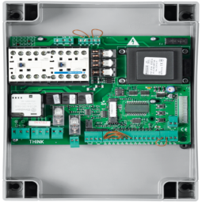
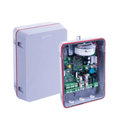
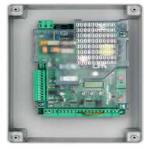
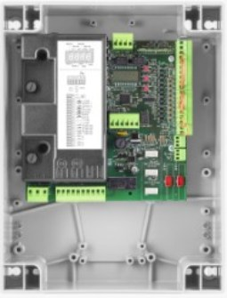
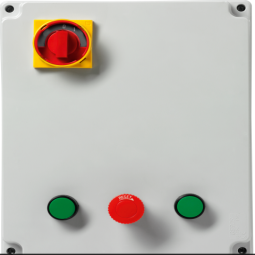
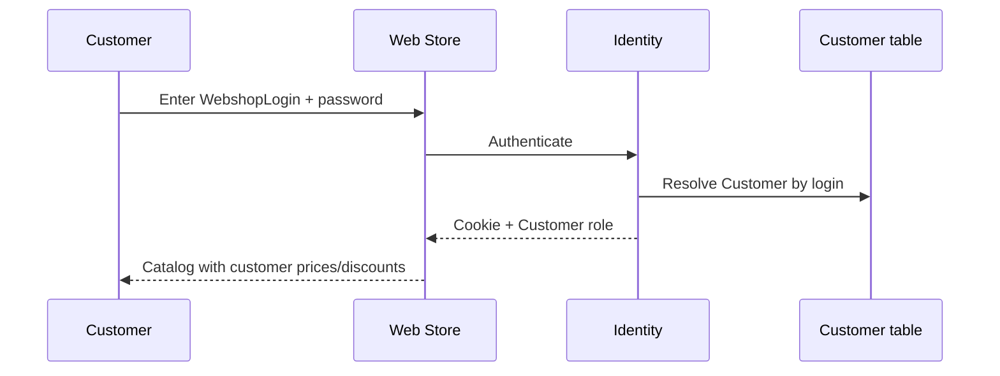
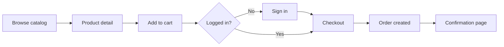

# Web Store — Functional Specification

   

> [!IMPORTANT]
> **Executive Summary:** The WebShopABMATIC **Web Store** is the B2B customer-facing storefront for browsing products, managing the cart, and placing orders. The current **HTML prototype** (`docs/mock-loja.html`) demonstrates UX, catalog filtering, stock hints, and account flows. Production delivery will be a Blazor Server or WebAssembly app sharing the same domain entities and stock rules as the admin panel.

### Coverage statistics

| Category | Count | Status | Notes |
|----------|-------|--------|-------|
| **Prototype SKUs** | 6 | ✅ Documented | `product1.png` … `product6.png` |
| **Store screens** | 7 | ✅ Documented | Catalog, detail, cart, checkout, account |
| **Auth flows** | 2 | ✅ Documented | Customer login; staff link to admin |
| **Stock rules** | 5 | ✅ Documented | Display, cart block, reservation |
| **Blazor storefront** | 5 pages | 🟡 Partial | Catalog, detail, cart, orders, sign-in |


### Implementation quality

| Aspect | Status | Details |
|--------|--------|---------|
| **Catalog UX** | ✅ Blazor + mock | `Catalog.razor` via `IStoreCatalogPort` |
| **Stock hints** | 🟡 Partial | From DB when seeded; mock threshold in prototype |
| **Checkout** | 🟡 UI only | `Cart.razor` — in-memory cart, no order persist |
| **Identity login** | 🟡 Partial | `/store/sign-in`; full Customer role binding ⏳ |
| **Order creation** | ⏳ Planned | `Order` + `OrderLine` + stock service |

---

## Overview

| Artifact | Path | Role |
|----------|------|------|
| **HTML prototype** | `docs/mock-loja.html` | Runnable UX reference (entry point for mocks) |
| **Product images** | `docs/images/product1.png` … `product6.png` | Catalog and detail imagery |
| **Admin data** | `Product`, `Customer`, `Order`, … | Maintained via admin use cases + repositories |
| **Admin spec** | `readme/SPEC_ADMIN.md` | Registrations that feed the store |

### Implementation status

| Area | Blazor (`Web/Components/Pages/Store/`) | Backend |
|------|----------------------------------------|---------|
| **Catalog browse** | ✅ `Catalog.razor` | `IStoreCatalogPort` → `StoreCatalogService` |
| **Product detail** | ✅ `ProductDetail.razor` | Same port; static images Phase 1 |
| **Cart** | 🟡 `Cart.razor` | `StoreCartService` (scoped, in-memory) |
| **Orders list** | 🟡 `Orders.razor` | ⏳ `IOrderService` not implemented |
| **Customer sign-in** | 🟡 `SignIn.razor` | ⏳ Identity Customer role |
| **Admin entry** | ✅ Header link when staff signed in | Shared Identity cookie |

### Backend architecture (hexagonal)

Store pages inject **inbound ports** only — same hexagonal stack as admin:

```text
Catalog.razor
  → IStoreCatalogPort              (Application/Ports)
  → StoreCatalogService            (Infrastructure/Store)
  → WebShopABMATICDbContext + IProductMediaPort
```

Future: `IOrderService` / `ICartService` as inbound ports with use cases in Application; checkout persists via outbound `IOrderRepository`.

---

## 🛒 1. Visual design and catalog imagery

The storefront uses a **light blue** theme (`--primary: #0ea5e9`, soft backgrounds). Product cards show image, name, price, and stock hint.

### 1.1 Catalog products (prototype SKUs)

| SKU | Image | Mock name | Category | Mock stock |
|-----|-------|-----------|----------|------------|
| 1 |  | Hard drive 1 | storage | 24 |
| 2 |  | Hard drive 2 | storage | 18 |
| 3 |  | Hard drive 3 | ssd | 32 |
| 4 |  | Hard drive 4 | ssd | 15 |
| 5 |  | Hard drive 5 | hdd | 9 (low) |
| 6 |  | Hard drive 6 | hdd | 41 |

**Production mapping:** Each row becomes a `Product` with `ShowOnWebshop = true`, linked `ProductPrice` for `GrossSalesPrice`, and `ProductStockLocation.Quantity` for availability.

### 1.2 Screen regions (prototype)

| Region | Purpose |
|--------|---------|
| **Header** | Logo, search, account menu, cart badge |
| **Category chips** | Filter by `WebshopStructure` / category id |
| **Product grid** | Cards with image, price, stock line |
| **Product detail** | Large image, description, options, quantity, add to cart |
| **Cart drawer / page** | Line items, quantities, subtotal |
| **Checkout** | Delivery address, delivery type, payment method, confirm |
| **Account** | Profile, orders history, delivery addresses |
| **Footer** | Link to admin panel (staff) |

Open the prototype:

```text
docs/mock-loja.html
```

(relative to repository root; open in browser or via static file server)

---

## 🔐 2. Authentication and login

### 2.1 Customer identity model

| Concept | Entity / field | Description |
|---------|----------------|-------------|
| **Store login** | `Customer.WebshopLogin` | Unique username (often email) for the shop |
| **Password** | `Customer` password hash + salt | Legacy fields; production maps to ASP.NET Identity **Customer** role |
| **Account link** | `Customer` ↔ Identity user | One login per B2B customer company |
| **Role** | `AppRoles.Customer` | Policy `CustomerOnly` for storefront routes |

> [!NOTE]
> Customers do **not** self-register in the target B2B model unless explicitly enabled. Typically an **admin** creates the `Customer` record and webshop credentials in the admin panel.

### 2.2 Login flow



| Step | Behaviour |
|------|-----------|
| 1 | Customer opens **Sign in** |
| 2 | Enters `WebshopLogin` and password |
| 3 | On success: session cookie; load `CustomerId` for pricing and addresses |
| 4 | On failure: generic error (no user enumeration) |

**Development seed (shared with admin app):** `customer@webshop.com` / `Customer@12345` (Identity); map to a `Customer` row when domain DB is seeded.

### 2.3 Logout

- Clears session; cart may be persisted in cookie/local storage (implementation choice).
- Guest browsing remains allowed for catalog; checkout requires login.

### 2.4 Staff access from store

- Footer / utility link: **Admin panel** → staff use **separate** credentials (`admin@…`, `manager@…`).
- Customers must not access `/admin/*` routes (authorization policy).

---

## 📋 3. Registrations and master data (what the store consumes)

The store does not own master data; it **reads** configurations maintained in the admin panel.

### 3.1 Data dependencies

| Admin registration | Store usage |
|--------------------|-------------|
| **Product** + `ShowOnWebshop` | Visible catalog |
| **ProductPrice** | Current valid sales price per product |
| **ProductQuantityTier** | Volume discount at quantity breaks |
| **ProductOption** | Configurable lines on product detail |
| **WebshopStructure** / **WebshopProductStructure** | Navigation and category filters |
| **Customer** | Login, company name, default terms |
| **CustomerDeliveryAddress** | Checkout ship-to selection |
| **CustomerProductDiscount** | Customer-specific price override |
| **CustomerType** | Default discount %, delivery defaults |
| **DeliveryType** | Checkout delivery options and costs |
| **PaymentMethod** | Checkout payment choice |
| **VatType** | Line and order VAT calculation |
| **ProductStockLocation** | Stock hints and cart validation |

### 3.2 Customer-facing “registrations”

| Action | Who | Result |
|--------|-----|--------|
| **Account created** | Admin | New `Customer` + `WebshopLogin` |
| **Delivery address added** | Customer (profile) or Admin | `CustomerDeliveryAddress` |
| **Order placed** | Customer | New `Order` + `OrderLine` rows |
| **Password change** | Customer | Update Identity password (and legacy hash if synced) |

---

## 🧩 4. Storefront functionality

### 4.1 Catalog and search

| Feature | Description | Validation / rules |
|---------|-------------|-------------------|
| **Product list** | Grid of products with image, name, price | Only `ShowOnWebshop = true` |
| **Category filter** | Chips map to `WebshopStructure` ids | Empty category shows no products |
| **Search** | Text match on name, part number, EAN | Case-insensitive (planned server-side) |
| **Sort** | Price, name (planned) | — |

### 4.2 Product detail

| Feature | Description |
|---------|-------------|
| **Hero image** | From product media or default asset |
| **Meta line** | `ProductId`, `ShowOnWebshop`, tags |
| **Description** | `WebshopDescriptionNl` / EN / FR |
| **Price** | Current `ProductPrice.GrossSalesPrice` (customer discounts applied) |
| **Options** | Required/optional `ProductOption` values |
| **Stock line** | e.g. “24 in stock” from stock location |
| **Quantity** | Spinner before add to cart |
| **Add to cart** | Creates/updates cart line with options |

### 4.3 Cart

| Feature | Description |
|---------|-------------|
| **Line items** | Product, qty, unit price, option surcharges |
| **Update qty** | Recalculate tiers and totals |
| **Remove line** | — |
| **Subtotal / VAT** | Per `VatType` on lines |
| **Persistence** | Logged-in: server cart; guest: session (TBD) |

### 4.4 Checkout

| Step | Fields / logic |
|------|----------------|
| **Delivery address** | Select `CustomerDeliveryAddress` or default |
| **Delivery type** | `DeliveryType` — cost rules per type |
| **Payment method** | `PaymentMethod` |
| **Review** | Lines, discounts, VAT, total |
| **Submit** | Create `Order`, `OrderLine`; trigger stock reservation per `OrderStatus` |

### 4.5 Account area (logged-in)

| Screen | Content |
|--------|---------|
| **Profile** | Company name, email, `WebshopLogin` (read-only) |
| **Orders** | List of customer `Order` with status |
| **Addresses** | CRUD on allowed `CustomerDeliveryAddress` |
| **Change password** | Identity password change |

---

## 📦 5. Stock validation

Stock behaviour must stay **consistent** with admin rules ([SPEC_ADMIN.md §4](SPEC_ADMIN.md#4-stock-validation-and-alerts)).

### 5.1 Display rules (catalog and detail)

| Condition | UI behaviour | Implementation |
|-----------|----------------|----------------|
| `available > MinQuantity` (or min = 0) | Green “N in stock” | `StoreProductDto` from default location |
| `available <= MinQuantity` and `> 0` | Orange **low** class | `IsLowStock` — uses DB `MinQuantity`, not hardcoded 10 |
| `available = 0` | “Out of stock” | `IsOutOfStock` |
| Product not on webshop | Hidden | `ShowOnWebshop != true` |

**Implemented** in `StoreCatalogService`, `Catalog.razor`, `ProductDetail.razor` (May 2026).

### 5.2 Cart and checkout validation (planned)

| Rule | When | Action |
|------|------|--------|
| **Reserve on submit** | Order created with initial status | ⬜ Not used — **decrement on pay** (PrePay) or checkout (PostPay) via `IStockMovementService` |
| **Sufficient stock** | Add to cart / checkout | ✅ Reject if `requestedQty > available` |
| **Consume on fulfilment** | Status with `AffectsStock` | Decrease `Quantity`, release reservation |
| **Multi-location** | Warehouse selection (future) | Pick `ProductStockLocation` with `IsDefault` or nearest |

> [!WARNING]
> The HTML prototype does **not** enforce server-side stock checks. Implement validation in the application service before persisting `OrderLine` rows.

### 5.3 Order status interaction

| `OrderStatus` flag | Effect on stock |
|--------------------|-----------------|
| `ReserveStock = true` | Reserve quantity when order enters status |
| `AffectsStock = true` | Deduct on-hand when order reaches status |

Configured by staff in admin → **Sales** → **Order status**.

---

## 💰 6. Pricing and discounts

| Source | Applied when |
|--------|--------------|
| **ProductPrice** (valid date range) | All customers — base list price |
| **ProductQuantityTier** | Line quantity meets `MinimumQuantity` |
| **CustomerProductDiscount** | Logged-in customer, matching product |
| **CustomerType** base discount | Default % for customer segment |

**Display:** Show struck-through list price when discount applies (planned).

---

## 📊 7. Dashboards (customer vs operations)

### 7.1 Customer-facing (store)

| View | Purpose |
|------|---------|
| **Order history** | Status, date, total, lines |
| **Open orders** | Awaiting acceptance / shipment |
| **Quick reorder** | Copy lines from past `Order` (planned) |

No financial YTD dashboard on the store — that remains **admin** ([SPEC_ADMIN.md §5](SPEC_ADMIN.md#5-dashboards-and-reporting)).

### 7.2 Operational visibility (admin only)

Store activity appears on the **admin dashboard**:

- Orders this month / pending acceptance
- Products on webshop count
- Low stock alerts affecting catalog availability

---

## ✅ 8. Validations summary

| Area | Rule |
|------|------|
| **Login** | Valid credentials; account active; lockout after failed attempts (Identity) |
| **Catalog** | `ShowOnWebshop`; inactive products excluded |
| **Cart qty** | Integer &gt; 0; max per tier if configured |
| **Stock** | Available quantity ≥ line qty at checkout |
| **Required options** | All `ProductOption` with `IsRequired` selected |
| **Checkout** | Delivery address and type required; payment method required |
| **VAT** | Valid `VatType` on lines |
| **Authorization** | Customer may only see own `Order` and `CustomerId` data |

---

## 🔄 9. User journeys



### 9.1 Guest vs logged-in

| Capability | Guest | Logged-in customer |
|------------|-------|-------------------|
| Browse catalog | ✅ | ✅ |
| View prices | List price | List + customer discounts |
| Add to cart | ✅ (session) | ✅ (persisted) |
| Checkout | ❌ | ✅ |
| Order history | ❌ | ✅ |

---

## 🗺️ 10. Prototype vs production roadmap

| Milestone | Deliverable |
|-----------|-------------|
| **M1** | HTML prototype — UX sign-off (`mock-loja.html`) |
| **M2** | Blazor storefront project, shared Application/Infrastructure |
| **M3** | Identity Customer login bound to `Customer.WebshopLogin` |
| **M4** | Live catalog from SQL + real images |
| **M5** | Cart, checkout, `Order` creation, stock validation |
| **M6** | Customer account area and order tracking |

---

## 📁 11. Related files

| File | Description |
|------|-------------|
| `docs/mock-loja.html` | Full storefront prototype |
| `docs/images/product*.png` | Product thumbnails |
| `docs/mock-admin.html` | Admin prototype (linked from store footer) |
| [MOCK_PROTOTYPE_GUIDE.md](MOCK_PROTOTYPE_GUIDE.md) | Screen-by-screen entity mapping |

### Run prototype

Open `docs/mock-loja.html` in a browser. No build required.

---

## Documentation

- 🏠 [Main Documentation](../README.md) — Project overview and requirements

---

**© 2026 AdminSense. All rights reserved.**
